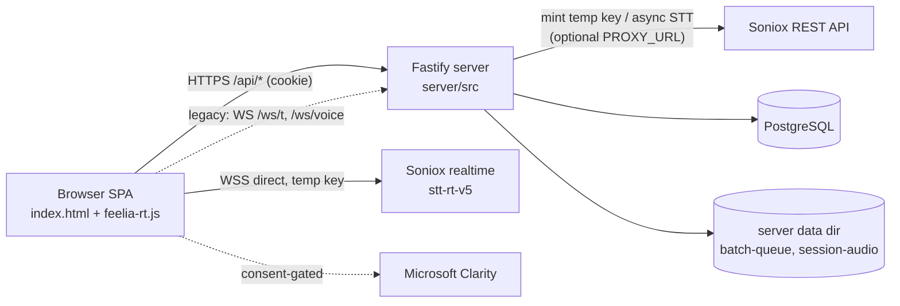

# PROJECT MASTER REFERENCE — فیلیا (Feelia)

> **نقش:** Master Index / Master Reference. تصویرِ کل را منتقل می‌کند و به اسنادِ مالکِ هر fact لینک می‌دهد؛ جزئیات را duplicate نمی‌کند.
> **Snapshot:** 2026-09-15، شاخه‌ی `feat/clarity` روی `54a17fd` (**push‌شده به `origin/feat/clarity`**؛ `origin/main` هنوز `8bcdf0e`، بدونِ merge). این نسخه اسنادِ core را با کدِ commitِ `54a17fd` هم‌گام کرده؛ بخش‌هایی که هنوز به «2026-09-13» یا «commitنشده» اشاره می‌کنند ممکن است عقب مانده باشند — سندِ مالکِ هر بخش (لینک‌های زیر) معتبرتر است.
> **روشِ تولید:** خواندنِ مستقیمِ همه‌ی ۳۸ فایلِ tracked + فایل‌های untracked مرتبط؛ اجرای harness و typecheck. ادعاهای استنباطی با برچسبِ **INFERRED** و ادعاهای غیرقابلِ‌بررسی از repo با **UNVERIFIED** مشخص شده‌اند.

---

## 1. Project Identity

| | |
|---|---|
| نام | Feelia / فیلیا — «دستیار جلسات درمان» (`<title>` در `public/index.html`) |
| نوع | وب‌اپلیکیشنِ monolith: یک سرورِ Node.js که هم API/WebSocket و هم فایل‌های استاتیکِ فرانت را سرو می‌کند |
| package | `feelia@0.1.0` (root, pnpm workspace) + `server@0.1.0` |
| repo | `github.com/smohebzadeh86-hub/feeliaa` |
| زبانِ محصول | فارسی (RTL)، اعدادِ فارسی در UI |
| دامنه‌ی production | `feelia.ir` — طبقِ `docs/analytics-clarity.md` و کامنت‌های کد (**UNVERIFIED** از داخلِ repo) |

## 2. Project Purpose

کاهشِ بارِ مستندسازیِ تراپیست: جلسه‌ی درمانی با رضایتِ صریحِ مراجع به‌صورتِ زنده به متنِ فارسی تبدیل شود،
علائمِ رفتاری و یادداشت‌ها با زمانِ دقیق کنارِ متن ثبت شوند، و پرونده‌ی هر مراجع فقط برای تراپیستِ خودش در دسترس باشد.
**اصلِ غالب:** حریمِ خصوصی و یکپارچگیِ متن (Transcript Integrity) بر راحتی و فیچر مقدم است.

## 3. Product Scope

**داخلِ scope (موجود در کد):** حسابِ تراپیست با موبایل؛ مراجعین (کد یکتا، نام مستعار، دسته/جنسیت، فعال/غیرفعال)؛
جلسه با رضایت و preflight؛ رونویسیِ زنده + fallback؛ pause/resume؛ ادامه بعد از reload؛ علائم/یادداشت/یادداشتِ صوتی؛
مشاهده‌ی متن، ویرایشِ تاریخ/ساعت، بازسازیِ اختیاریِ شماره‌ی گوینده‌ها؛ پنلِ ادمین (آمار، مدیریتِ حساب‌ها، export، پخشِ صدای آرشیو)؛ Clarity با رضایتِ تراپیست.

**خارج از scope (در کد وجود ندارد):** خلاصه‌سازی/تحلیلِ AI، گزارش‌ساز، پیامک/OTP، بازیابیِ رمز، export سمتِ تراپیست (عمداً حذف شده)، اپ موبایل، چندزبانه، پرداخت.

## 4. Major Capabilities

| Capability | ماژول |
|---|---|
| ثبت‌نام/ورود با موبایل، نشستِ کوکی، ادمینِ bootstrap | [01-therapist-accounts](docs/04-modules/01-therapist-accounts/module-prd.md) |
| مدیریتِ مراجعین | [02-client-management](docs/04-modules/02-client-management/module-prd.md) |
| چرخه‌ی عمرِ جلسه | [03-therapy-sessions](docs/04-modules/03-therapy-sessions/module-prd.md) |
| رونویسی (زنده، fallback، بازسازیِ گوینده) | [04-transcription](docs/04-modules/04-transcription/module-prd.md) |
| علائم و یادداشت‌ها | [05-notes-and-signs](docs/04-modules/05-notes-and-signs/module-prd.md) |
| پنلِ ادمین | [06-admin-panel](docs/04-modules/06-admin-panel/module-prd.md) |
| تحلیلِ UX با Clarity | [07-ux-analytics](docs/04-modules/07-ux-analytics/module-prd.md) |

## 5. System Overview



جزئیات: [system-architecture](docs/01-architecture/system-architecture.md).

## 6. Architecture Overview

- **Media-plane مستقیم:** صدای زنده از مرورگر مستقیم به Soniox می‌رود؛ سرور فقط کلیدِ موقتِ single-use صادر می‌کند. کلیدِ اصلی هرگز به مرورگر نمی‌رسد.
- **Fail-open:** شکستِ realtime جلسه را متوقف نمی‌کند؛ ضبطِ durable در IndexedDB ادامه می‌یابد و بعد از پایان با API async رونویسی و **append** می‌شود.
- **Transcript Integrity:** نوشتنِ متن با CAS روی `sessions.transcript_version`.
- **Single-process، stateful:** وضعیتِ in-memory (P1 records، rate-limit mint، jobهای resolve-speakers) → فقط یک instance.
- **فرانتِ بدونِ build:** HTML/JS خام، بدونِ bundler/npm در مرورگر.

جزئیات: [application-architecture](docs/01-architecture/application-architecture.md) · [integration-architecture](docs/01-architecture/integration-architecture.md).

## 7. Technology Stack

| لایه | تکنولوژی (از `server/package.json` و کد) |
|---|---|
| Runtime | Node.js (ESM, `"type":"module"`)؛ نسخه pin نشده — dev: v24.19.0 |
| زبان | TypeScript `^7.0.2` (strict)، اجرای dev با `tsx` |
| وب‌سرور | Fastify `^5.12.1` + `@fastify/cookie`، `@fastify/multipart`، `@fastify/static`، `@fastify/websocket` |
| DB | PostgreSQL از طریق `pg` (Pool)، migrationهای SQL خام |
| STT | Soniox: realtime `stt-rt-v5` (WebSocket)، async `stt-async-v5` (REST) |
| egress | `https-proxy-agent` (با `PROXY_URL`) |
| صدا (سرور) | `ffmpeg` خارجی (فقط برای resolve-speakers) |
| فرانت | HTML/CSS/JS خام، فونت Vazirmatn (Google Fonts)، MediaRecorder، IndexedDB |
| Analytics | Microsoft Clarity (اختیاری) |
| Package manager | pnpm (workspace)؛ dev: 10.34.5 |

## 8. Repository Structure

```
feeliaa/
├── CLAUDE.md, PROJECT_MASTER_REFERENCE.md   ← نقاطِ ورود
├── server/            ← backend (TypeScript)
│   ├── src/{index.ts, auth/, db/, http/, stt/, ws/}
│   ├── src/db/migrations/001..014_*.sql
│   └── scripts/copy-assets.mjs
├── public/            ← فرانتِ استاتیک (index.html, feelia-rt.js, feelia-analytics.js)
├── scripts/rt-harness.cjs   ← تستِ موتورِ realtime
├── docs/              ← مستندات (این معماری)
├── verification/      ← evidence تاریخ‌دار
└── (untracked/legacy) server-deploy/, soniox.html, feelia-f9b0a9c.tar, ...
```

نقشه‌ی کامل با وضعیتِ هر مسیر: [repository-map](docs/02-reference/repository-map.md).

## 9. Applications / Services

| سرویس | entry point | توضیح |
|---|---|---|
| Feelia server | `server/src/index.ts` (dev) / `server/dist/index.js` (prod) | API + WS + static؛ اجرای migration و sweeperها در startup |
| Feelia SPA | `public/index.html` | سرو شده توسطِ همان سرور از `public/` |
| سرویس‌های خارجی | Soniox، Clarity، Google Fonts | [integration-architecture](docs/01-architecture/integration-architecture.md) |

worker/queue/cache مستقل وجود ندارد؛ پردازش‌های پس‌زمینه داخلِ همان پروسه‌اند.

## 10. Major Modules

فهرست و نگاشت به کد: [module-map](docs/02-reference/module-map.md). (هفت ماژول در بخش 4.)

## 11. Major Subsystems

| Subsystem | چرا قبل از تغییر باید خوانده شود |
|---|---|
| [01 Browser Realtime Engine](docs/07-subsystems/01-browser-realtime-engine.md) | state machine با ۱۱ state، epoch/generation، race‌های واقعیِ رفع‌شده |
| [02 Audio Durability & Batch Fallback](docs/07-subsystems/02-audio-durability-batch-fallback.md) | IndexedDB، سه purpose صدا، ریسکِ duplicate متن |
| [03 Transcript Integrity](docs/07-subsystems/03-transcript-integrity.md) | CAS، قواعدِ merge، مارکرِ ناپیوستگی |
| [04 Legacy WS Proxy (P1)](docs/07-subsystems/04-legacy-ws-proxy-p1.md) | مسیرِ قدیمی با ordering/ACK پیچیده — frozen |
| [05 Session Audio Archive & Speaker Resolve](docs/07-subsystems/05-session-audio-archive-speaker-resolve.md) | نگهداریِ صدا، retention، ffmpeg |

## 12. Data Layer Overview

PostgreSQL با ۶ جدولِ برنامه + `_migrations`: `therapists`، `auth_sessions`، `clients`، `sessions`، `session_notes`، `session_audio`.
زنجیره‌ی حذفِ آبشاری: therapist → clients → sessions → notes/audio-rows. صدا روی دیسکِ سرور (`<cwd>/data/`) و در مرورگر (IndexedDB `feelia-audio`).
[data-architecture](docs/01-architecture/data-architecture.md) · [database-catalog](docs/02-reference/database-catalog.md).

## 13. API / Integration Overview

- REST زیرِ `/api/*` (JSON، خطا به شکلِ `{error, code?}`)، WS legacy زیرِ `/ws/t/:sessionId` و `/ws/voice/:sessionId`.
- [api-catalog](docs/02-reference/api-catalog.md) · [route-map](docs/02-reference/route-map.md) · [error-code-catalog](docs/02-reference/error-code-catalog.md).

## 14. Authentication / Authorization

- کوکیِ `feelia_session` (httpOnly، sameSite=lax، ۳۰ روز)؛ فقط SHA-256 توکن در `auth_sessions`.
- هر درخواست: resolve نشست + `is_admin` + `active` (غیرفعال‌سازی فوری اثر می‌کند).
- `requireAuth` برای روت‌های تراپیست، `requireAdmin` برای `/api/admin/*`؛ مالکیت با `getOwnedClient`/`getOwnedSession` (غیرمالک → 404).
- اولین ادمین با `ADMIN_PHONE`.
- جزئیات: [06-platform](docs/06-platform/platform-prd.md).

## 15. Deployment Overview

- dev: `pnpm dev` (cwd `server/`). build: `pnpm --filter server run build` (tsc + کپیِ migrationها). start: `node dist/index.js`.
- production طبقِ `docs/analytics-clarity.md`: pm2 (نام `feelia`) با cwd `/root/feeliaa` پشتِ nginx — **UNVERIFIED**؛ `diag-collect.sh` مسیرِ دیگری (`$HOME/server-deploy`) فرض می‌کند (تعارض).
- CI/CD، Docker، و IaC در repo وجود ندارد.
- [deployment-operations](docs/01-architecture/deployment-operations.md).

## 16. Important Business Rules

مالکِ canonical: [requirement-catalog](docs/03-requirements/requirement-catalog.md). مهم‌ترین‌ها:
- بدونِ رضایتِ مراجع جلسه ساخته نمی‌شود (سرور 400).
- هر تراپیست فقط داده‌ی خودش را می‌بیند؛ export فقط از مسیرِ ادمین.
- متنِ تأییدشده هرگز با متنِ کوتاه‌تر/قدیمی جایگزین نمی‌شود؛ نتیجه‌ی batch فقط append می‌شود.
- یادداشتِ صوتی هرگز واردِ transcript نمی‌شود.
- شکستِ رونویسی جلسه را بلاک نمی‌کند.
- Clarity هرگز برای ادمین و هرگز بدونِ رضایتِ تراپیست لود نمی‌شود.

## 17. Source-of-Truth Rules

خلاصه: قوانین > تصمیمِ ثبت‌شده‌ی مالک > requirementهای APPROVED > معماریِ canonical > **کد/schema در working tree** > تست‌ها > catalogها > evidence > deprecated.
چون همه‌ی REQها فعلاً DERIVED (از روی کد) هستند، در تعارضِ REQ با کد، کد وضعیتِ «موجود» را تعیین می‌کند و تعارضِ قانون با کد «violation» است.
کامل: [source-of-truth](docs/00-governance/source-of-truth.md).

## 18. Documentation Structure

```
PROJECT_MASTER_REFERENCE.md
  ├── docs/00-governance   قوانین، source of truth، راهنمای agent، نقشه‌ی اسناد
  ├── docs/01-architecture سیستم، اپلیکیشن، داده، یکپارچه‌سازی، استقرار
  ├── docs/02-reference    catalogهای API/DB/config/error/route/module/repo/glossary
  ├── docs/03-requirements REQ-xxx + traceability
  ├── docs/04-modules      PRD + implementation plan برای هر ماژول
  ├── docs/05-plans        master implementation plan
  ├── docs/06-platform     cross-cutting
  ├── docs/07-subsystems   briefهای فنیِ بخش‌های پرریسک
  └── verification/        evidence
```

فهرستِ سند به سند با وضعیت/اعتبار: [documentation-map](docs/00-governance/documentation-map.md).

## 19. Module Index

| # | ماژول | PRD | Implementation Plan |
|---|---|---|---|
| 01 | Therapist Accounts | [PRD](docs/04-modules/01-therapist-accounts/module-prd.md) | [Plan](docs/04-modules/01-therapist-accounts/implementation-plan.md) |
| 02 | Client Management | [PRD](docs/04-modules/02-client-management/module-prd.md) | [Plan](docs/04-modules/02-client-management/implementation-plan.md) |
| 03 | Therapy Sessions | [PRD](docs/04-modules/03-therapy-sessions/module-prd.md) | [Plan](docs/04-modules/03-therapy-sessions/implementation-plan.md) |
| 04 | Transcription | [PRD](docs/04-modules/04-transcription/module-prd.md) | [Plan](docs/04-modules/04-transcription/implementation-plan.md) |
| 05 | Notes & Signs | [PRD](docs/04-modules/05-notes-and-signs/module-prd.md) | [Plan](docs/04-modules/05-notes-and-signs/implementation-plan.md) |
| 06 | Admin Panel | [PRD](docs/04-modules/06-admin-panel/module-prd.md) | [Plan](docs/04-modules/06-admin-panel/implementation-plan.md) |
| 07 | UX Analytics (Clarity) | [PRD](docs/04-modules/07-ux-analytics/module-prd.md) | [Plan](docs/04-modules/07-ux-analytics/implementation-plan.md) |
| — | Platform | [PRD](docs/06-platform/platform-prd.md) | [Plan](docs/06-platform/implementation-plan.md) |

## 20. Current Project Status (2026-09-15)

| موضوع | وضعیت | منبع |
|---|---|---|
| Git | شاخه‌ی `feat/clarity` روی **`54a17fd`** (2026-09-15)، **push‌شده به `origin/feat/clarity`** (`git rev-parse` محلی = remote). شاملِ همه‌ی کدِ قبلاً commitنشده تا این تاریخ: migrationهای 008–014، صفِ IndexedDB، keepalive، آرشیوِ صدا، resolve-speakers، وضعیت/دسته‌ی مراجع، فیکسِ کارتِ فعال/غیرفعال، ثبتِ دستیِ جلسه، تاریخِ شمسیِ اختیاری. **`origin/main` هنوز `8bcdf0e`** — بدونِ merge/PR، فاصله‌ی زیاد با `feat/clarity` باقی‌ست (R3). کارِ محلیِ commitنشده باقی‌مانده: بخشِ عمده‌ی خودِ `docs/`، `CLAUDE.md`، این فایل، `.claude/` (عمداً — دامنه‌ی این commit UI+بک‌اند بود، نه بازسازیِ مستندات) | `git log`، `git rev-parse`، `PROJECT_STATUS.md` |
| Typecheck سرور | `npx tsc --noEmit` بدونِ خطا (آخرین بار قبل از commitِ `54a17fd`) | [evidence](verification/2026-09-13-documentation-baseline.md) |
| Harness realtime | **29 PASS / 6 FAIL** (T2، T15×3، T16×2) — baselineِ پایدار؛ این شکست‌ها پیش از commitِ `54a17fd` هم وجود داشتند و ربطی به آن ندارند (harness موتورِ realtime را تست می‌کند، نه UI/کلاینتِ مراجعین). دیگر واگراییِ working-tree/HEAD معنا ندارد چون همه‌چیز commit شده | [verification 2026-09-15](verification/2026-09-15-clients-tabs-ui.md) |
| تستِ backend / E2E / CI | وجود ندارد | repo |
| Production | `feelia.ir` (VPS `185.110.191.126`, pm2 `feelia`) روی commit **`8bcdf0e`** — یعنی **هیچ‌کدام از کارِ `2763414` تا `54a17fd` روی production نیست** (نه keepalive، نه فیکس‌هایِ UI، نه وضعیت/دستیِ جلسه/تاریخِ شمسی). Deploy نیازمندِ دسترسیِ SSH به VPS است که این نشست ندارد؛ دستورِ لازم: `cd /root/feeliaa && git pull && pm2 restart feelia --update-env` (migrationها خودکار اجرا می‌شوند). `server-deploy/` محلی همچنان قدیمی (`f9b0a9c`) و بی‌ربط به production واقعی است | [PROJECT_STATUS.md §7](PROJECT_STATUS.md) — DEPLOY 2026-09-14، [deployment-operations](docs/01-architecture/deployment-operations.md) |
| مستندات | ساختارِ جدید ایجاد شد؛ هیچ سندی هنوز توسطِ مالک review نشده؛ همه‌ی رویدادها در [PROJECT_STATUS.md](PROJECT_STATUS.md) ثبت می‌شوند | [documentation-map](docs/00-governance/documentation-map.md) |
| بررسیِ UI (2026-09-14) | ۴۷ یافته (۶ بحرانی، ۲۱ مهم)؛ ۴۲ مورد روی production هم وجود دارد؛ **بازبینیِ دوم روی `2763414`: کد یکسان، هیچ‌کدام رفع نشده** (۱۴ مورد دوباره اجرا و تأیید شد) | [ui-ux-audit-2026-09-14](docs/05-plans/ui-ux-audit-2026-09-14.md) |
| UX audit (2026-09-14) | ۴۲ یافته‌ی UX-xx (Critical ۵، High ۱۴، Medium ۱۸، Low ۵؛ ۳۸ روی production). پس از commitهای هم‌زمان تا `8347fbb`: هر ۵ Critical پابرجا (R15–R17 + R1)، ۷ یافته جزئی رفع؛ ۱۲ سؤالِ باز نیازمندِ تحقیقِ کاربر | [UX_AUDIT_REPORT](docs/05-plans/ux-audit-2026-09-14/UX_AUDIT_REPORT.md) |
| آپلودِ فایلِ صوتیِ جلسه (2026-09-23) | پیاده‌سازی شد (migration 023، [subsystem 06](docs/07-subsystems/06-audio-upload-pipeline.md)) + رفعِ F1–F8؛ `pnpm test:up` 24/24، `test:cf` 108/108، `tsc` تمیز؛ UI با mock تست شد؛ **تستِ کاملِ واقعی (Soniox/LLM/MySQL، ۶۰ دقیقه، kill ِ سرور، هم‌زمانی، mutation) انجام شد — همه PASS** (گفتارِ فارسی و حافظه‌ی سرور تست‌نشده)؛ commit/deploy نشده | [verification](verification/2026-09-23-audio-upload-pipeline.md) |
| ۷ باگِ گزارش‌شده (2026-09-15) | هر ۶ موردِ کد پیاده‌سازی شد به دستورِ صریحِ مالک (Clarity بدونِ پرسیدن/D1 — نقضِ آگاهانه‌ی LAW-011؛ دسترسیِ کاملِ ادمین/D2؛ انتخابگرِ تاریخِ شمسی/D4؛ نام/تخصصِ اجباری/D3؛ اسکرولِ خودکار؛ یادداشتِ صوتی↔متنی)؛ syntax/typecheck/`pnpm test:rt` سبز؛ تستِ تعاملیِ مرورگری/سرورِ لوکال انجام نشد؛ commitنشده | [PROJECT_STATUS §7](PROJECT_STATUS.md)، [verification](verification/2026-09-15-seven-bugs.md) |

## 21. Known Limitations

- فقط یک instance از سرور (state in-memory). ری‌استارت: jobهای resolve-speakers و وضعیتِ P1 از بین می‌روند.
- Soniox شماره‌ی گوینده را در هر اتصالِ جدید از صفر می‌شمارد. **به‌روزشده ۲۰۲۶-۰۹-۱۴:** `pause()`/`resume()` دیگر WS را نمی‌بندند — طبقِ مستنداتِ رسمیِ Soniox («Connection keepalive»، «Pause and resume»)، حینِ توقف پیامِ کنترلیِ `{"type":"keepalive"}` فرستاده می‌شود و همان اتصال حفظ می‌شود؛ یعنی توقف/ادامه‌ی دستیِ عادی دیگر شماره‌گذاریِ گوینده را ریست نمی‌کند و مارکرِ ناپیوستگی هم نمی‌گیرد. مارکرِ ناپیوستگی و ریستِ شماره‌گذاری فقط برایِ reconnectِ واقعی (قطعیِ شبکه/mint، یا موقعی که WS حینِ pause واقعاً بسته شده باشد) باقی می‌ماند — یکدست‌سازیِ کاملِ آن حالت‌ها فقط با resolve-speakers و ffmpeg.
- ضبطِ مرورگر نیازمندِ HTTPS/localhost است؛ WebViewهای درون‌برنامه‌ای پایدار نیستند.
- **آرشیوِ صدایِ جلساتِ پیش از رفعِ race چرخشِ durable (2026-09-23، commitنشده/deployنشده):** هر سگمنتی که با چرخشِ ۱۵ثانیه‌ای یا مرزِ قطعی بسته شده، عمدتاً فقط دُمِ زیرِ ۱ثانیه‌ایِ بی‌هدر است (بدنه در مرورگر گم شده؛ قابلِ بازیابی نیست)؛ فقط سگمنت‌هایِ pause/finish/flushِ visibility سالم‌اند. در همان جلسات، صدایِ دوره‌هایِ قطعی به‌خاطرِ intentِ برعکس رونویسی نشده. جزئیات: [verification](verification/2026-09-23-durable-rotation-race.md).
- `clarity.ms` از شبکه‌ی dev در دسترس نبود (احتمالاً روی کاربرانِ مشابه هم لود نمی‌شود).
- هیچ بازیابیِ رمز/OTP؛ ثبت‌نام برای همه باز است.
- ~~فرمتِ تاریخِ جلسه ناهمگون است (پیش‌فرضِ سرور میلادی، راهنمای ویرایش شمسی).~~ **رفع، commit شده در `54a17fd` (2026-09-15):** همه‌ی تاریخ‌ها شمسیِ `YYYY/MM/DD`؛ داده‌ی قبلی با migration 013 تبدیل می‌شود؛ تاریخ برایِ جلسه‌ی `source=manual` می‌تواند خالی بماند (migration 014). **هنوز رویِ production اجرا نشده — قبل از deploy از `sessions` backup بگیرید.**

## 22. Important Risks

| # | ریسک | شدت | مالک/سند |
|---|---|---|---|
| R1 | **تعارضِ متنِ رضایت با واقعیت:** UI می‌گوید «صدا هیچ‌جا ذخیره نمی‌شود» ولی صدا در IndexedDB (تا 300MB) و روی سرور (آرشیو ۱۴روزه، قابلِ پخش برای ادمین، حتی در جلساتِ موفق با `purpose=archive`) ذخیره می‌شود | **بحرانی** (اخلاقی/حقوقی) | [LAW-009](docs/00-governance/project-laws.md)، [subsystem 05](docs/07-subsystems/05-session-audio-archive-speaker-resolve.md) |
| R2 | لاگِ موقتِ `DIAG-TEMP` در `PUT /api/sessions/:id` ۸۰ کاراکترِ آخرِ متنِ جلسه را در لاگ چاپ می‌کند | بالا | LAW-001، LAW-023 |
| R3 | کارِ بزرگ (شاملِ migrationهای 008–014) commit و به `origin/feat/clarity` push شده (خطرِ «از دست رفتن» رفع شد) — ولی `origin/main` هنوز `8bcdf0e` است و production هنوز روی `8bcdf0e`؛ فاصله‌ی زیاد با `feat/clarity`/`54a17fd` باقی‌ست، بدونِ merge/PR یا برنامه‌ی deploy مشخص (به‌روزشده 2026-09-15) | متوسط (کاهش‌یافته از بالا) | [master plan](docs/05-plans/master-implementation-plan.md)، [PROJECT_STATUS.md](PROJECT_STATUS.md) |
| R4 | حذفِ مراجع/جلسه/تراپیست ردیفِ `session_audio` را cascade می‌کند ولی فایل‌ها روی دیسک یتیم می‌مانند و sweeper آن‌ها را نمی‌بیند (**INFERRED** از کد) | بالا (حریم خصوصی) | subsystem 05 |
| R5 | CAS در `PUT /api/sessions/:id` اتمیک نیست (read سپس update)؛ مسیرِ legacy و merge بدونِ CAS می‌نویسند | متوسط | [subsystem 03](docs/07-subsystems/03-transcript-integrity.md) |
| R6 | harness با working tree ۶ شکست دارد؛ مسیرِ fallback عملاً پوششِ تست ندارد | متوسط | [module 04 plan](docs/04-modules/04-transcription/implementation-plan.md) |
| R7 | نبودِ rate-limit برای login، نبودِ flag `secure` روی کوکی، نبودِ CSP/security headers | متوسط | [06-platform](docs/06-platform/platform-prd.md) |
| R8 | توپولوژیِ production مستند/قابلِ‌بررسی نیست؛ دو فرضِ متعارض | متوسط | deployment-operations |
| R9 | حذفِ مراجع توسطِ ادمین در UI هیچ تأییدی نمی‌خواهد | متوسط | module 06 |
| R10 | پیش‌فرضِ `DATABASE_URL` در کد شاملِ credential ثابت است | پایین/متوسط | configuration-catalog |
| R11 | سقفِ عملیِ آپلودِ multipart = **1MiB** (پیش‌فرضِ Fastify؛ تأییدشده در `node_modules`)؛ سگمنتِ صدای بزرگ‌تر رد می‌شود و در IndexedDB بی‌پایان در صف می‌ماند؛ چکِ 50MB در کد دست‌نیافتنی است | متوسط | [configuration-catalog](docs/02-reference/configuration-catalog.md)، [platform plan](docs/06-platform/implementation-plan.md) |
| R12 | ~~یادداشتِ صوتیِ مسیرِ اصلی هرگز به سرور ارسال نمی‌شود~~ — **✅ رفع شد 2026-09-14، commit شده (`2763414`/`ecf00b4`)**؛ **همچنان روی production فعال است** چون `origin/main`/production هنوز `8bcdf0e` — منتظرِ merge/deploy، نه push (که قبلاً انجام شده) | بالا → کاهش‌یافته (رفعِ commit‌شده، deploy‌نشده) | [UI audit — UI-02](docs/05-plans/ui-ux-audit-2026-09-14.md) |
| R13 | ~~«خروج از حساب» وسطِ جلسه ضبط را متوقف نمی‌کند~~ — **✅ رفع شد 2026-09-14، commit شده**؛ **همچنان روی production فعال است** تا merge/deploy | بالا → کاهش‌یافته (رفعِ commit‌شده، deploy‌نشده) | [UI audit — UI-01](docs/05-plans/ui-ux-audit-2026-09-14.md) |
| R14 | ~~شماره‌ی موبایل با ارقامِ فارسی رد می‌شود؛ دوبار کلیکِ «شروع جلسه»/«ایجادِ مراجع» تکراری می‌سازد~~ — **✅ رفع شد 2026-09-14، commit شده (`ecf00b4`)**؛ **همچنان روی production فعال است** تا merge/deploy؛ ⚠️ دوبار کلیک روی سایرِ دکمه‌های نوشتنی (یادداشت، ذخیره، حذف، …) هنوز رفع نشده | بالا → کاهش‌یافته (جزئی، رفعِ commit‌شده/deploy‌نشده) | [UI audit — UI-03، UI-04، UI-06](docs/05-plans/ui-ux-audit-2026-09-14.md) |
| R15 | **یادداشت‌ها/علائم/یادداشتِ صوتی در شکستِ ذخیره (مثلاً قطعیِ اینترنت) بی‌صدا از دست می‌روند** ولی در UI و صفحه‌ی تکمیل ثبت‌شده دیده می‌شوند؛ روی production (اجرا، 2026-09-14) | **بحرانی** (داده‌ی بالینی) | [UX audit — UX-001](docs/05-plans/ux-audit-2026-09-14/UX_AUDIT_REPORT.md) |
| R16 | **متنِ یادداشت‌ها، علائم و یادداشت‌های صوتی در پرونده نمایش داده نمی‌شود** (فقط زمان)؛ از `f58bd29`، روی production (اجرا) | **بحرانی** | [UX audit — UX-002](docs/05-plans/ux-audit-2026-09-14/UX_AUDIT_REPORT.md) |
| R18 | **(2026-09-23)** فیچرِ آپلود صدا را رویِ سرور (۱۴ روز) و در IndexedDB نگه می‌دارد، در حالی که متنِ رضایت هنوز «صدا هیچ‌جا ذخیره نمی‌شود» است — به دستورِ مالک دست‌نخورده (تشدیدِ R1). (ریسکِ فنیِ «اجرانشده» با تستِ کاملِ واقعیِ همان روز برطرف شد) | **بحرانی** (اخلاقی/حقوقی) | LAW-009، [subsystem 06](docs/07-subsystems/06-audio-upload-pipeline.md) |
| R17 | **فیکسِ UI-01 ناقص است:** در حالتِ ضبطِ محلی (رونویسیِ زنده FAILED/قطع، بدونِ WSِ باز) خروج مسدود نیست و میکروفون روشن می‌ماند؛ هشدارِ بستنِ تب هم نمی‌آید (اجرا در FAILED) | **بحرانی** (حریمِ خصوصی) | [UX audit — UX-003](docs/05-plans/ux-audit-2026-09-14/UX_AUDIT_REPORT.md) |

## 23. How AI Agents Must Read This Project

[CLAUDE.md](CLAUDE.md) → این سند → [project-laws](docs/00-governance/project-laws.md) → [ai-agent-reading-guide](docs/00-governance/ai-agent-reading-guide.md).
قاعده‌ی طلایی: **هیچ‌چیز را حدس نزن؛ کد را بخوان؛ evidence را حقیقتِ فعلی فرض نکن؛ بعد از تغییر، سندِ مالک را به‌روز کن.**

## 24. Links to Canonical Documentation

- Governance: [laws](docs/00-governance/project-laws.md) · [source-of-truth](docs/00-governance/source-of-truth.md) · [agent guide](docs/00-governance/ai-agent-reading-guide.md) · [doc map](docs/00-governance/documentation-map.md)
- Architecture: [system](docs/01-architecture/system-architecture.md) · [application](docs/01-architecture/application-architecture.md) · [data](docs/01-architecture/data-architecture.md) · [integration](docs/01-architecture/integration-architecture.md) · [deployment](docs/01-architecture/deployment-operations.md)
- Reference: [API](docs/02-reference/api-catalog.md) · [modules](docs/02-reference/module-map.md) · [routes](docs/02-reference/route-map.md) · [DB](docs/02-reference/database-catalog.md) · [config](docs/02-reference/configuration-catalog.md) · [errors](docs/02-reference/error-code-catalog.md) · [repo](docs/02-reference/repository-map.md) · [glossary](docs/02-reference/glossary.md)
- Requirements: [catalog](docs/03-requirements/requirement-catalog.md) · [traceability](docs/03-requirements/traceability-matrix.md)
- Plans: [master plan](docs/05-plans/master-implementation-plan.md)
- Platform: [README](docs/06-platform/README.md)
- Subsystems: [README](docs/07-subsystems/README.md)
- Verification: [README](verification/README.md)
- Clarity detail: [analytics-clarity](docs/analytics-clarity.md)
- Live status & Event Log: [PROJECT_STATUS.md](PROJECT_STATUS.md) (LAW-024 — با هر رویداد به‌روز می‌شود)
