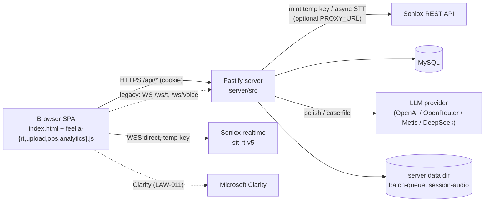

# PROJECT MASTER REFERENCE — فیلیا (Feelia)

> **نقش:** Master Index / Master Reference. تصویرِ کل را منتقل می‌کند و به اسنادِ مالکِ هر fact لینک می‌دهد؛ جزئیات را duplicate نمی‌کند.
> **Snapshot:** 2026-09-30، شاخه‌ی `feat/clarity` @ `17d6919`. وضعیتِ commit/push/deploy/production و شمارشِ تست‌ها **فقط** در [PROJECT_STATUS.md](PROJECT_STATUS.md) نگه‌داری می‌شود (LAW-027)؛ این سند تصویرِ ساختاری است. نقشه‌ی «فیچر ↔ کد ↔ سند ↔ تست ↔ جدول»: [feature-index](docs/02-reference/feature-index.md).
> **روشِ تولید:** خواندنِ مستقیمِ همه‌ی فایل‌هایِ tracked + فایل‌های untracked مرتبط؛ اجرای harness و typecheck. ادعاهای استنباطی با برچسبِ **INFERRED** و ادعاهای غیرقابلِ‌بررسی از repo با **UNVERIFIED** مشخص شده‌اند.

---

## 1. Project Identity

| | |
|---|---|
| نام | Feelia / فیلیا — «دستیار جلسات درمان» (`<title>` در `public/index.html`) |
| نوع | وب‌اپلیکیشنِ monolith: یک سرورِ Node.js که هم API/WebSocket و هم فایل‌های استاتیکِ فرانت را سرو می‌کند |
| package | `feelia@0.1.0` (root, pnpm workspace) + `server@0.1.0` |
| repo | `github.com/smohebzadeh86-hub/feeliaa` |
| زبانِ محصول | فارسی (RTL)، اعدادِ فارسی در UI |
| دامنه‌ی production | `feelia.ir` — طبقِ `docs/analytics-clarity.md` و کامنت‌های کد (**UNVERIFIED** از داخلِ repo) |

## 2. Project Purpose

کاهشِ بارِ مستندسازیِ تراپیست: جلسه‌ی درمانی با رضایتِ صریحِ مراجع به‌صورتِ زنده به متنِ فارسی تبدیل شود،
علائمِ رفتاری و یادداشت‌ها با زمانِ دقیق کنارِ متن ثبت شوند، و پرونده‌ی هر مراجع فقط برای تراپیستِ خودش در دسترس باشد.
**اصلِ غالب:** حریمِ خصوصی و یکپارچگیِ متن (Transcript Integrity) بر راحتی و فیچر مقدم است.

## 3. Product Scope

**داخلِ scope (موجود در کد):** حسابِ تراپیست با موبایل؛ مراجعین (کد یکتا، نام مستعار، دسته/جنسیت، فعال/غیرفعال، رضایتِ یک‌باره)؛ واحدِ درمان (زوج/خانواده، مدالیته)؛
جلسه با رضایت و preflight؛ رونویسیِ زنده + fallback؛ pause/resume؛ ادامه بعد از reload؛ علائم/یادداشت/یادداشتِ صوتی؛
مشاهده‌ی متن، ویرایشِ تاریخ/ساعت، بازسازیِ اختیاریِ شماره‌ی گوینده‌ها؛ یادداشتِ پیش از جلسه (متنی/صوتی)؛ آپلودِ فایلِ صوتیِ جلسه؛ «متنِ نهایی» (polish با LLM)؛ پروندهٔ درمانِ AI (Case File)؛ اعلان‌ها؛ پنلِ ادمین (آمار، مدیریتِ حساب‌ها، export، پخشِ صدا، تشخیص)؛ رصد/حسابرسی (`obs`)؛ Clarity (طبقِ LAW-011).

**خارج از scope (در کد وجود ندارد):** گزارش‌سازِ عمومی، پیامک/OTP، بازیابیِ رمز، export سمتِ تراپیست (عمداً حذف شده)، اپ موبایل، چندزبانه، پرداخت.

## 4. Major Capabilities

| Capability | ماژول |
|---|---|
| ثبت‌نام/ورود با موبایل، نشستِ کوکی، ادمینِ bootstrap | [01-therapist-accounts](docs/04-modules/01-therapist-accounts/module-prd.md) |
| مدیریتِ مراجعین | [02-client-management](docs/04-modules/02-client-management/module-prd.md) |
| چرخه‌ی عمرِ جلسه | [03-therapy-sessions](docs/04-modules/03-therapy-sessions/module-prd.md) |
| رونویسی (زنده، fallback، بازسازیِ گوینده) | [04-transcription](docs/04-modules/04-transcription/module-prd.md) |
| علائم و یادداشت‌ها | [05-notes-and-signs](docs/04-modules/05-notes-and-signs/module-prd.md) |
| پنلِ ادمین | [06-admin-panel](docs/04-modules/06-admin-panel/module-prd.md) |
| تحلیلِ UX با Clarity | [07-ux-analytics](docs/04-modules/07-ux-analytics/module-prd.md) |
| پروندهٔ درمانِ AI | [08-ai-case-file](docs/04-modules/08-ai-case-file/module-prd.md) |
| واحدِ درمان (زوج/خانواده) | [09-treatment-unit](docs/04-modules/09-treatment-unit/module-prd.md) |
| آپلودِ صدا / متنِ نهایی | [subsystem 06](docs/07-subsystems/06-audio-upload-pipeline.md) · [subsystem 07](docs/07-subsystems/07-final-transcript.md) |
| LLM، رصد/حسابرسی، اعلان، پاکسازیِ صدا | [platform](docs/06-platform/README.md) |

## 5. System Overview


```mermaid
flowchart LR
  B["Browser SPA<br/>index.html + feelia-{rt,upload,obs,analytics}.js"] -- "HTTPS /api/* (cookie)" --> S["Fastify server<br/>server/src"]
  B -- "WSS direct, temp key" --> SX["Soniox realtime<br/>stt-rt-v5"]
  S -- "mint temp key / async STT<br/>(optional PROXY_URL)" --> SXA["Soniox REST API"]
  S --> PG[("MySQL")]
  S -- "polish / case file" --> LLM["LLM provider<br/>(OpenAI / OpenRouter / Metis / DeepSeek)"]
  S --> FS[("server data dir<br/>batch-queue, session-audio")]
  B -. "legacy: WS /ws/t, /ws/voice" .-> S
  B -. "Clarity (LAW-011)" .-> C["Microsoft Clarity"]
```

جزئیات: [system-architecture](docs/01-architecture/system-architecture.md).

## 6. Architecture Overview

- **Media-plane مستقیم:** صدای زنده از مرورگر مستقیم به Soniox می‌رود؛ سرور فقط کلیدِ موقتِ single-use صادر می‌کند. کلیدِ اصلی هرگز به مرورگر نمی‌رسد.
- **Fail-open:** شکستِ realtime جلسه را متوقف نمی‌کند؛ ضبطِ durable در IndexedDB ادامه می‌یابد و بعد از پایان با API async رونویسی و **append** می‌شود.
- **Transcript Integrity:** نوشتنِ متن با CAS روی `sessions.transcript_version`.
- **Single-process، stateful:** وضعیتِ in-memory (P1 records، rate-limit mint، jobهای resolve-speakers، قفل‌هایِ کلیددار) → فقط یک instance.
- **فرانتِ بدونِ build:** HTML/JS خام، بدونِ bundler/npm در مرورگر.

جزئیات: [application-architecture](docs/01-architecture/application-architecture.md) · [integration-architecture](docs/01-architecture/integration-architecture.md).

## 7. Technology Stack

| لایه | تکنولوژی (از `server/package.json` و کد) |
|---|---|
| Runtime | Node.js (ESM, `"type":"module"`)؛ نسخه pin نشده — dev: v24.19.0 |
| زبان | TypeScript `^7.0.2` (strict)، اجرای dev با `tsx` |
| وب‌سرور | Fastify `^5.12.1` + `@fastify/cookie`، `@fastify/multipart`، `@fastify/static`، `@fastify/websocket` |
| DB | MySQL از طریق `mysql2`، migrationهای SQL خام (`server/src/db/mysql/migrations/001–046`) |
| STT | Soniox: realtime `stt-rt-v5` (WebSocket)، async `stt-async-v5` (REST) |
| egress | `https-proxy-agent` (با `PROXY_URL`)؛ LLM: `openai` SDK (OpenAI/OpenRouter/Metis/DeepSeek/custom) — [llm-provider-layer](docs/06-platform/llm-provider-layer.md) |
| صدا (سرور) | `ffmpeg` خارجی (resolve-speakers، نرمال‌سازیِ آپلود، سنجشِ کیفیت) |
| فرانت | HTML/CSS/JS خام، فونت Vazirmatn (Google Fonts)، MediaRecorder، IndexedDB |
| Analytics | Microsoft Clarity (اختیاری) |
| Package manager | pnpm (workspace)؛ dev: 10.34.5 |

## 8. Repository Structure

```
feeliaa/
├── CLAUDE.md, PROJECT_MASTER_REFERENCE.md   ← نقاطِ ورود
├── server/            ← backend (TypeScript)
│   ├── src/{index.ts, app.ts, features/*, auth/, db/, obs/, llm/, shared/, jobs/}
│   ├── src/db/mysql/migrations/001..046_*
│   └── scripts/copy-assets.mjs
├── public/            ← فرانتِ استاتیک (index.html, feelia-rt.js, feelia-upload.js, feelia-obs.js, feelia-analytics.js)
├── scripts/           ← harnessها (rt/cf/up/tu/ft/llm/api) + route-snapshot + check-backend-boundaries + check-docs
├── docs/              ← مستندات (این معماری)
├── verification/      ← evidence تاریخ‌دار
└── (untracked/legacy) server-deploy/, soniox.html, feelia-f9b0a9c.tar, ...
```

نقشه‌ی کامل با وضعیتِ هر مسیر: [repository-map](docs/02-reference/repository-map.md).

## 9. Applications / Services

| سرویس | entry point | توضیح |
|---|---|---|
| Feelia server | `server/src/index.ts` (dev) / `server/dist/index.js` (prod) | API + WS + static؛ اجرای migration و sweeperها در startup |
| Feelia SPA | `public/index.html` | سرو شده توسطِ همان سرور از `public/` |
| سرویس‌های خارجی | Soniox، Clarity، Google Fonts | [integration-architecture](docs/01-architecture/integration-architecture.md) |

worker/queue/cache مستقل وجود ندارد؛ پردازش‌های پس‌زمینه داخلِ همان پروسه‌اند.

## 10. Major Modules

فهرست و نگاشت به کد: [module-map](docs/02-reference/module-map.md). (نه ماژول در بخش 19؛ نگاشتِ کاملِ فیچرها: [feature-index](docs/02-reference/feature-index.md).)

## 11. Major Subsystems

| Subsystem | چرا قبل از تغییر باید خوانده شود |
|---|---|
| [01 Browser Realtime Engine](docs/07-subsystems/01-browser-realtime-engine.md) | state machine با ۱۱ state، epoch/generation، race‌های واقعیِ رفع‌شده |
| [02 Audio Durability & Batch Fallback](docs/07-subsystems/02-audio-durability-batch-fallback.md) | IndexedDB، سه purpose صدا، ریسکِ duplicate متن |
| [03 Transcript Integrity](docs/07-subsystems/03-transcript-integrity.md) | CAS، قواعدِ merge، مارکرِ ناپیوستگی |
| [04 Legacy WS Proxy (P1)](docs/07-subsystems/04-legacy-ws-proxy-p1.md) | مسیرِ قدیمی با ordering/ACK پیچیده — frozen |
| [05 Session Audio Archive & Speaker Resolve](docs/07-subsystems/05-session-audio-archive-speaker-resolve.md) | نگهداریِ صدا، retention، ffmpeg |
| [06 Audio Upload Pipeline](docs/07-subsystems/06-audio-upload-pipeline.md) | jobِ پس‌زمینه، state machine، سنجشِ کیفیت |
| [07 Final Transcript](docs/07-subsystems/07-final-transcript.md) | polishِ نوبت‌به‌نوبت با LLM، نگهبان‌ها |

## 12. Data Layer Overview

MySQL با ۲۸ جدول (شاملِ `_migrations`؛ فهرست و مالکِ هر جدول: [database-catalog](docs/02-reference/database-catalog.md)) — هسته: `therapists`، `auth_sessions`، `clients`، `sessions`، `session_notes`، `session_audio`؛ بعدی‌ها: `client_case_file`، `audio_uploads`/`audio_jobs`/`notifications`، `final_transcripts`، `tu_*`/`client_members`، `obs_events`/`obs_ui_events`/`audit_log`.
زنجیره‌ی حذفِ آبشاری: therapist → clients → sessions → notes/audio-rows (جدول‌هایِ `obs_*` عمداً بدونِ FK، LAW-010). صدا روی دیسکِ سرور (`<cwd>/data/`) و در مرورگر (IndexedDB `feelia-audio`).
[data-architecture](docs/01-architecture/data-architecture.md) · [database-catalog](docs/02-reference/database-catalog.md).

## 13. API / Integration Overview

- REST زیرِ `/api/*` (JSON، خطا به شکلِ `{error, code?}`)، WS legacy زیرِ `/ws/t/:sessionId` و `/ws/voice/:sessionId`.
- [api-catalog](docs/02-reference/api-catalog.md) · [route-map](docs/02-reference/route-map.md) · [error-code-catalog](docs/02-reference/error-code-catalog.md).

## 14. Authentication / Authorization

- کوکیِ `feelia_session` (httpOnly، sameSite=lax، ۳۰ روز)؛ فقط SHA-256 توکن در `auth_sessions`.
- هر درخواست: resolve نشست + `is_admin` + `active` (غیرفعال‌سازی فوری اثر می‌کند).
- `requireAuth` برای روت‌های تراپیست، `requireAdmin` برای `/api/admin/*`؛ مالکیت با `getOwnedClient`/`getOwnedSession` (غیرمالک → 404).
- اولین ادمین با `ADMIN_PHONE`.
- جزئیات: [06-platform](docs/06-platform/platform-prd.md).

## 15. Deployment Overview

- dev: `pnpm dev` (cwd `server/`). build: `pnpm --filter server run build` (tsc + کپیِ migrationها). start: `node dist/index.js`.
- production طبقِ `docs/analytics-clarity.md`: pm2 (نام `feelia`) با cwd `/root/feeliaa` پشتِ nginx — **UNVERIFIED**؛ `diag-collect.sh` مسیرِ دیگری (`$HOME/server-deploy`) فرض می‌کند (تعارض).
- CI/CD، Docker، و IaC در repo وجود ندارد.
- [deployment-operations](docs/01-architecture/deployment-operations.md).

## 16. Important Business Rules

مالکِ canonical: [requirement-catalog](docs/03-requirements/requirement-catalog.md). مهم‌ترین‌ها:
- بدونِ رضایتِ مراجع جلسه ساخته نمی‌شود (سرور 400).
- هر تراپیست فقط داده‌ی خودش را می‌بیند؛ export فقط از مسیرِ ادمین.
- متنِ تأییدشده هرگز با متنِ کوتاه‌تر/قدیمی جایگزین نمی‌شود؛ نتیجه‌ی batch فقط append می‌شود.
- یادداشتِ صوتی هرگز واردِ transcript نمی‌شود.
- شکستِ رونویسی جلسه را بلاک نمی‌کند.
- Clarity طبقِ LAW-011 (نسخه‌ی اصلاح‌شده به تصمیمِ مالک 2026-09-15): بدونِ `identify`، فقط رویدادِ allowlistشده، برایِ ادمین لود نمی‌شود؛ `FeeliaObs` نقضِ آگاهانه‌ی ثبت‌شده است.

## 17. Source-of-Truth Rules

خلاصه: قوانین > تصمیمِ ثبت‌شده‌ی مالک > requirementهای APPROVED > معماریِ canonical > **کد/schema در working tree** > تست‌ها > catalogها > evidence > deprecated.
چون همه‌ی REQها فعلاً DERIVED (از روی کد) هستند، در تعارضِ REQ با کد، کد وضعیتِ «موجود» را تعیین می‌کند و تعارضِ قانون با کد «violation» است.
کامل: [source-of-truth](docs/00-governance/source-of-truth.md).

## 18. Documentation Structure

```
PROJECT_MASTER_REFERENCE.md
  ├── docs/00-governance   قوانین، source of truth، راهنمای agent، نقشه‌ی اسناد
  ├── docs/01-architecture سیستم، اپلیکیشن، داده، یکپارچه‌سازی، استقرار
  ├── docs/02-reference    catalogهای API/DB/config/error/route/module/repo/glossary
  ├── docs/03-requirements REQ-xxx + traceability
  ├── docs/04-modules      PRD + implementation plan برای هر ماژول
  ├── docs/05-plans        master implementation plan
  ├── docs/06-platform     cross-cutting (LLM، obs/audit، notifications، session-media)
  ├── docs/07-subsystems   briefهای فنیِ بخش‌های پرریسک
  └── verification/        evidence
```

فهرستِ سند به سند با وضعیت/اعتبار: [documentation-map](docs/00-governance/documentation-map.md).

## 19. Module Index

| # | ماژول | PRD | Implementation Plan |
|---|---|---|---|
| 01 | Therapist Accounts | [PRD](docs/04-modules/01-therapist-accounts/module-prd.md) | [Plan](docs/04-modules/01-therapist-accounts/implementation-plan.md) |
| 02 | Client Management | [PRD](docs/04-modules/02-client-management/module-prd.md) | [Plan](docs/04-modules/02-client-management/implementation-plan.md) |
| 03 | Therapy Sessions | [PRD](docs/04-modules/03-therapy-sessions/module-prd.md) | [Plan](docs/04-modules/03-therapy-sessions/implementation-plan.md) |
| 04 | Transcription | [PRD](docs/04-modules/04-transcription/module-prd.md) | [Plan](docs/04-modules/04-transcription/implementation-plan.md) |
| 05 | Notes & Signs | [PRD](docs/04-modules/05-notes-and-signs/module-prd.md) | [Plan](docs/04-modules/05-notes-and-signs/implementation-plan.md) |
| 06 | Admin Panel | [PRD](docs/04-modules/06-admin-panel/module-prd.md) | [Plan](docs/04-modules/06-admin-panel/implementation-plan.md) |
| 07 | UX Analytics (Clarity) | [PRD](docs/04-modules/07-ux-analytics/module-prd.md) | [Plan](docs/04-modules/07-ux-analytics/implementation-plan.md) |
| 08 | AI Case File | [PRD](docs/04-modules/08-ai-case-file/module-prd.md) | [Plan](docs/04-modules/08-ai-case-file/implementation-plan.md) |
| 09 | Treatment Unit | [PRD](docs/04-modules/09-treatment-unit/module-prd.md) | [Plan](docs/04-modules/09-treatment-unit/implementation-plan.md) |
| — | Platform | [PRD](docs/06-platform/platform-prd.md) | [Plan](docs/06-platform/implementation-plan.md) |

## 20. Current Project Status (2026-09-30)

> وضعیتِ زنده (commit، push، production، شمارشِ تست، آخرین رویداد) **فقط** در [PROJECT_STATUS.md](PROJECT_STATUS.md) است — اینجا تکرار نمی‌شود (LAW-027).

| موضوع | وضعیت | منبع |
|---|---|---|
| Baseline ساختاری (2026-09-30، @ `17d6919`) | `pnpm test:arch` OK (۱۴۰ فایل، بدونِ چرخه)، `pnpm test:routes` OK (۱۲۷ route)، `cd server && npx tsc --noEmit` تمیز | [verification](verification/2026-09-30-docs-modularity-audit.md) |
| ساختار | backend ماژولار (`features/*`، `shared/`، `obs/`، `llm/`، `jobs/`) با قواعدِ R1–R6 ([LAW-025](docs/00-governance/project-laws.md))؛ `sessions` هنوز توسطِ چند feature نوشته می‌شود؛ ۴ feature بدونِ `index.ts`؛ فرانت: `index.html` یک اسکریپتِ بزرگ + ۴ فایلِ IIFE | [application-architecture](docs/01-architecture/application-architecture.md)، [feature-index](docs/02-reference/feature-index.md) |
| تست | harnessها: `test:rt`، `test:cf`، `test:up`، `test:tu`، `test:ft`، `test:llm`، `test:routes`، `test:arch`، `test:docs`؛ `test:api` رویِ DBِ مشترکِ dev فقط با مجوزِ مالک؛ CI وجود ندارد | [CLAUDE.md §8](CLAUDE.md) |
| Production / deploy | طبقِ آخرین ورودیِ deploy در Event Log؛ رویه: [deployment-operations](docs/01-architecture/deployment-operations.md) | [PROJECT_STATUS.md §7](PROJECT_STATUS.md) |
| مستندات | ساختارِ فیچر-محور (رجیستری + قالب + LAW-025/026/027)؛ review مالک روی laws و REQها هنوز انجام نشده | [documentation-map](docs/00-governance/documentation-map.md) |
| بررسی‌هایِ UI/UX (2026-09-14) | یافته‌ها EVIDENCE‌اند؛ برخی رفع شده‌اند — قبل از اتکا با کد و Event Log تطبیق دهید | [ui-ux-audit](docs/05-plans/ui-ux-audit-2026-09-14.md)، [UX_AUDIT_REPORT](docs/05-plans/ux-audit-2026-09-14/UX_AUDIT_REPORT.md) |

## 21. Known Limitations

- فقط یک instance از سرور (state in-memory). ری‌استارت: jobهای resolve-speakers و وضعیتِ P1 از بین می‌روند.
- Soniox شماره‌ی گوینده را در هر اتصالِ جدید از صفر می‌شمارد. **به‌روزشده ۲۰۲۶-۰۹-۱۴:** `pause()`/`resume()` دیگر WS را نمی‌بندند — طبقِ مستنداتِ رسمیِ Soniox («Connection keepalive»، «Pause and resume»)، حینِ توقف پیامِ کنترلیِ `{"type":"keepalive"}` فرستاده می‌شود و همان اتصال حفظ می‌شود؛ یعنی توقف/ادامه‌ی دستیِ عادی دیگر شماره‌گذاریِ گوینده را ریست نمی‌کند و مارکرِ ناپیوستگی هم نمی‌گیرد. مارکرِ ناپیوستگی و ریستِ شماره‌گذاری فقط برایِ reconnectِ واقعی (قطعیِ شبکه/mint، یا موقعی که WS حینِ pause واقعاً بسته شده باشد) باقی می‌ماند — یکدست‌سازیِ کاملِ آن حالت‌ها فقط با resolve-speakers و ffmpeg.
- ضبطِ مرورگر نیازمندِ HTTPS/localhost است؛ WebViewهای درون‌برنامه‌ای پایدار نیستند.
- **آرشیوِ صدایِ جلساتِ پیش از رفعِ race چرخشِ durable (2026-09-23):** هر سگمنتی که با چرخشِ ۱۵ثانیه‌ای یا مرزِ قطعی بسته شده، عمدتاً فقط دُمِ زیرِ ۱ثانیه‌ایِ بی‌هدر است (بدنه در مرورگر گم شده؛ قابلِ بازیابی نیست)؛ فقط سگمنت‌هایِ pause/finish/flushِ visibility سالم‌اند. در همان جلسات، صدایِ دوره‌هایِ قطعی به‌خاطرِ intentِ برعکس رونویسی نشده. جزئیات: [verification](verification/2026-09-23-durable-rotation-race.md).
- `clarity.ms` از شبکه‌ی dev در دسترس نبود (احتمالاً روی کاربرانِ مشابه هم لود نمی‌شود).
- هیچ بازیابیِ رمز/OTP؛ ثبت‌نام برای همه باز است.

## 22. Important Risks

| # | ریسک | شدت | مالک/سند |
|---|---|---|---|
| R1 | **تعارضِ متنِ رضایت با واقعیت:** UI می‌گوید «صدا هیچ‌جا ذخیره نمی‌شود» ولی صدا در IndexedDB (تا 300MB) و روی سرور (آرشیو ۳۰روزه، قابلِ پخش برای ادمین، حتی در جلساتِ موفق با `purpose=archive`) ذخیره می‌شود | **بحرانی** (اخلاقی/حقوقی) | [LAW-009](docs/00-governance/project-laws.md)، [subsystem 05](docs/07-subsystems/05-session-audio-archive-speaker-resolve.md) |
| R2 | ~~لاگِ موقتِ `DIAG-TEMP` در `PUT /api/sessions/:id` ۸۰ کاراکترِ آخرِ متنِ جلسه را چاپ می‌کند~~ **(رفع‌شده — 2026-09-22؛ بازبینی 2026-10-02):** سرور فقط `logEvent` با طول/نسخه می‌نویسد (`sessions.routes.ts`)؛ `DIAG-TEMP`ِ باقی‌مانده در `feelia-rt.js` یک `console.warn` با `status/code/message`ِ شکستِ اتصال است، بدونِ متنِ بالینی | رفع‌شده | LAW-001، LAW-023 |
| R3 | شاخه‌ی کاری `feat/clarity` از `main` فاصله‌ی زیادی دارد؛ وضعیتِ merge/PR فقط در `PROJECT_STATUS.md` (LAW-027) | متوسط | [master plan](docs/05-plans/master-implementation-plan.md)، [PROJECT_STATUS.md](PROJECT_STATUS.md) |
| R4 | ~~(2026-10-01 ممیزیِ Core: رفع‌شده — `features/session-media/purge.ts`: بعد از حذفِ موفقِ ردیف فایل‌ها پاک می‌شوند، همه‌ی مسیرهایِ حذف)~~ حذفِ مراجع/جلسه/تراپیست ردیفِ `session_audio` را cascade می‌کند ولی فایل‌ها روی دیسک یتیم می‌مانند و sweeper آن‌ها را نمی‌بیند (**INFERRED** از کد) | بسته (بازبینی 2026-10-03) | subsystem 05 |
| R5 | **(2026-10-01: رفع شد — CAS اجباری؛ `transcript` بدونِ `transcript_version` ⇒ 400 `version-required`، `TRANSCRIPT_CAS_REQUIRED=0` بازگشتِ اضطراری)** CAS در `PUT /api/sessions/:id` اتمیک است ولی اختیاری (callerِ بدونِ `transcript_version` پذیرفته می‌شود)؛ مسیرِ legacy و merge بدونِ CAS می‌نویسند | متوسط | [subsystem 03](docs/07-subsystems/03-transcript-integrity.md) |
| R6 | مسیرِ fallback/batch پوششِ تستِ خودکارِ ناقص دارد (`test:rt` بدونِ شبکه/DB)؛ auth/clients/sessions/admin harnessِ اختصاصی ندارند (`test:api` فقط دستی) | متوسط | [module 04 plan](docs/04-modules/04-transcription/implementation-plan.md) |
| R7 | نبودِ rate-limit برای login، نبودِ flag `secure` روی کوکی، نبودِ CSP/security headers | متوسط | [06-platform](docs/06-platform/platform-prd.md) |
| R8 | توپولوژیِ production مستند/قابلِ‌بررسی نیست؛ دو فرضِ متعارض | متوسط | deployment-operations |
| R9 | حذفِ مراجع توسطِ ادمین در UI هیچ تأییدی نمی‌خواهد | متوسط | module 06 |
| R10 | پیش‌فرضِ `DATABASE_URL` در کد شاملِ credential ثابت است | پایین/متوسط | configuration-catalog |
| R11 | سقفِ multipart و رفتارِ سگمنتِ بزرگ: مقدارِ فعلی را در [configuration-catalog](docs/02-reference/configuration-catalog.md) و `server/src/app.ts` تطبیق دهید (ادعای قدیمیِ «1MiB» بازبینی نشده — INFERRED) | نامعلوم | [configuration-catalog](docs/02-reference/configuration-catalog.md)، [platform plan](docs/06-platform/implementation-plan.md) |
| R12 | ~~یادداشتِ صوتیِ مسیرِ اصلی هرگز به سرور ارسال نمی‌شد~~ — رفع شد (2026-09-14)؛ وضعیتِ deploy در `PROJECT_STATUS.md` | بسته | [UI audit — UI-02](docs/05-plans/ui-ux-audit-2026-09-14.md) |
| R13 | ~~«خروج از حساب» وسطِ جلسه ضبط را متوقف نمی‌کرد~~ — رفع شد (2026-09-14)؛ ناقص در حالتِ ضبطِ محلی: R17 | بسته/جزئی | [UI audit — UI-01](docs/05-plans/ui-ux-audit-2026-09-14.md) |
| R14 | ~~ارقامِ فارسیِ موبایل رد می‌شد؛ دوبار کلیکِ «شروع جلسه»/«ایجادِ مراجع» تکراری می‌ساخت~~ — رفع شد (2026-09-14)؛ ⚠️ دوبار کلیک روی سایرِ دکمه‌هایِ نوشتنی هنوز رفع نشده | جزئی | [UI audit — UI-03، UI-04، UI-06](docs/05-plans/ui-ux-audit-2026-09-14.md) |
| R15 | ~~(2026-10-01 ممیزیِ Core: رفع‌شده — `NOTE_OUTBOX_KEY` در `index.html`: صفِ ماندگارِ یادداشت/علامت)~~ **یادداشت‌ها/علائم/یادداشتِ صوتی در شکستِ ذخیره (مثلاً قطعیِ اینترنت) بی‌صدا از دست می‌روند** ولی در UI و صفحه‌ی تکمیل ثبت‌شده دیده می‌شوند؛ روی production (اجرا، 2026-09-14) | بسته (بازبینی 2026-10-03؛ متنِ یادداشتِ صف‌شده تا ارسال در localStorage می‌ماند) | [UX audit — UX-001](docs/05-plans/ux-audit-2026-09-14/UX_AUDIT_REPORT.md) |
| R16 | ~~**متنِ یادداشت‌ها، علائم و یادداشت‌های صوتی در پرونده نمایش داده نمی‌شود** (فقط زمان)؛ از `f58bd29`~~ — رفع شد (`08e8d20`، 2026-09-14) | بسته | [UX audit — UX-002](docs/05-plans/ux-audit-2026-09-14/UX_AUDIT_REPORT.md) |
| R18 | **(2026-09-23)** فیچرِ آپلود صدا را رویِ سرور (۳۰ روز) و در IndexedDB نگه می‌دارد، در حالی که متنِ رضایت هنوز «صدا هیچ‌جا ذخیره نمی‌شود» است — به دستورِ مالک دست‌نخورده (تشدیدِ R1). (ریسکِ فنیِ «اجرانشده» با تستِ کاملِ واقعیِ همان روز برطرف شد) | **بحرانی** (اخلاقی/حقوقی) | LAW-009، [subsystem 06](docs/07-subsystems/06-audio-upload-pipeline.md) |
| R19 | **(2026-09-27)** «متنِ نهایی» (پیش‌فرض خاموش) کلِ صدایِ آرشیوشده را دوباره به Soniox و متنِ جلسه را به OpenRouter/OpenAI می‌فرستد. متنِ رضایت هیچ‌کدام را نمی‌گوید و به تصمیمِ مالک فعلاً دست‌نخورده است (تشدیدِ R1/R18). هزینه‌ی Soniox هر جلسه دو برابر می‌شود و سقفِ روزانه‌ی آپلود شاملِ آن نیست. نگهبان‌هایِ قطعی جلویِ تغییرِ منفی/عدد/خلاصه‌سازی را می‌گیرند، ولی تغییرِ معنایِ ظریف‌تر (مثلاً جابه‌جاییِ نقش) فقط با اندازه‌گیری کنترل می‌شود | **بالا** (حقوقی + کیفیتِ سندِ بالینی) | LAW-009، [subsystem 07](docs/07-subsystems/07-final-transcript.md) |
| R20 | **(2026-09-28، پلنِ B)** آستانه‌هایِ کیفیتِ فایلِ آپلودی (`too_quiet` −60، `UPLOAD_LOW_CONF_RATIO` ۰٫۰۸، `TRANSCRIPT_UNCERTAIN_CONFIDENCE` ۰٫۵) از **یک گفت‌وگویِ ساختگیِ TTS** (فاز ۰B) آمده‌اند؛ گفتارِ واقعی احتمالاً کمتر مقاوم است ⇒ ممکن است هشدار دیر یا زیاد بیاید. رصد با `obs` (`audio_job.quality_flags`، `audio_job.low_confidence`، `final_transcript.done.uncertain/role_fixes`) و بازتنظیم از env. نگهبانِ «نقشِ مجاز ولی غلط» (همان روز) فقط برایِ متنِ asyncِ با تفکیکِ ادغام‌نشده فعال است؛ وقتی Soniox گوینده‌ها را ادغام کرده، نقش همچنان فقط از قضاوتِ LLM می‌آید (دکمه‌ی «نمایشِ متنِ خام» مرجع است). | متوسط | باز — نیازمندِ دادهٔ واقعی (با رضایت) |
| R21 | **(2026-09-28، پذیرفته‌شده توسطِ مالک)** با `LLM_PROVIDER=metis` متنِ بالینیِ جلسه (پرونده‌ی درمان + «متنِ نهایی») از متیس (Metis AI، دروازه‌ی ایرانی) به DeepSeek می‌رود. سیاستِ نگهداری/آموزشِ داده در مستنداتِ متیس نیست و معادلِ `data_collection:'deny'`ِ OpenRouter وجود ندارد. متنِ رضایت این را نمی‌گوید (تشدیدِ R19/LAW-009). `LLM_FALLBACK_PROVIDER` (پیش‌فرض خاموش) اگر روشن شود متن را به providerِ دوم هم می‌برد. DeepSeek `json_schema`ِ strict ندارد ⇒ ساختارِ پرونده به `shapeOk` + `validateCaseFileDraft` + `finalizeDraft` متکی است | **بالا** (حقوقی/حریمِ خصوصی) | [configuration-catalog](docs/02-reference/configuration-catalog.md)، `server/src/llm/config.ts` |
| R22 | ~~drift بینِ بازسازیِ ماژولار و `feat/clarity`~~ — merge شده؛ نگاشتِ مسیرهایِ قدیمی→جدید در [repository-map](docs/02-reference/repository-map.md) | بسته | [verification](verification/2026-09-28-backend-modular-refactor-v2.md) |
| R24 | **(2026-10-03، بازممیزیِ Core)** **نگهداریِ بی‌مدت + حذفِ نرم در برابرِ متنِ رضایت:** از 2026-10-02 («هیچ چیزی هارد دیلیت نشود»، LAW-010) صدا، متن، توکن‌هایِ زمان‌دار (038) و رکوردِ canonical بی‌مدت می‌مانند و حذفِ مراجع/جلسه نرم است؛ متنِ UI هنوز «صدا هیچ‌جا ذخیره نمی‌شود» / «صدای خام هرگز ذخیره نمی‌شود» است. «حقِ فراموشی» فقط با مداخله‌ی دستی ممکن است. تشدیدِ R1/R18 — متنِ رضایت به تصمیمِ مالک بیرون از [core-data-plan](docs/05-plans/core-data-plan-2026-10-03.md) است | **بحرانی** (اخلاقی/حقوقی) | LAW-009، LAW-010 |
| R23 | **(2026-09-30)** ماژولاریتیِ داده و فرانت ناقص است: `sessions` توسطِ چند feature نوشته می‌شود؛ `index.html` یک اسکریپتِ بزرگِ global | متوسط | [LAW-025](docs/00-governance/project-laws.md)، [verification](verification/2026-09-30-docs-modularity-audit.md) |
| R17 | ~~فیکسِ UI-01 ناقص بود: در ضبطِ محلی (رونویسیِ زنده FAILED/قطع) خروج مسدود نبود و میکروفون روشن می‌ماند~~ — **رفع شد (2026-10-04):** `hasActiveRecording()`ِ `index.html` حالا `FeeliaRT.hasActiveRecording()` (recorderِ durable) را هم می‌سنجد ⇒ خروج/بازکردنِ پنلِ ادمین در ضبطِ محلی مسدود؛ تأییدشده در Chromeِ واقعی با mintِ مسدود ([verification](verification/2026-10-04-core-data-plan.md) §۷) | بسته | [UX audit — UX-003](docs/05-plans/ux-audit-2026-09-14/UX_AUDIT_REPORT.md) |

## 23. How AI Agents Must Read This Project

[CLAUDE.md](CLAUDE.md) → این سند → [project-laws](docs/00-governance/project-laws.md) → [ai-agent-reading-guide](docs/00-governance/ai-agent-reading-guide.md).
قاعده‌ی طلایی: **هیچ‌چیز را حدس نزن؛ کد را بخوان؛ evidence را حقیقتِ فعلی فرض نکن؛ بعد از تغییر، سندِ مالک را به‌روز کن.**

## 24. Links to Canonical Documentation

- Governance: [laws](docs/00-governance/project-laws.md) · [source-of-truth](docs/00-governance/source-of-truth.md) · [agent guide](docs/00-governance/ai-agent-reading-guide.md) · [doc map](docs/00-governance/documentation-map.md)
- Architecture: [system](docs/01-architecture/system-architecture.md) · [application](docs/01-architecture/application-architecture.md) · [data](docs/01-architecture/data-architecture.md) · [integration](docs/01-architecture/integration-architecture.md) · [deployment](docs/01-architecture/deployment-operations.md)
- Reference: [API](docs/02-reference/api-catalog.md) · [modules](docs/02-reference/module-map.md) · [routes](docs/02-reference/route-map.md) · [DB](docs/02-reference/database-catalog.md) · [config](docs/02-reference/configuration-catalog.md) · [errors](docs/02-reference/error-code-catalog.md) · [repo](docs/02-reference/repository-map.md) · [glossary](docs/02-reference/glossary.md)
- Requirements: [catalog](docs/03-requirements/requirement-catalog.md) · [traceability](docs/03-requirements/traceability-matrix.md)
- Plans: [master plan](docs/05-plans/master-implementation-plan.md)
- Feature registry: [feature-index](docs/02-reference/feature-index.md) · [template](docs/00-governance/feature-doc-template.md) · [frontend-map](docs/02-reference/frontend-map.md)
- Platform: [README](docs/06-platform/README.md)
- Subsystems: [README](docs/07-subsystems/README.md)
- Verification: [README](verification/README.md)
- Clarity detail: [analytics-clarity](docs/analytics-clarity.md)
- Live status & Event Log: [PROJECT_STATUS.md](PROJECT_STATUS.md) (LAW-024 — با هر رویداد به‌روز می‌شود)
