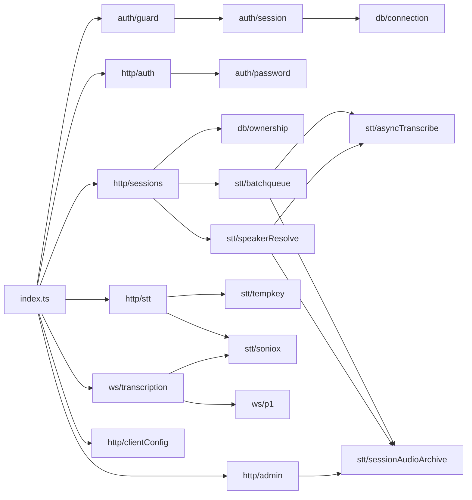

# Application Architecture

> **وضعیت:** ACTIVE-CANONICAL · Snapshot 2026-09-13 (working tree). شماره‌خط‌ها snapshot هستند؛ به نامِ symbol اعتماد کنید.

## ۱. Backend (`server/`)

### 1.1 ساختار

```
server/src/
├── index.ts               entry: health، ثبتِ pluginها، static، migrate، sweepers، listen
├── auth/
│   ├── guard.ts           registerAuthContext (hook سراسری onRequest)، requireAuth، requireAdmin
│   ├── session.ts         createSession / resolveSession / destroySession (هشِ SHA-256)
│   └── password.ts        scrypt: hashPassword / verifyPassword
├── db/
│   ├── connection.ts      Pool (client_encoding=UTF8)، query() با لاگِ کوئریِ >100ms
│   ├── migrate.ts         runMigrations: جدولِ _migrations + اجرای ترتیبیِ *.sql
│   ├── ownership.ts       getOwnedClient / getOwnedSession
│   └── migrations/        001..011
├── http/
│   ├── auth.ts            /api/auth/* (register, login, logout, me) + ensureAdminFlag
│   ├── clients.ts         /api/clients*, /api/recovered
│   ├── sessions.ts        /api/sessions*, /api/notes/:id, batch-*, resolve-speakers, voice-note
│   ├── stt.ts             /api/stt/check, /api/stt/realtime-session
│   ├── admin.ts           /api/admin/*
│   └── clientConfig.ts    /api/client-config
├── stt/
│   ├── tempkey.ts         mintTemporaryKey (POST /v1/auth/temporary-api-key)
│   ├── asyncTranscribe.ts upload → transcription → poll → tokens → delete
│   ├── batchqueue.ts      صفِ فایلِ صدا، processBatchQueue، mergeBatchTranscript، sweep
│   ├── sessionAudioArchive.ts  آرشیوِ ادمین + sweep ۱۴روزه
│   ├── speakerResolve.ts  concat با ffmpeg + رونویسیِ async + job map
│   └── soniox.ts          SonioxEngine (WS سمتِ سرور؛ فقط legacy و /api/stt/check)
└── ws/
    ├── transcription.ts   /ws/t/:sessionId (P1)، /ws/voice/:sessionId
    └── p1.ts              state و پارامترهای ordering/grace
```

### 1.2 ترتیبِ بوت (`server/src/index.ts`)
1. `dotenv/config` (`.env` از cwd).
2. `Fastify({ logger: true })`؛ `GET /api/health` (بدونِ auth).
3. `register(multipart)` → `registerAuthContext(app)` (کوکی + hook سراسری) → pluginهای `authRoutes`، `adminRoutes`، `clientRoutes`، `sessionRoutes`، `sttRoutes`، `clientConfigRoutes`، `transcriptionRoutes`.
4. `fastifyStatic` روی `public/`.
5. `start()`: `runMigrations()` → `sweepOldBatchFiles()` → `sweepOldSessionAudio()` + interval ۲۴h → interval ساعتیِ `sweepOldResolveJobs` → `listen(PORT, 0.0.0.0)`. هر خطا → `process.exit(1)`.

### 1.3 الگوها و قراردادها
- **Plugin per resource** با `app.addHook('preHandler', requireAuth|requireAdmin)` داخلِ plugin (encapsulated).
- **SQL خام پارامتری** از طریقِ `query()`؛ لیستِ ستون‌های `SET` پویا فقط از نام‌های ثابت ساخته می‌شود.
- **خطا:** `reply.code(n); return { error: '<فارسی>', code?: '<machine>' }` — [error-code-catalog](../02-reference/error-code-catalog.md).
- **مالکیت:** قبل از هر عمل روی client/session؛ `UPDATE/DELETE` هم شرطِ `therapist_id` را تکرار می‌کنند (دفاع در عمق).
- **پس‌زمینه:** `promise.catch(()=>{})` بدونِ صفِ مستقل؛ پایداری از طریقِ فایل روی دیسک.
- **لاگ:** `console.log` با پیشوند (`[batch]`، `[stt-mint]`، `[p1]`، ...) + logger داخلیِ Fastify.
- **هیچ لایه‌ی service/repository** مجزا نیست؛ handlerها مستقیم SQL اجرا می‌کنند.

## ۲. Frontend (`public/`)

### 2.1 فایل‌ها

| فایل | خط | نقش |
|---|---|---|
| `index.html` | ~3640 | CSS (tokenهای سیستمِ طراحی)، markup همه‌ی screenها و مدال‌ها، و یک `<script>` بزرگ با همه‌ی منطقِ UI |
| `feelia-rt.js` | ~1220 | IIFE → `window.FeeliaRT` (موتورِ realtime + `AudioQueueDB`) |
| `feelia-analytics.js` | ~290 | IIFE → `window.FeeliaAnalytics` |

ترتیبِ لود: `feelia-rt.js` → `feelia-analytics.js` → inline script؛ `DOMContentLoaded → init()`.

### 2.2 مدلِ UI
- SPA بدونِ router: `showScreen(name)` روی `section#screen<Name>` (`hidden`). URL عوض نمی‌شود.
- state سراسری با `let`های بالای اسکریپت (`currentClient`، `currentSession`، `rtSession`، ...).
- `api(path, options)` = wrapperِ fetch که `err.status`/`err.code` را حفظ می‌کند.
- DOM: ترکیبِ `innerHTML` (با `escapeHtml` برای داده) و `textContent`.
- screenها و جریان: [route-map](../02-reference/route-map.md).

### 2.3 سه مسیرِ realtime هم‌زیست (مهم)

| اولویت | مسیر | شرطِ فعال‌شدن | وضعیت |
|---|---|---|---|
| 1 | `FeeliaRT` (`startNewRTSession`) | `window.FeeliaRT.isAvailable()` (fetch+WebSocket+MediaRecorder+getUserMedia) و `start()` موفق (شاملِ حالتِ durable-only) | **اصلی** |
| 2 | `SonioxDirect` (`startDirectLive`) | FeeliaRT ناموجود/`start()` false، و `localStorage.feelia_direct !== '0'` | LEGACY |
| 3 | proxyِ `/ws/t` (`connectWS`) | fallbackِ SonioxDirect یا `feelia_direct='0'` | LEGACY |

یادداشتِ صوتی: `startVoiceNoteDirect` (FeeliaRT mode `note`) → در غیرِ این صورت `/ws/voice`.
توجه: `start()` در FeeliaRT فقط وقتی میکروفون در دسترس نباشد false برمی‌گرداند؛ پس مسیرهای ۲ و ۳ عملاً فقط در مرورگرهای فاقدِ API یا بدونِ میکروفون فعال می‌شوند (**INFERRED** از کد).

### 2.4 ذخیره‌سازیِ سمتِ مرورگر
[configuration-catalog §4](../02-reference/configuration-catalog.md).

## ۳. وابستگی‌های بین‌لایه‌ای



هیچ وابستگیِ چرخه‌ای دیده نشد (import پویا در `batchqueue.ts` برای `asyncTranscribe`/`sessionAudioArchive`).
