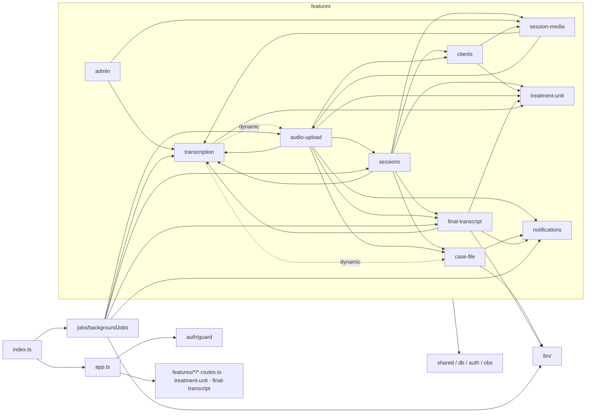

# Application Architecture

> **وضعیت:** ACTIVE-CANONICAL · last-verified: 2026-09-30 @ `17d6919` · قواعدِ مرز = [LAW-025](../00-governance/project-laws.md) · نگاشتِ feature↔سند: [feature-index](../02-reference/feature-index.md). شماره‌خط‌ها snapshot هستند؛ به نامِ symbol اعتماد کنید.

## ۱. Backend (`server/`)

> **چرا ماژولار (2026-09-28):** ساختارِ لایه‌ایِ قدیم (`http/`، `stt/`، `ws/`) به `features/*` منتقل شد **بدونِ تغییرِ رفتار** (route snapshot، API contract harness، SQL و promptها یکسان؛ [verification](../../verification/2026-09-28-backend-modular-refactor-v2.md)). نگاشتِ مسیرهایِ قدیم→جدید: [repository-map](../02-reference/repository-map.md).

### 1.1 ساختار

```
server/src/
├── index.ts                 entry: dotenv → buildApp → migrations → startBackgroundJobs → listen (+ SIGTERM/SIGINT)
├── app.ts                   buildApp(): Fastify + multipart + auth context + obs hooks + route pluginها + static + /api/health
├── jobs/backgroundJobs.ts   همه‌ی sweep/workerها با همان ترتیب/interval
├── shared/                  primitiveهایِ بی‌دامنه: keyedLock، rateLimit، persianDigits، jalali، ffmpeg (FFMPEG_BIN)، httpRange،
│                            sessionSttContext (contextِ ثابتِ Soniox — مشترکِ transcription و treatment-unit)
├── llm/                     لایه‌ی LLMِ مستقل از provider: config · jsonCall · healthAlert (مصرف: case-file، final-transcript، jobs)
├── db/  auth/  obs/         platform (obs/obs.routes.ts = POST /api/obs/events)
└── features/
    ├── auth/                auth.routes.ts · therapists.repository.ts
    ├── clients/             clients.routes.ts · clients.repository.ts · consent.ts · index.ts
    ├── sessions/            sessions.routes.ts (CRUD + tail؛ pluginهایِ فرزند را ثبت می‌کند) · notes.routes.ts · batch.routes.ts
    │                        · voiceNote.legacy.ts (LAW-015) · sessions.repository.ts · sessionDate.ts · sessionNumber.ts · autoClose.ts · index.ts
    ├── transcription/       stt.routes.ts · soniox/{config,restClient,tempKey}.ts · signMarkers.ts · speakerResolve.ts · index.ts
    │   ├── batch/           queueFiles.ts · recoveryMerge.ts · processQueue.ts · sweep.ts
    │   └── archive/         store.ts · ffmpegOps.ts · archiveWrite.ts · listing.ts · fullAudio.ts · sweep.ts
    ├── session-media/       purge.ts (دُمِ مشترکِ حذفِ آبشاری: پوشه‌هایِ صدا + منابعِ Soniox) · index.ts
    ├── admin/               admin.routes.ts (requireAdmin) → therapists/sessions/audio/export/obs .admin.ts
    │                        · admin.repository.ts · diagnosis.ts (تابعِ خالص) · filters.ts
    ├── audio-upload/        uploads.routes.ts · uploads.repository.ts · uploadSession.ts · groupFinalize.ts · uploadLocks.ts
    │                        · jobMachine.ts · jobStore.sql.ts · worker.ts · quota.ts · sonioxRefs.ts · orphanSweep.ts
    │                        · uploadStore.ts · media.ts · quality.ts · index.ts
    ├── notifications/       notify.ts · notifications.routes.ts · index.ts
    ├── case-file/           api/ · application/ (+ writeCaseFileWithCas) · domain/ · ports/ · adapters/ · prompts/ · composition.ts · index.ts
    ├── treatment-unit/      واحدِ درمان (فردی/زوج/خانواده، اعضا، رویکردها) — index.ts routeها را هم export می‌کند
    ├── final-transcript/    «متنِ نهایی» (worker + runner + api + adapters) — index.ts routeها و worker را export می‌کند
    ├── client-config/       clientConfig.routes.ts
    └── legacy-ws/           transcription.routes.ts (/ws/t، /ws/voice) · p1.ts · soniox.ts — محتوا frozen (LAW-015)
```

### 1.2 ترتیبِ بوت (`server/src/index.ts`)
1. `dotenv/config` (اولین import؛ `.env` از cwd).
2. `buildApp()` (`app.ts`): Fastify با logger (redact کوکی/Authorization)؛ `GET /api/health`؛ `multipart` → `registerAuthContext` → `registerObsHooks`
   → route pluginها به همان ترتیبِ قبلی (auth، admin، clients، sessions، stt، client-config، legacy-ws، case-file، treatment-unit، obs، یک scopeِ
   encapsulated برایِ آپلود + اعلان‌ها با parserِ `application/octet-stream`، final-transcript) → `fastifyStatic` رویِ `public/` → hookِ `onClose` (flushِ obs).
3. `start()`: `runMigrations()` → `startBackgroundJobs()` → `listen(PORT, 0.0.0.0)`. هر خطا → `process.exit(1)`.

### 1.3 الگوها و قراردادها
- **Plugin per feature** با `app.addHook('preHandler', requireAuth|requireAdmin)`؛ زیرماژول‌ها pluginِ فرزندند و گارد را به ارث می‌برند
  (sessions: notes/batch/voice-note؛ admin: therapists/sessions/audio/export/obs).
- **Repository:** SQLِ خامِ پارامتری در `*.repository.ts` (و تراکنش‌هایِ ساختِ جلسه در `sessions.repository.ts` / `audio-upload/uploadSession.ts`)؛
  handler فقط validation، ترتیبِ عملیات، پاسخ، `logEvent` و ممیزی را دارد.
- **مرزها (`pnpm test:arch`):** featureها فقط از `features/<x>/index.ts` یکدیگر import می‌کنند؛ `shared/`، `db/`، `auth/`، `obs/` هرگز از
  features import نمی‌کنند؛ `app.ts`/`jobs/` فقط `index.ts` یا `*.routes.ts`؛ چرخه‌ی importِ استاتیک ممنوع؛ لایه‌بندیِ case-file/treatment-unit/final-transcript (R5)؛ هر feature `index.ts` دارد (R7، با allowlistِ نام‌دار).
  `index.ts`ِ featureهایِ قدیمی‌تر routeها را export **نمی‌کند** (routeها را `app.ts` مستقیم import می‌کند) — همین از چرخه‌ی
  audio-upload → sessions → session-media → audio-upload جلوگیری می‌کند. treatment-unit و final-transcript از ابتدا routeها را
  از `index.ts` می‌دادند و همان‌طور ماندند (R3 هر دو شکل را می‌پذیرد).
- **Import پویا (lazy):** batch → archive/Soniox/case-file/treatment-unit و archive → audio-upload عمداً پویا مانده‌اند (زمان‌بندیِ بارگذاری جزوِ رفتار است).
- **state درون‌حافظه‌ای (LAW-013):** هر ماژول instanceِ خودش را از `createKeyedLock()`/`createRateLimiter()` می‌سازد.
- **خطا:** `reply.code(n); return { error: '<فارسی>', code?: '<machine>' }` — [error-code-catalog](../02-reference/error-code-catalog.md).
- **مالکیت:** قبل از هر عمل روی client/session؛ `UPDATE/DELETE` هم شرطِ `therapist_id` را تکرار می‌کنند (دفاع در عمق).
- **لاگ:** `console.log` با پیشوند (`[batch]`، `[stt-mint]`، `[p1]`، ...) + `logEvent`/`recordAudit` (obs).

## ۲. Frontend (`public/`)

### 2.1 فایل‌ها

| فایل | نقش |
|---|---|
| `index.html` | CSS (tokenهای سیستمِ طراحی)، markup همه‌ی screenها (۱۶) و مدال‌ها (۱۸)، و یک `<script>` بزرگِ global با همه‌ی منطقِ UI (≈۴۵۰ تابع؛ بدونِ قانونِ ساختاری — backlog) |
| `feelia-rt.js` | IIFE → `window.FeeliaRT` (موتورِ realtime + `AudioQueueDB`) — [subsystem 01](../07-subsystems/01-browser-realtime-engine.md) |
| `feelia-analytics.js` | IIFE → `window.FeeliaAnalytics` (Clarity) |
| `feelia-obs.js` | IIFE → `window.FeeliaObs` (تله‌متریِ کلیک/ناوبری به `/api/obs/events`) |
| `feelia-upload.js` | IIFE → `window.FeeliaUpload` (آپلودِ تکه‌تکه/قابلِ ادامه) — [subsystem 06](../07-subsystems/06-audio-upload-pipeline.md) |

ترتیبِ لود: `feelia-rt.js` → `feelia-analytics.js` → `feelia-obs.js` → `feelia-upload.js` → inline script؛ `DOMContentLoaded → init()`. فرانتِ جدید برایِ فیچرِ جدید در IIFEِ جدا (LAW-025). نقشه‌ی تابع/state: [frontend-map](../02-reference/frontend-map.md).

### 2.2 مدلِ UI
- SPA بدونِ router: `showScreen(name)` روی `section#screen<Name>` (`hidden`). URL عوض نمی‌شود.
- state سراسری با `let`های بالای اسکریپت (`currentClient`، `currentSession`، `rtSession`، ...).
- `api(path, options)` = wrapperِ fetch که `err.status`/`err.code` را حفظ می‌کند.
- DOM: ترکیبِ `innerHTML` (با `escapeHtml` برای داده) و `textContent`.
- screenها و جریان: [route-map](../02-reference/route-map.md).

### 2.3 سه مسیرِ realtime هم‌زیست (مهم)

| اولویت | مسیر | شرطِ فعال‌شدن | وضعیت |
|---|---|---|---|
| 1 | `FeeliaRT` (`startNewRTSession`) | `window.FeeliaRT.isAvailable()` (fetch+WebSocket+MediaRecorder+getUserMedia) و `start()` موفق (شاملِ حالتِ durable-only) | **اصلی** |
| 2 | `SonioxDirect` (`startDirectLive`) | FeeliaRT ناموجود/`start()` false، و `localStorage.feelia_direct !== '0'` | LEGACY |
| 3 | proxyِ `/ws/t` (`connectWS`) | fallbackِ SonioxDirect یا `feelia_direct='0'` | LEGACY |

یادداشتِ صوتی: `startVoiceNoteDirect` (FeeliaRT mode `note`) → در غیرِ این صورت `/ws/voice`.
توجه: `start()` در FeeliaRT فقط وقتی میکروفون در دسترس نباشد false برمی‌گرداند؛ پس مسیرهای ۲ و ۳ عملاً فقط در مرورگرهای فاقدِ API یا بدونِ میکروفون فعال می‌شوند (**INFERRED** از کد).

### 2.4 ذخیره‌سازیِ سمتِ مرورگر
[configuration-catalog §4](../02-reference/configuration-catalog.md).

## ۳. وابستگی‌های بین‌لایه‌ای


```mermaid
flowchart LR
  idx[index.ts] --> app[app.ts] --> guard[auth/guard]
  idx --> jobs[jobs/backgroundJobs]
  app --> R[features/*/*.routes.ts · treatment-unit · final-transcript]
  subgraph features
    sessions --> transcription
    sessions --> sessionMedia[session-media]
    sessions --> clients
    sessions --> caseFile[case-file]
    sessions --> tu[treatment-unit]
    sessions --> ft[final-transcript]
    admin --> transcription
    admin --> sessionMedia
    clients --> sessionMedia
    clients --> tu
    sessionMedia --> transcription
    sessionMedia --> audioUpload[audio-upload]
    audioUpload --> transcription
    audioUpload --> sessions
    audioUpload --> clients
    audioUpload --> caseFile
    audioUpload --> notifications
    audioUpload --> tu
    audioUpload --> ft
    caseFile --> notifications
    ft --> transcription
    ft --> tu
    ft --> notifications
    transcription --> tu
    transcription -. dynamic .-> caseFile
    transcription -. dynamic .-> audioUpload
  end
  caseFile --> llm[llm/]
  ft --> llm
  jobs --> transcription
  jobs --> audioUpload
  jobs --> sessions
  jobs --> notifications
  jobs --> ft
  jobs --> llm
  features --> platform[shared / db / auth / obs]
```

فلشِ هر feature به featureِ دیگر یعنی importِ `features/<x>/index.ts` (یا routeها از `app.ts`). `pnpm test:arch` نبودِ چرخه‌ی importِ
استاتیک را در کلِ `server/src` بررسی می‌کند؛ فلش‌هایِ نقطه‌چین importِ پویا (lazy) هستند و در چرخه شمرده نمی‌شوند.
