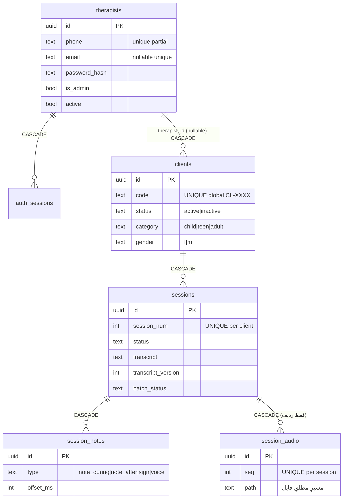
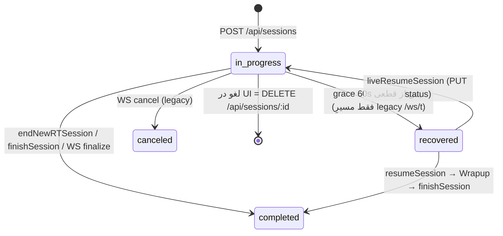
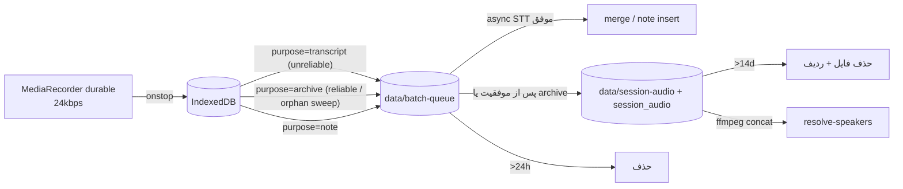

# Data Architecture

> **وضعیت:** ACTIVE-CANONICAL · مالکِ جزئیاتِ ستون‌ها: [database-catalog](../02-reference/database-catalog.md). این سند مدل، مالکیت و چرخه‌ی عمر را توضیح می‌دهد.

## ۱. محل‌های نگهداریِ داده

| محل | چه چیزی | حساسیت | نگهداری |
|---|---|---|---|
| MySQL (production، از 2026-09-16؛ Postgres قبلی روی سرور نگه داشته شده برایِ rollback) | حساب‌ها، نشست‌های auth، مراجعین، جلسات + متن، یادداشت/علائم، متادیتای صدای آرشیو | بسیار بالا | نامحدود تا حذف |
| `<cwd>/data/batch-queue/` | فایل‌های `.webm` در انتظارِ رونویسی/آرشیو | بسیار بالا | تا موفقیت؛ فایل‌های قدیمی‌تر از ۲۴h در startup حذف |
| `<cwd>/data/session-audio/<sessionId>/NNNNNN.webm` | آرشیوِ صدا برای ادمین | بسیار بالا | ۱۴ روز (startup + هر ۲۴h) |
| `os.tmpdir()/feelia-speaker-resolve-*` | concatِ موقتِ ffmpeg | بسیار بالا | حذف در `finally` |
| حافظه‌ی پروسه | P1 records (شاملِ hint و بافرِ صدا)، jobهای resolve (متنِ preview)، mintHits | بالا | تا ری‌استارت؛ jobها >۲h حذف |
| Soniox | فایل و transcriptionِ async | بسیار بالا | در `finally` حذف می‌شوند (`deleteTranscription`، `deleteFile`) |
| مرورگر IndexedDB `feelia-audio/segments` | سگمنت‌های ۶۰ثانیه‌ای صدا | بسیار بالا | تا آپلودِ موفق/abort؛ سقفِ کل ۳۰۰MB |
| مرورگر localStorage | `feelia_active_session`، `feelia_direct`، `feelia_ux_consent_v1:<therapistId>` | متوسط (شناسه) | نامحدود |
| مرورگر sessionStorage | `p1c-<sessionId>` | پایین | تب |
| لاگ‌های سرور | شناسه‌ها، طول‌ها؛ **به‌علاوه‌ی دُمِ متن در `DIAG-TEMP`** | متغیر | بسته به pm2/journal (UNVERIFIED) |

## ۲. مدلِ موجودیت‌ها

## ۳. مالکیت و ایزولاسیون

- مالکیت از طریقِ زنجیره‌ی `session → client → therapist_id`؛ جدولِ `sessions` ستونِ therapist ندارد.
- `clients.therapist_id` nullable است (migration 004 با `ADD COLUMN`). مراجعینِ ساخته‌شده قبل از 004 بدونِ مالک هستند: برای هیچ تراپیستی نمایش داده نمی‌شوند و در export ادمین (که بر اساسِ therapist است) هم نمی‌آیند — **INFERRED**؛ وجودِ چنین ردیف‌هایی در production نامعلوم است.
- `clients.code` در کلِ سیستم یکتاست (نه per-therapist).

## ۴. چرخه‌ی عمر

### 4.1 جلسه (`sessions.status`)

- `PUT /api/sessions/:id` هر رشته‌ای را برای `status` می‌پذیرد (بدونِ اعتبارسنجی).
- `recovered` فقط توسطِ `ws/transcription.ts` تولید می‌شود؛ مسیرِ FeeliaRT هیچ‌وقت آن را تنظیم نمی‌کند (**INFERRED** از grep).

### 4.2 متن (`transcript`, `transcript_version`)
مالک: [subsystem 03](../07-subsystems/03-transcript-integrity.md).

### 4.3 صدا

### 4.4 حذف
| عمل | اثر در DB | اثر روی فایل‌ها |
|---|---|---|
| حذفِ تراپیست (ادمین) | cascade: auth_sessions، clients، sessions، notes، session_audio | **فایل‌های `data/session-audio` حذف نمی‌شوند** و sweeper (که از ردیف‌ها می‌خواند) پیدایشان نمی‌کند → یتیمِ دائمی (**INFERRED**) |
| حذفِ مراجع | cascade: sessions، notes، session_audio | همان |
| حذفِ جلسه / لغو | cascade: notes، session_audio | همان؛ فایل‌های batch-queue تا ۲۴h |
| abort در مرورگر | — | `AudioQueueDB.clearForSession` |
| logout | نشستِ auth حذف | IndexedDB دست نمی‌خورد |
| انقضای نشست auth | ردیف باقی می‌ماند (بدونِ sweeper) | — |

## ۵. migration

- اجرا: خودکار در startup، ترتیبِ الفبایی، ثبت در `_migrations(name)`؛ هر فایل در یک `query()` (بدونِ transaction صریح).
- تاریخچه: 001–014 در git (008–014 با commitِ `54a17fd`، 2026-09-15؛ هنوز رویِ production اجرا نشده). 012 افزودنیِ خالص است (`sessions.source` = `live`|`manual`). **013 داده را تبدیل می‌کند** (`sessions.date` میلادی/نانرمال → شمسیِ `YYYY/MM/DD`؛ تأییدِ مالک 2026-09-14؛ backup قبل از deploy الزامی). 014 افزودنیِ خالص است (`sessions.date DROP NOT NULL` — فقط `source=manual` بدونِ ورودی می‌تواند `NULL` بماند). 009 داده را تبدیل می‌کند (`adult-f/m → adult + gender`).
- قوانین: LAW-007.

## ۶. ریسک‌های داده

| ریسک | منبع |
|---|---|
| فایل‌های یتیمِ صدا بعد از حذف | §4.4 |
| نبودِ sweeper برای `auth_sessions` منقضی | `auth/session.ts` |
| export ادمین فیلدهای `status/category/gender/specialty` و `stt_mode`… را ندارد | `buildTherapistExport` در `http/admin.ts` |
| `date`/`start_time` به‌صورتِ TEXT — C4 (فرمتِ ناهمگون) رفع شد: شمسیِ `YYYY/MM/DD` و `HH:MM` با ارقامِ لاتین، نرمال‌سازی در `http/sessionDate.ts`، تبدیلِ داده‌ی قبلی با migration 013، `date` با 014 nullable (فقط `source=manual`) — همه commit شده در `54a17fd` (2026-09-15) | `002_sessions.sql`، `POST`/`PUT /api/sessions`، `013_session_date_jalali.sql`، `014_session_date_optional.sql` |
| `offset_ms || null` مقدارِ 0 را null می‌کند | `POST /api/sessions/:id/notes` |
| `/api/recovered` متنِ کاملِ جلسات را برمی‌گرداند در حالی که UI فقط متادیتا لازم دارد | `http/clients.ts` |
