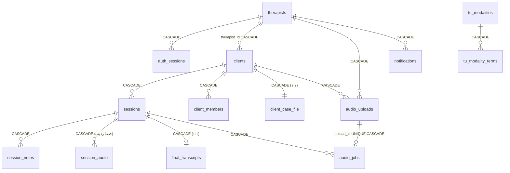
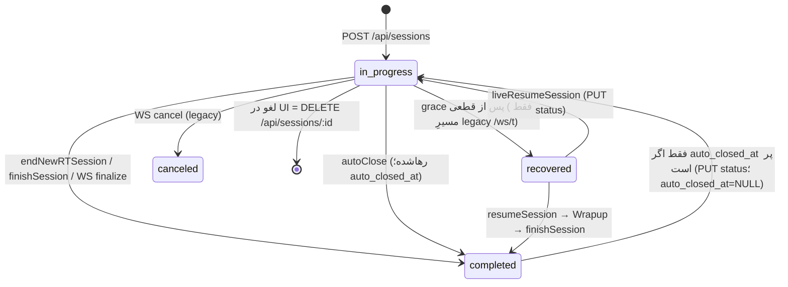
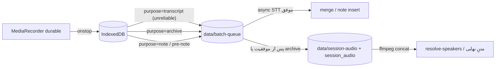

# Data Architecture

> **وضعیت:** ACTIVE-CANONICAL · last-verified: 2026-09-30 @ `17d6919`
> مالکِ جزئیاتِ ستون‌ها و **مالکِ هر جدول**: [database-catalog](../02-reference/database-catalog.md). این سند مدل، مالکیت و چرخه‌ی عمر را توضیح می‌دهد.
> منبعِ schema: `server/src/db/mysql/migrations/001–046` (MySQL 8؛ اجرا در startup با `server/src/db/migrate.ts`).

## ۱. محل‌های نگهداریِ داده

مقدارِ نگهداری/سقف‌ها فقط در [configuration-catalog](../02-reference/configuration-catalog.md) است؛ اینجا به‌صورتِ کیفی آمده (LAW-027).

| محل | چه چیزی | حساسیت | نگهداری / مالک |
|---|---|---|---|
| MySQL | حساب‌ها، نشست‌هایِ auth، مراجعین/اعضا، جلسات + متن، یادداشت/علائم، متادیتایِ صدا، پرونده، آپلود/job، «متنِ نهایی»، اعلان‌ها، رصد/ممیزی | بسیار بالا | نامحدود تا حذف؛ `obs_*` و `audit_log` بر اساسِ سن (LAW-010) — [database-catalog](../02-reference/database-catalog.md) |
| `<cwd>/data/batch-queue/` | فایل‌هایِ صدایِ در انتظارِ رونویسی/آرشیو | بسیار بالا | گذرا؛ پاک‌سازی در startup و ساعتی — [subsystem 02](../07-subsystems/02-audio-durability-batch-fallback.md) |
| `<cwd>/data/session-audio/<sessionId>/` | آرشیوِ صدا برایِ ادمین (شاملِ نسخه‌ی نرمال‌شده‌ی آپلود و صدایِ `note-`/`prenote-`) | بسیار بالا | آرشیوِ محدود (LAW-010) — [subsystem 05](../07-subsystems/05-session-audio-archive-speaker-resolve.md) |
| `<cwd>/data/uploads/<uploadId>/` | تکه‌هایِ آپلودِ فایلِ صوتیِ جلسه + `source.*` | بسیار بالا | تا پایانِ نرمال‌سازی؛ یتیم‌ها حذف — [subsystem 06](../07-subsystems/06-audio-upload-pipeline.md) |
| `os.tmpdir()/feelia-speaker-resolve-*` | concatِ موقتِ ffmpeg | بسیار بالا | حذف در `finally` |
| حافظه‌ی پروسه | P1 records، jobهایِ resolve، `mintHits`، قفل‌هایِ کلیددار (`shared/keyedLock.ts`) | بالا | تا ری‌استارت (LAW-013) |
| Soniox (خارجی) | فایل و transcriptionِ async | بسیار بالا | حذف در `finally`/پس از ثبتِ متن؛ یتیم‌هایِ بعد از کرش با `sweepSonioxOrphans` (فقط با فلگِ prod) — [subsystem 06](../07-subsystems/06-audio-upload-pipeline.md) |
| LLM provider (خارجی) | متنِ جلسه/پرونده برایِ polish و تولیدِ پرونده | بسیار بالا | سیاستِ provider — [llm-provider-layer](../06-platform/llm-provider-layer.md)، [integration-architecture](integration-architecture.md) |
| مرورگر IndexedDB | `feelia-audio/segments` (سگمنتِ صدایِ durable)، `feelia-uploads/tasks` (فایلِ آپلودی)، `feelia-predraft/clips` (پیش‌نویسِ صوتیِ pre-note) | بسیار بالا | تا آپلودِ موفق/لغو/انقضا — [configuration-catalog §۴](../02-reference/configuration-catalog.md) |
| مرورگر localStorage/sessionStorage | `feelia_active_session`، `feelia_note_outbox`، `feelia_pending_complete`، `feelia_direct`، `feelia_theme`، `feelia-cf-open:*`، `p1c-<sessionId>` | متوسط (شناسه؛ outbox شاملِ متنِ یادداشت) | تا پاک‌سازی — همان بخش |
| لاگ‌هایِ سرور | شناسه‌ها/طول‌ها + JSONL رصد (`obs/fileSink.ts`)؛ **به‌علاوه‌ی دُمِ متن در `DIAG-TEMP`** (نقضِ LAW-001) | متغیر | pm2/journal (UNVERIFIED) + چرخشِ فایلِ obs |

## ۲. مدلِ موجودیت‌ها

```mermaid
erDiagram
  therapists ||--o{ auth_sessions : "CASCADE"
  therapists ||--o{ clients : "therapist_id CASCADE"
  therapists ||--o{ audio_uploads : "CASCADE"
  therapists ||--o{ notifications : "CASCADE"
  clients ||--o{ sessions : "CASCADE"
  clients ||--o{ client_members : "CASCADE"
  clients ||--|| client_case_file : "CASCADE (۱:۱)"
  clients ||--o{ audio_uploads : "CASCADE"
  sessions ||--o{ session_notes : "CASCADE"
  sessions ||--o{ session_audio : "CASCADE (فقط ردیف)"
  sessions ||--o| final_transcripts : "CASCADE (۱:۱)"
  sessions ||--o{ audio_jobs : "CASCADE"
  audio_uploads ||--o| audio_jobs : "upload_id UNIQUE CASCADE"
  tu_modalities ||--o{ tu_modality_terms : "CASCADE"
```

جدول‌هایِ بدونِ FK (عمدی): `obs_events`، `obs_ui_events`، `audit_log` (ردِ حسابرسی بعد از حذف می‌ماند)، کاتالوگِ `tu_unit_types`/`tu_member_roles` (مرجعِ کدها؛ اعتبار در دامنه). `client_case_file.generated_from_session_id` عمداً بدونِ FK. ستون‌ها: [database-catalog](../02-reference/database-catalog.md).

## ۳. مالکیت و ایزولاسیون

- مالکیتِ داده از زنجیره‌ی `session → client → therapist_id`؛ `sessions` ستونِ therapist ندارد (بجز جدول‌هایِ job/آپلود/«متنِ نهایی» که `therapist_id` را برایِ کوئریِ سریع دارند).
- `clients.therapist_id` nullable است (migration 004 با `ADD COLUMN`): مراجعینِ پیش از 004 بدونِ مالک‌اند و برایِ هیچ تراپیستی/export نمی‌آیند — **INFERRED**؛ وجودشان در production نامعلوم است.
- `clients.code` در کلِ سیستم یکتاست (نه per-therapist).
- دسترسی فقط با `getOwnedClient`/`getOwnedSession` (`server/src/db/ownership.ts`، LAW-004).

## ۴. چرخه‌ی عمر

### 4.1 جلسه (`sessions.status`)

```mermaid
stateDiagram-v2
  [*] --> in_progress: POST /api/sessions
  in_progress --> recovered: grace پس از قطعی (فقط مسیرِ legacy /ws/t)
  recovered --> in_progress: liveResumeSession (PUT status)
  in_progress --> completed: endNewRTSession / finishSession / WS finalize
  in_progress --> completed: autoClose (رهاشده؛ auto_closed_at)
  completed --> in_progress: فقط اگر auto_closed_at پر است (PUT status؛ auto_closed_at=NULL)
  recovered --> completed: resumeSession → Wrapup → finishSession
  in_progress --> canceled: WS cancel (legacy)
  in_progress --> [*]: لغو در UI = DELETE /api/sessions/:id
```
- `PUT /api/sessions/:id` فقط `in_progress|recovered|completed|canceled` را می‌پذیرد (`400 invalid-status`)؛ `completed`/`canceled` نهایی‌اند (`409 invalid-transition`) مگر جلسه‌ی بسته‌شده‌ی خودکار (`auto_closed_at`) که تراپیست ادامه‌اش دهد (A5، 2026-09-26).
- `recovered` فقط توسطِ `features/legacy-ws/transcription.routes.ts` تولید می‌شود.
- بستنِ خودکار: `features/sessions/autoClose.ts` ([ماژول 03](../04-modules/03-therapy-sessions/module-prd.md)).

### 4.2 متن (`transcript`, `transcript_version`)
مالک: [subsystem 03](../07-subsystems/03-transcript-integrity.md). **چند featureِ دیگر هم `sessions.transcript` را می‌نویسند** (آپلود، batch، legacy-ws؛ [database-catalog §۰](../02-reference/database-catalog.md)) — همه باید LAW-008 را رعایت کنند؛ API واحدِ نوشتن در backlog است (LAW-025).

### 4.3 صدا

```mermaid
flowchart LR
  MR["MediaRecorder durable"] -->|onstop| IDB[("IndexedDB")]
  IDB -->|"purpose=transcript (unreliable)"| Q[("data/batch-queue")]
  IDB -->|"purpose=archive"| Q
  IDB -->|"purpose=note / pre-note"| Q
  Q -->|async STT موفق| M["merge / note insert"]
  Q -->|پس از موفقیت یا archive| AR[("data/session-audio + session_audio")]
  AR -->|ffmpeg concat| RS["resolve-speakers / متنِ نهایی"]
```

**مسیرِ آپلودِ فایل:** `File` → IndexedDB `feelia-uploads` → تکه‌ها → `data/uploads/<id>` → `source.*` → ffmpeg → `data/session-audio/<sessionId>/` (`session_audio.source='upload'`) → Soniox async → متن در `sessions.transcript` (exactly-once با `audio_jobs.transcript_applied_at`). [subsystem 06](../07-subsystems/06-audio-upload-pipeline.md).

### 4.4 حذف
حذفِ جلسه/مراجع/تراپیست: cascadeِ DB + **`features/session-media/purge.ts`** (فایل‌هایِ `data/session-audio` و منابعِ Soniox؛ ابتدا `prepareSessionMediaPurge` پیش از `DELETE`، سپس `purgeSessionMedia` بعد از موفقیت) — [session-media-purge](../06-platform/session-media-purge.md). `obs_*`/`audit_log` عمداً باقی می‌مانند (LAW-010).

| عمل | اثر در DB | اثر روی فایل‌ها |
|---|---|---|
| حذفِ تراپیست (ادمین) | cascade به همه‌ی جدول‌هایِ وابسته | purge (بالا)؛ IndexedDBِ مرورگر دست نمی‌خورد |
| حذفِ مراجع / جلسه | cascade | همان |
| abort در مرورگر | — | `AudioQueueDB.clearForSession` |
| logout | نشستِ auth حذف | IndexedDB دست نمی‌خورد |
| انقضای نشستِ auth | ردیف باقی می‌ماند (بدونِ sweeper — INFERRED؛ `auth/session.ts` را ببینید) | — |

## ۵. migration

- اجرا: خودکار در startup، ترتیبِ نامِ فایل، ثبت در `_migrations(name)`؛ هر فایل تکه‌تکه با `;` (idempotency با نادیده‌گرفتنِ errnoهایِ مشخص) — [migrations/README](../../server/src/db/mysql/migrations/README.md)، LAW-007.
- داده‌تغییردهنده‌ها: **009** (`adult-f/m → adult + gender`)، **013** (تاریخِ شمسی؛ `.mjs`)، **030** (برچسبِ seed). بقیه additive.
- تاریخچه و ترجمه‌ی دیالکت از Postgres: [database-catalog](../02-reference/database-catalog.md) (بالا) و `server/src/db/mysql/schema.sql`.

## ۶. ریسک‌هایِ داده

| ریسک | منبع |
|---|---|
| نبودِ sweeper برایِ `auth_sessions` منقضی | `auth/session.ts` |
| export ادمین بعضی فیلدها را ندارد (`status/category/gender/specialty`، `stt_mode`، …) | `buildTherapistExport` در `features/admin/` |
| `offset_ms || null` مقدارِ 0 را null می‌کند | `POST /api/sessions/:id/notes` (INFERRED — بازبینی نشده) |
| `/api/recovered` متنِ کاملِ جلسات را برمی‌گرداند در حالی که UI فقط متادیتا لازم دارد | `features/clients/clients.routes.ts` |
| نوشتنِ چندفeatureیِ `sessions` | LAW-025، [database-catalog §۰](../02-reference/database-catalog.md) |
| متنِ بالینی در `final_transcripts.async_text/clean_text/clean_turns` و `client_case_file.content` (کپیِ مشتق از `sessions.transcript`) | LAW-001 |
