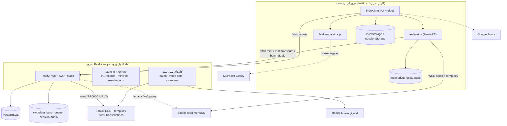
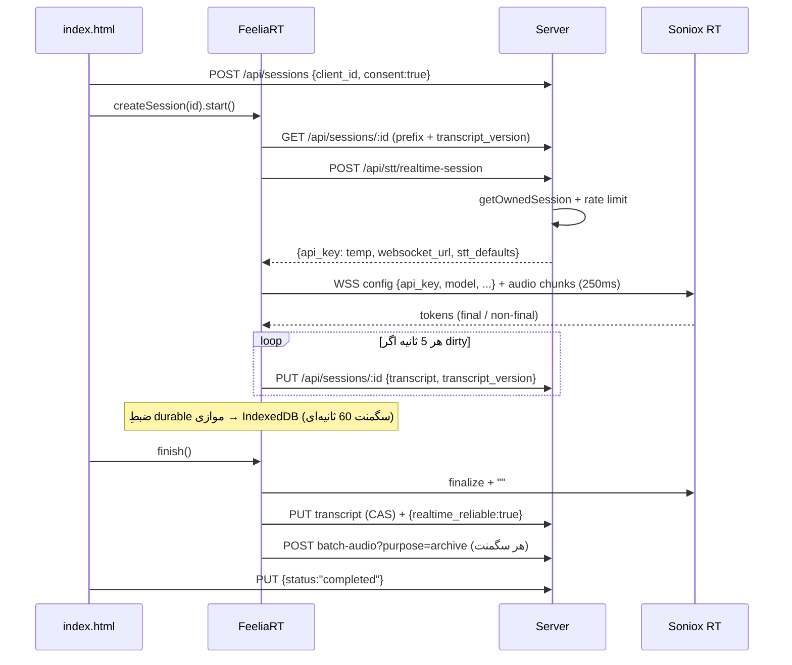

# System Architecture

> **وضعیت:** ACTIVE-CANONICAL · **Snapshot:** working tree، 2026-09-13 · ادعاهای production با UNVERIFIED مشخص‌اند.

## ۱. مرزهای سیستم

| مرز | چه چیزی از آن عبور می‌کند | کنترل |
|---|---|---|
| Browser ↔ Feelia server | JSON، multipart صدا، WS legacy | کوکیِ httpOnly؛ `requireAuth`/`requireAdmin`؛ مالکیت |
| Browser ↔ Soniox realtime | صدای WebM/Opus زنده، توکن‌های متن | کلیدِ موقتِ single-use (۱۲۰ ثانیه اعتبارِ شروع، سقفِ ۷۲۰۰ ثانیه) |
| Server ↔ Soniox REST | کلیدِ اصلی (header)، فایلِ صدای fallback/آرشیو برای رونویسی | `SONIOX_API_KEY`؛ egress اختیاری با `PROXY_URL` |
| Server ↔ PostgreSQL | همه‌ی داده‌ی ساختاریافته | `DATABASE_URL`؛ کوئری‌های پارامتری |
| Server ↔ دیسک | فایل‌های صدا | مسیر نسبت به `process.cwd()`؛ retention |
| Browser ↔ Clarity | رفتارِ UI (masked) | رضایتِ تراپیست + `CLARITY_PROJECT_ID` |

## ۲. اجزا

| جزء | مسئولیت | کد |
|---|---|---|
| SPA shell | screenها، مدال‌ها، فراخوانیِ API، glueِ موتورها | `public/index.html` |
| FeeliaRT | موتورِ اصلیِ realtime، ضبطِ durable، autosave، finish/fallback | `public/feelia-rt.js` |
| FeeliaAnalytics | لودِ مشروطِ Clarity | `public/feelia-analytics.js` |
| HTTP API | auth، clients، sessions، notes، STT، admin، client-config | `server/src/http/*.ts` |
| Auth core | کوکی، resolveِ نشست، guardها، هش | `server/src/auth/*.ts` |
| DB layer | pool، migrate، مالکیت | `server/src/db/*` |
| STT server-side | mint، async transcribe، batch queue، archive، resolve | `server/src/stt/*.ts` |
| Legacy WS | proxyِ `/ws/t` با ordering P1، `/ws/voice` | `server/src/ws/*.ts` |

## ۳. جریان‌های اصلیِ داده

### 3.1 جلسه‌ی موفق (مسیرِ اصلی)

### 3.2 جلسه با قطعی (fallback)
reconnect ناموفق یا هر گپ → `unreliable=true` → در `finish()` سگمنت‌ها با `purpose=transcript` آپلود → سرور صف روی دیسک → `transcribeFileAsync` (stt-async-v5) → `mergeBatchTranscript` (append) → آرشیو برای ادمین. جزئیات: [subsystem 02](../07-subsystems/02-audio-durability-batch-fallback.md).

### 3.3 شکستِ mint در شروع
`start()` مقدارِ `true` برمی‌گرداند با state=`FAILED`؛ ضبطِ durable ادامه دارد؛ بعد از پایان مثلِ 3.2.

## ۴. مرزهای runtime

- **یک پروسه‌ی Node** همه‌ی HTTP/WS/پس‌زمینه را اجرا می‌کند؛ پردازشِ batch و voice-note به‌صورتِ promiseهای fire-and-forget داخلِ همان پروسه‌اند (صفِ پایدار = فایل‌های دیسک).
- sweeperها: `sweepOldBatchFiles` (startup)، `sweepOldSessionAudio` (startup + هر ۲۴ ساعت)، `sweepOldResolveJobs` (هر ساعت) — `server/src/index.ts`.
- مرورگر: موتور در `window.FeeliaRT`؛ registryِ جلساتِ زنده برای `beforeunload`.

## ۵. مرزهای استقرار

- سرور هم فرانت را از `path.join(__dirname,'..','..','public')` سرو می‌کند → فرانت و بک باید با هم deploy شوند.
- TLS داخلِ اپ نیست؛ برای میکروفون HTTPS لازم است → reverse proxy (nginx طبقِ `diag-collect.sh`؛ **UNVERIFIED**).
- جزئیات: [deployment-operations](deployment-operations.md).

## ۶. تصمیم‌های معماریِ مهم (ADRِ ضمنی، استخراج از commitها و کامنت‌ها)

| # | تصمیم | دلیل (از کد/commit) | پیامد |
|---|---|---|---|
| AD-1 | Browser→Soniox مستقیم با temp key (commit `f9b0a9c`) | ساعت‌ها استریمِ صدا از VPS عبور نکند؛ egress VPS ناپایدار | سرور فقط control-plane؛ LAW-003 |
| AD-2 | fail-open + ضبطِ durable | قطعی نباید جلسه‌ی درمانی را خراب کند | پیچیدگیِ صف/merge؛ LAW-012 |
| AD-3 | CAS با `transcript_version` (migration 007) | جلوگیری از overwrite کهنه بینِ تب‌ها/مسیرها | 409 و rebase در کلاینت |
| AD-4 | batch با API async به‌جای موتورِ realtime | دقتِ diarization بالاتر در async | وابستگی به REST Soniox |
| AD-5 | `enable_endpoint_detection:true` (2026-09-14؛ قبلاً false) | کاربر با صدای واقعی کندیِ غیرقابلِ‌قبولِ finalize را گزارش داد؛ طبقِ docs Soniox این تنظیم سرعت را در برابرِ دقتِ diarization معاوضه می‌کند | کپشن سریع‌تر، دقتِ گوینده کمتر — برای یکدست‌سازی، resolve-speakers |
| AD-6 | ادمین = تراپیست + فلگ `is_admin` | سادگی | یک سیستمِ auth |
| AD-7 | export فقط ادمین (commit `de6cb31`) | کنترلِ خروجِ داده | — |
| AD-8 | فرانتِ بدونِ build | سادگی/استقرار | فایلِ ۳۶۴۰ خطی؛ LAW-014 |
| AD-9 | آرشیوِ صدا ۱۴ روزه برای دیباگِ ادمین | ریشه‌یابیِ باگ‌های STT | **تعارض با متنِ رضایت** (C1) |
| AD-10 | مارکرِ صریحِ ناپیوستگی به‌جای ادغامِ گوینده‌ها (commit `da1c4a0`) | نسبت‌دادنِ اشتباهِ گفته در یادداشتِ درمانی خطرناک است | متن شاملِ خطِ مارکر |

## ۷. محدودیت‌های بحرانی

- LAW-013: فقط یک instance.
- HTTPS اجباری برای ضبط.
- صدای ضبط‌شده در مرورگر تا آپلود/پاکسازی در IndexedDB می‌ماند (سقفِ ۳۰۰MB برای همه‌ی جلسات).
- ffmpeg فقط برای resolve-speakers؛ بدونِ آن این قابلیت خطا می‌دهد ولی بقیه کار می‌کند.
