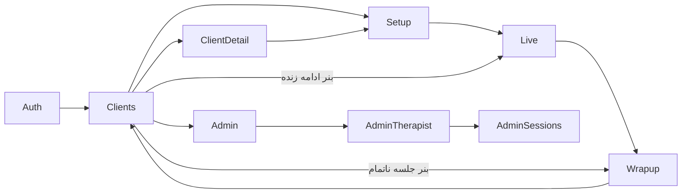

# Route Map — screenهای UI و ثبتِ روت‌های سرور

> **وضعیت:** ACTIVE-CANONICAL · منبع: `public/index.html` (`showScreen`) و `server/src/index.ts`. endpointها: [api-catalog](api-catalog.md).

## ۱. UI — screenها

URL هرگز عوض نمی‌شود؛ ناوبری فقط با `showScreen(name)` که `section#screen<Name>` را نمایش می‌دهد و `FeeliaAnalytics.screen(name)` را صدا می‌زند. نوارِ مراحل (`#stepsNav`) فقط در Setup/Live/Wrapup.

| Screen | ورود از | خروج به | API | Clarity mask |
|---|---|---|---|---|
| `Auth` | `init` ناموفق، `logout` | `Clients` (`enterApp`) | `auth/register|login|me` | کلِ section |
| `Clients` | `enterApp`، بازگشت‌ها، `finishSession`، لغو | `Setup` (کارتِ مراجع)، `ClientDetail`، `Admin`، `Live` (بنرِ ادامه)، `Wrapup` (بنرِ ناتمام) | `clients`، `recovered`، `sessions/:id` | `#searchInput`، `#clientsList`، `#bannerBox` |
| `Setup` | `setupNewSession(client)` | `Live` (`startSession`)، `Clients` | `stt/check`، `POST sessions` | `#setupClientInfo`، `#setupChips` |
| `Live` | `startSession`، `liveResumeSession` | `Wrapup` (`handleFinished`)، `Clients` (لغو) | realtime-session، `PUT sessions`، notes، batch-* | `#recChip`، `#liveConnBanner`، `#liveText`، `#signsRow`، `#signsLog`، `#notesLog`، `.qn-row` |
| `Wrapup` | `handleFinished`، `resumeSession` | `Clients` (`finishSession`، `confirmExitWithoutSave`) | notes، `PUT status=completed`، voice (FeeliaRT/`/ws/voice`) | همه‌ی بلوک‌ها |
| `ClientDetail` | `openClientDetail` | `Setup` (`startFromDetail`)، `Clients` | `clients/:id`، `sessions/:id`، resolve-speakers، `PUT` تاریخ، `DELETE` جلسه | `#detailTitle`، `#sessionsList`، `#sessionDetail` |
| `Admin` | `openAdminPanel` (دکمه‌ی `#adminBtn` فقط برای `is_admin`) | `AdminTherapist`، `Clients` | stats، therapists، export، PATCH/DELETE | کلِ section |
| `AdminTherapist` | `openAdminTherapistDetail` | `AdminSessions`، `Admin` | therapists/:id/clients، DELETE clients | کلِ section |
| `AdminSessions` | `openAdminClientSessions` | `AdminTherapist` | clients/:id/sessions، sessions/:id/audio، stream | کلِ section |

### مدال‌ها
`newClientModal`، `resolveSpeakersModal`، `deactivateClientModal`، `editCategoryModal`، `cancelModal`، `exitModal`، `deleteSessionModal`، `editSessionModal`، `deleteTherapistModal`، `deleteClientModal`. (بجز `cancelModal`، همه `data-clarity-mask`.)

### جریانِ اصلی

### رویدادهای سراسری
- `DOMContentLoaded → init()`.
- `beforeunload`: ارسالِ `close-hint` روی `/ws/t` و هشدارِ خروج اگر هر اتصالی باز باشد.

## ۲. Server — ترتیبِ ثبت (`server/src/index.ts`)

| ترتیب | ثبت | hook | scope |
|---|---|---|---|
| 1 | `GET /api/health` | — | root |
| 2 | `@fastify/multipart` | — | root |
| 3 | `registerAuthContext` (مستقیم، نه register) | `onRequest`: resolve کوکی → `request.therapistId`، `request.isAdmin` | سراسری |
| 4 | `authRoutes` | — | plugin |
| 5 | `adminRoutes` | `preHandler: requireAdmin` | plugin |
| 6 | `clientRoutes` | `preHandler: requireAuth` | plugin |
| 7 | `sessionRoutes` | `preHandler: requireAuth` | plugin |
| 8 | `sttRoutes` | `preHandler: requireAuth` | plugin |
| 9 | `clientConfigRoutes` | `preHandler: requireAuth` | plugin |
| 10 | `transcriptionRoutes` (+ `@fastify/websocket`) | `preHandler: requireAuth` | plugin |
| 11 | `@fastify/static` روی `public/` | — | root |

نتیجه: هر درخواست (حتی static) یک کوئریِ resolveِ نشست اجرا می‌کند اگر کوکی داشته باشد.
