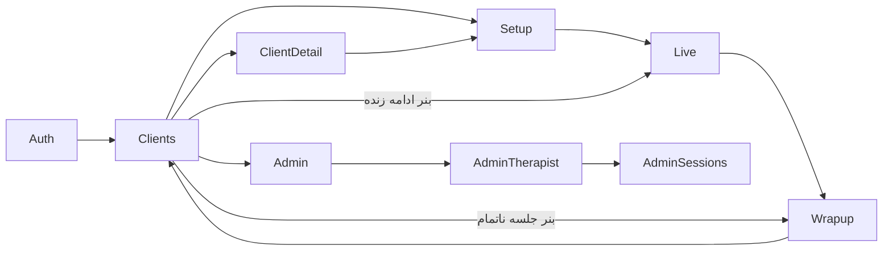

# Route Map — screenهای UI و ثبتِ روت‌های سرور

> **وضعیت:** ACTIVE-CANONICAL · last-verified: 2026-09-30 @ `17d6919` · منبع: `public/index.html` (`showScreen`، ۱۶ صفحه) و `server/src/app.ts` (`buildApp`). نقشه‌ی تابع/state: [frontend-map](frontend-map.md). endpointها: [api-catalog](api-catalog.md).

## ۱. UI — screenها

URL هرگز عوض نمی‌شود؛ ناوبری فقط با `showScreen(name)` که `section#screen<Name>` را نمایش می‌دهد و `FeeliaAnalytics.screen(name)` را صدا می‌زند. نوارِ مراحل (`#stepsNav`) فقط در Setup/Live/Wrapup.

| Screen | ورود از | خروج به | API | Clarity mask |
|---|---|---|---|---|
| `Auth` | `init` ناموفق، `logout` | `Clients` (`enterApp`) | `auth/register|login|me` | کلِ section |
| `Clients` | `enterApp`، بازگشت‌ها، `finishSession`، لغو | `Setup` (کارتِ مراجع)، `ClientDetail`، `Admin`، `Live` (بنرِ ادامه)، `Wrapup` (بنرِ ناتمام) | `clients`، `recovered`، `sessions/:id` | `#searchInput`، `#clientsList`، `#bannerBox` |
| `Setup` | `setupNewSession(client)` | `Live` (`startSession`)، `Clients` | `stt/check`، `POST sessions` | `#setupClientInfo`، `#setupChips` |
| `Live` | `startSession`، `liveResumeSession` | `Wrapup` (`handleFinished`)، `Clients` (لغو) | realtime-session، `PUT sessions`، notes، batch-* | `#recChip`، `#liveConnBanner`، `#liveText`، `#signsRow`، `#signsLog`، `#notesLog`، `.qn-row` |
| `Wrapup` | `handleFinished`، `resumeSession` | `Clients` (`finishSession`، `confirmExitWithoutSave`) | notes، `PUT status=completed`، voice (FeeliaRT/`/ws/voice`) | همه‌ی بلوک‌ها |
| `ClientDetail` | `openClientDetail` | `Setup` (`startFromDetail`)، `Clients` | `clients/:id`، `sessions/:id`، resolve-speakers، `PUT` تاریخ، `DELETE` جلسه | `#detailTitle`، `#sessionsList`، `#sessionDetail` |
| `Admin` | `openAdminPanel` (دکمه‌ی `#adminBtn` فقط برای `is_admin`) | `AdminTherapist`، `Clients` | stats، therapists، export، PATCH/DELETE | کلِ section |
| `AdminTherapist` | `openAdminTherapistDetail` | `AdminSessions`، `Admin` | therapists/:id/clients، DELETE clients | کلِ section |
| `AdminSessions` | `openAdminClientSessions` | `AdminTherapist`، `AdminSessionDetail` | clients/:id/sessions، sessions/:id/audio، stream | کلِ section |
| `AdminSessionDetail` | `openAdminSessionDetail(sessionId, clientTitle)` | `AdminSessions`، `AdminSessionTimeline` | `admin/sessions/:id`، `…/audio`، `…/diagnosis` | کلِ section |
| `AdminActivity` | `openAdminActivity` (ناوبریِ `data-admin-nav="activity"`) | `AdminSessionTimeline`، `AdminSessionDetail` | `admin/sessions/recent`، `admin/obs/*` | کلِ section |
| `AdminSessionTimeline` | `openAdminSessionTimeline(sessionId, title)` | `AdminActivity` | `admin/sessions/:id/timeline` | کلِ section |
| `AdminAudio` | `openAdminAudio` | `AdminSessionDetail` | `admin/audio-archive`، `admin/session-audio/:id/stream`، `DELETE admin/sessions/:id/audio` | کلِ section |
| `AdminVoiceNotes` | `openAdminVoiceNotes` | `AdminSessionDetail` | `admin/voice-notes`، `…/:noteId/text` | کلِ section |
| `AdminLive` | `openAdminLive` (`data-admin-nav="live"`) | `AdminSessionTimeline` | `admin/sessions/live` (poll ۱۵ث، فقط وقتی دیده می‌شود) | کلِ section |
| `AdminQueue` | `openAdminQueue` (`data-admin-nav="queue"`) | `AdminSessionDetail` | `admin/queue`، `POST admin/audio-jobs/:id/retry`، `POST admin/sessions/:id/final-transcript/retry` | کلِ section |
| `AdminSystem` | `openAdminSystem` (`data-admin-nav="system"`) | — | `admin/system` | کلِ section |
| `AllClients` | `showAllClients` | `ClientDetail`، `Clients` | `clients` | — |
| `SessionDetail` | `doViewTranscript(sessionId)` (از `ClientDetail`) | `ClientDetail` | `sessions/:id`، `final-transcript`، `notes` | جزئیاتِ جلسه (mask) |

### مدال‌ها (۱۸)
`newClientModal`، `audioUploadModal`، `resolveSpeakersModal`، `logoutUploadModal`، `deactivateClientModal`، `editCategoryModal`، `editUnitModal`، `modalitiesModal`، `caseFileAutoPromptModal`، `cfAddItemModal`، `cfDeleteItemModal`، `genericConfirmModal`، `cancelModal`، `exitModal`، `deleteSessionModal`، `editSessionModal`، `deleteTherapistModal`، `deleteClientModal`.

### جریانِ اصلی

```mermaid
flowchart LR
  Auth --> Clients
  Clients --> Setup --> Live --> Wrapup --> Clients
  Clients --> ClientDetail --> Setup
  Clients -->|بنر ادامه زنده| Live
  Clients -->|بنر جلسه ناتمام| Wrapup
  Clients --> Admin --> AdminTherapist --> AdminSessions
```

### رویدادهای سراسری
- `DOMContentLoaded → init()`.
- `beforeunload`: ارسالِ `close-hint` روی `/ws/t` و هشدارِ خروج اگر هر اتصالی باز باشد.

## ۲. Server — ترتیبِ ثبت (`server/src/app.ts`، `buildApp`)

| ترتیب | ثبت | hook | scope |
|---|---|---|---|
| 1 | `GET /api/health` | — | root |
| 2 | `@fastify/multipart` | — | root |
| 3 | `registerAuthContext` (مستقیم) | `onRequest`: resolve کوکی → `request.therapistId`، `isAdmin` | سراسری |
| 4 | `registerObsHooks` | لاگِ درخواست/رصد (بلافاصله بعد از auth) | سراسری |
| 5 | `authRoutes`، `adminRoutes`، `clientRoutes`، `sessionRoutes`، `sttRoutes`، `clientConfigRoutes`، `transcriptionRoutes` (legacy WS)، `caseFileRoutes`، `treatmentUnitRoutes`، `obsRoutes` | guard در خودِ plugin (`requireAuth`/`requireAdmin`) | plugin |
| 6 | scopeِ آپلود: `registerUploadChunkParser` + `audioUploadRoutes` + `notificationRoutes` (parserِ `application/octet-stream` روی هر دو — قراردادِ عمدی، FINDING در Event Log) | `requireAuth` | plugin |
| 7 | `finalTranscriptRoutes` | `requireAuth` | plugin |
| 8 | `@fastify/static` روی `public/` | — | root |

نتیجه: هر درخواست (حتی static) یک کوئریِ resolveِ نشست اجرا می‌کند اگر کوکی داشته باشد. قراردادِ دقیقِ method/path/guard: `scripts/route-snapshot.txt` (`pnpm test:routes`).
