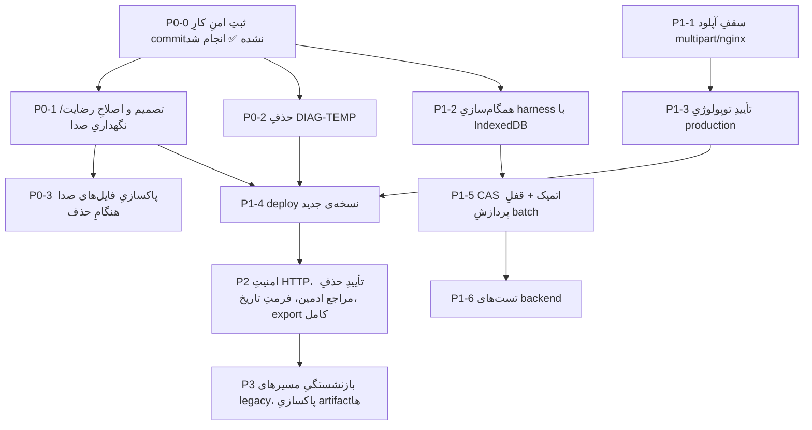

# Master Implementation Plan

> **وضعیت: PROPOSED** — هیچ گامی بدونِ تأییدِ مالک اجرا نمی‌شود. مبنا: یافته‌های ساختِ مستندات در 2026-09-13.
> اولویت‌ها: **P0** = حریمِ خصوصی/از دست رفتنِ داده · **P1** = پایداری/تست · **P2** = کیفیتِ محصول · **P3** = پاکسازی.

## ۱. نقشه‌ی وابستگی

## ۲. گام‌ها

| ID | What | Why | Dependencies | Prerequisites | Risks | Verification | اسنادِ مالک |
|---|---|---|---|---|---|---|---|
| **P0-0** | commit کردنِ کارِ فعلی (migrations+server، frontend، Clarity، docs) بدونِ artifactها | ۱۱ فایلِ modified و ۴ migrationِ untracked در خطرِ از دست رفتن‌اند | — | تأییدِ مالک برای commit (LAW-022) | commit شدنِ اشتباهیِ secret/داده → `git status` دقیق | ✅ **انجام شد** — کدِ محصول در `2763414`…`54a17fd` commit و به `origin/feat/clarity` push شده؛ `git status` برایِ کد تمیز است. فقط خودِ `docs/`/`CLAUDE.md`/`PROJECT_MASTER_REFERENCE.md`/`.claude/` عمداً untracked مانده‌اند (کارِ جداگانه). **باقی‌مانده:** merge به `main` و deploy | repository-map |
| **P0-1** | تصمیمِ مالک: (الف) اصلاحِ متنِ رضایت/privacy note برای توصیفِ دقیقِ ذخیره‌ی صدا (مرورگر + ۱۴ روز سرور + دسترسیِ ادمین)، یا (ب) توقفِ آرشیوِ صدا در جلساتِ موفق (`archiveQueuedAudioOnly`، `sweepOrphanedAudioQueue`) و محدودکردنِ آن به fallback، یا ترکیب | REQ-098، LAW-009؛ ریسکِ اخلاقی/حقوقی R1 | P0-0 | تصمیمِ مالک (احتمالاً مشاوره‌ی حقوقی) | (ب) قابلیتِ resolve-speakers را برای جلساتِ موفق از کار می‌اندازد | متن ↔ رفتار؛ اصلاحِ کامنت‌های C5 | subsystem 02، 05؛ module 03، 06 |
| **P0-2** | حذفِ `tail` متن از لاگ‌های `[diag-transcript]` یا کلِ لاگ | REQ-099، LAW-001/023 | P0-0 | — | از دست رفتنِ دیدِ تشخیصی | grep | platform plan PL-1 |
| **P0-3** | حذفِ فایل‌های صدا در حذفِ جلسه/مراجع/تراپیست + sweepِ یتیم‌ها | REQ-093، LAW-010 | P0-1 | تأییدِ اجرای sweep روی prod | حذفِ ناخواسته | تستِ حذف روی دادهٔ آزمایشی | platform plan PL-3 |
| **P1-1** | تنظیمِ صریحِ سقفِ آپلود و هم‌خوانی با nginx | REQ-100؛ سگمنت‌های >1MiB بی‌پایان در صف می‌مانند | — | عددِ هدف | افزایشِ سطحِ حمله‌ی حجمی | آپلودِ آزمایشی | platform plan PL-2 |
| **P1-2** | افزودنِ stub ِ `indexedDB` (مثلاً `fake-indexeddb` یا stubِ درون‌حافظه‌ای بدونِ dependency) به harness تا T2/T15/T16 سبز شوند | R6؛ LAW-016 | P0-0 | تصمیم درباره‌ی dependencyِ dev | — | `pnpm test:rt` 35/35 در WT | module 04 plan |
| **P1-3** | تأییدِ cwd، مسیرِ `.env`، `data/`، نسخه‌ی مستقرشده، nginx، ffmpeg روی سرور (read-only، مثلاً با `diag-collect.sh`) | C3، R8 | — | دسترسیِ مالک به سرور | — | ثبت در verification/ | deployment-operations |
| **P1-4** | deploy نسخه‌ی جدید (backup DB قبل از migration 009) | اجرای تغییراتِ ثبت‌شده | P0-1، P0-2، P1-1، P1-3 | مجوزِ صریح (LAW-006) | migrationِ داده‌تغییردهنده | health + mint-ok + smoke | deployment-operations |
| **P1-5** | CAS اتمیک در `PUT /api/sessions/:id`؛ جلوگیری از پردازشِ هم‌زمانِ صفِ یک جلسه در `processBatchQueue` | R5؛ subsystem 02 §8.5 | P1-2 | — | تغییرِ رفتارِ 409 | تستِ هم‌زمانی | module 04 plan، subsystem 03 |
| **P1-6** | تست‌های backend برای guard/مالکیت/CAS/admin | شکافِ پوشش | P1-5 | انتخابِ ابزار (`node:test` پیشنهادی) | — | CI محلی | traceability-matrix |
| **P2-1** | امنیتِ HTTP: rate-limit login، `Secure`، headers، UUID validation، حذفِ credentialِ پیش‌فرض | R7، R10 | P1-4 | — | CSP ممکن است UI را بشکند | چک‌لیستِ platform | platform plan PL-4…8 |
| **P2-2** | مدالِ تأیید برای حذفِ مراجع توسطِ ادمین | R9، REQ-075 | — | — | — | تستِ UI با mock | module 06 plan |
| **P2-3** | یکسان‌سازیِ فرمتِ تاریخِ جلسه (شمسی/میلادی) — **✅ commit شد در `54a17fd` (2026-09-15):** مالک «شمسی» و تبدیلِ داده با migration را انتخاب کرد؛ migration 013 + `http/sessionDate.ts`؛ 014 هم تاریخ را برایِ جلسه‌ی دستی اختیاری کرد؛ DBِ واقعیِ محلی تست شد ([verification](../../verification/2026-09-14-client-status-archive.md))، production هنوز deploy نشده | C4 | P0-0 | ~~تصمیمِ مالک~~ گرفته شد؛ backup قبل از deploy | migrationِ داده | — | module 03 plan |
| **P2-4** | افزودنِ فیلدهای جدید (status، category، gender، specialty، STT fields) به export ادمین | REQ-077 | — | — | — | مقایسه‌ی JSON | module 06 plan |
| **P2-5** | بهینه‌سازیِ `/api/recovered` (بدونِ transcript) | data minimization | — | — | — | — | module 03 plan |
| **P3-1** | تصمیم درباره‌ی بازنشستگیِ `SonioxDirect`، `/ws/t`، `/ws/voice`، `POST voice-note`، `/api/stt/check` proxy probe | LAW-015؛ کاهشِ سطحِ کد | P1-4 | تصمیمِ مالک؛ داده‌ی استفاده | مرورگرهای قدیمی بدونِ مسیر | — | subsystem 04 |
| **P3-2** | پاکسازیِ artifactها و وابستگیِ بی‌استفاده (`global-agent`، `AUTH_PASSWORD`، `packages/*` در workspace، `package-lock.json`، tar) | نظم | — | تأیید (LAW-006 برای حذفِ فایل) | — | — | repository-map، configuration-catalog |
| **P3-3** | review مالک روی laws و REQها → APPROVED | source-of-truth §2.1 | — | زمانِ مالک | — | — | requirement-catalog |
| **UI-Ph0** | رفعِ ۵ باگِ فازِ ۰ (UI-01، UI-02، UI-03، UI-04، UI-06) | اثرِ مستقیم روی داده و حریمِ خصوصی، روی production فعال | مستقل | — | تغییرِ رفتارِ جلسه‌ی زنده | ✅ **انجام و commit شد** (`2763414`، 2026-09-14) — harness ۲۹/۶ بدونِ شکستِ جدید، tsc تمیز، mock backend برای هر ۵ مورد + رگرسیونِ کامل ([جزئیات](ui-ux-audit-2026-09-14.md#رفعِ-فازِ-۰--2026-09-14)) — commit و push شده به `feat/clarity`؛ منتظرِ merge/deploy برای رسیدن به production | module 03/05/01، requirement-catalog |
| **UI-Ph0-b** | UI-05 (متنِ رضایت) — عمداً از Ph0 جدا نگه داشته شد | تصمیمِ مالک لازم دارد، نه صرفاً bugfix | — | P0-1 | — | ⏳ منتظرِ تصمیمِ مالک | module 03، subsystem 02/05 |
| **UI-Ph1 (دورِ اول)** | ۹ موردِ P1 (UI-07، 10، 12، 16، 17، 18، 19، 21، 37) | جریانِ اصلیِ کار، اطلاعاتِ گمراه‌کننده | Ph0 | — | تغییرِ رفتارِ جلسه‌ی زنده | ✅ **commit شد** (`ecf00b4`، 2026-09-14) — mock برای هر مورد + رگرسیونِ کامل ([جزئیات](ui-ux-audit-2026-09-14.md#رفعِ-فازِ-۱-دورِ-اول--2026-09-14)) | module 03/05/01، requirement-catalog |
| **UI-Ph1 (دورِ دوم)** | ۴ موردِ P1 (UI-08، 11، 27) + نیمِ باقی‌مانده‌ی UI-20 | جریانِ اصلیِ کار، ایمنیِ اکشن‌های ادمین | UI-Ph1 (دورِ اول) | — | تغییرِ رفتار؛ ۳ اکشنِ ادمین حالا `confirm()` دارند | ✅ **commit شد** (`fedeac2`، 2026-09-14) — mock برای هر مورد (شاملِ accept/cancel برایِ هر سه confirm) + رگرسیونِ کامل ([جزئیات](ui-ux-audit-2026-09-14.md#رفعِ-فازِ-۱-دورِ-دوم--2026-09-14)) | module 03/05/06، requirement-catalog |
| **UI-Ph1 (چیدمانِ موبایل)** | ۳ موردِ P1 (UI-22، 23، 24) — نوارِ کنترلِ ثابت/دکمه‌ی ثابت در ≤480px | چیدمانِ موبایل، جریانِ اصلیِ کار | UI-Ph1 (دورِ دوم) | — | فقط CSS/HTML؛ `feelia-rt.js` عمداً لمس نشد (دستورِ صریحِ مالک) | ✅ **commit شد** (`8347fbb`، 2026-09-14) — mobile emulation (375×812) + دسکتاپِ واقعی (1280px) + رگرسیونِ کامل ([جزئیات](ui-ux-audit-2026-09-14.md#رفعِ-چیدمانِ-موبایل-ui-222324--2026-09-14)) | module 03/05/01 |
| **P2/P3 کم‌خطر (دورِ اول)** | ۶ موردِ بدونِ لمسِ `feelia-rt.js` و بدونِ نیازِ تصمیمِ مالک (UI-20 تصحیحِ سند، UI-26، UI-34، UI-41، UI-42، UI-46) | جریانِ اصلیِ کار، کیفیت، دسترس‌پذیری | UI-Ph1 (چیدمانِ موبایل) | — | فقط CSS/JSِ کوچک؛ `feelia-rt.js` و سرور دست‌نخورده | ✅ **commit شد** (`85bd08e`، 2026-09-14) — mock + syntax/tsc/harness ([جزئیات](ui-ux-audit-2026-09-14.md#رفعِ-p2p3-کم‌خطر--2026-09-14)) | module 03/05/01 |
| **P2/P3 کم‌خطر (دورِ دوم)** | ۴ موردِ دیگر (UI-29، UI-28، UI-38، UI-44-جزئی) — بعدِ یک رگرسیونِ کاملِ دستی روی `85bd08e` | جریانِ اصلیِ کار، کیفیت | P2/P3 کم‌خطر (دورِ اول) | — | فقط CSS/JSِ کوچک؛ `feelia-rt.js`، UI-05 (متنِ رضایت) و UI-25 (نیازِ API) عمداً کنار گذاشته شدند | ✅ **commit شد** (`2763414`، 2026-09-14) — mock + syntax/tsc/harness ([جزئیات](ui-ux-audit-2026-09-14.md#رفعِ-p2p3-کم‌خطر-دورِ-دوم--2026-09-14)) | module 02/06/01 |
| **UI-Ph1 (باقی‌مانده)…Ph4** | UI-09، 13، 14، 15، 36، UI-25 (نیازِ فیلدِ جدیدِ API) + بقیه‌ی P2/P3 (UI-30/32/33/35/39/40/43/45/47) طبقِ فازبندیِ [ui-ux-audit-2026-09-14 §5](ui-ux-audit-2026-09-14.md) (شاملِ اعمالِ الگوی «دکمه تا پایانِ درخواست غیرفعال» روی سایرِ اکشن‌های نوشتنی) | جریانِ اصلیِ کار، کیفیت، دسترس‌پذیری | P2/P3 کم‌خطر (دورِ دوم) | تأییدِ مالک؛ برخی نیازمندِ میکروفون یا تصمیمِ طراحی (تقویم/فونت/کنتراست) | تغییرِ رفتارِ جلسه‌ی زنده؛ بعضی `feelia-rt.js` را لمس می‌کنند؛ بعضی تغییرِ بصریِ گسترده دارند | چک‌لیستِ §6 همان سند + harness | module 03/05/01، requirement-catalog |

## ۳. ترتیبِ پیشنهادی
P0-0 → (P0-2، P1-2، P1-3 موازی) → P0-1 → P0-3 → P1-1 → P1-4 → P1-5 → P1-6 → P2-* → P3-*.
