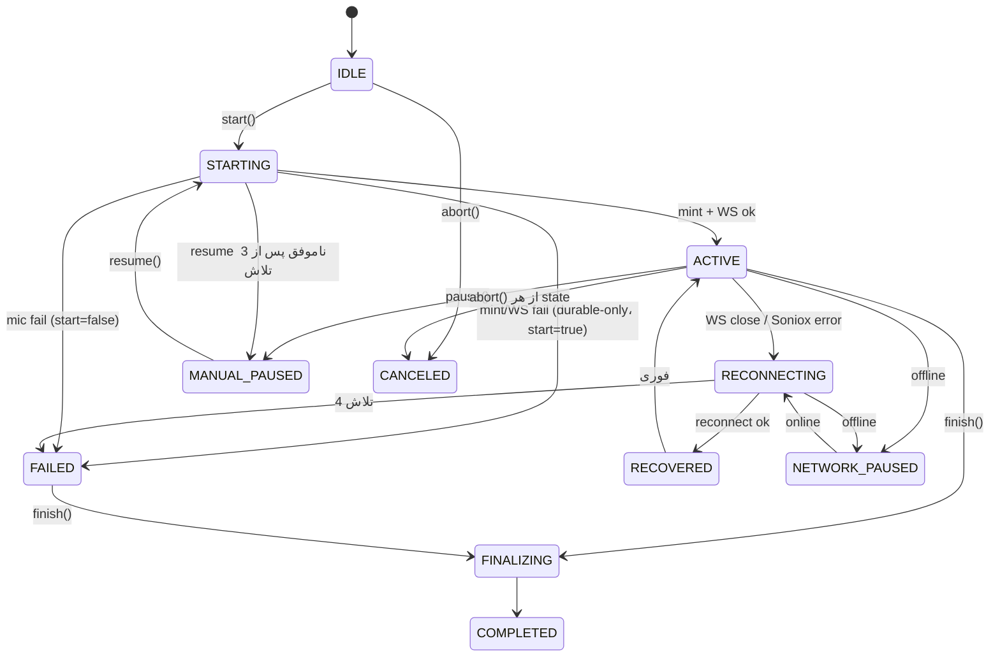

# Subsystem 01 — Browser Realtime Engine (FeeliaRT)

> **وضعیت:** ACTIVE-CANONICAL · کد: `public/feelia-rt.js` (≈1280 خط، commit شده در `2763414`؛ یک لاگِ تشخیصیِ کوچک اضافه‌تر در `54a17fd`، 2026-09-15) · تست: `scripts/rt-harness.cjs` · **به‌روزشده 2026-09-14:** pause مبتنی بر keepalive (WS بسته نمی‌شود).
> مرتبط: [02 audio](02-audio-durability-batch-fallback.md) · [03 integrity](03-transcript-integrity.md) · [ماژول 04](../04-modules/04-transcription/module-prd.md).

## ۱. مسئولیت
یک `RTSession` برای هر جلسه (`mode:'live'`) یا یادداشتِ صوتی (`mode:'note'`): گرفتنِ میکروفون، mint، WS مستقیم به Soniox، ساختِ متنِ confirmed/interim، autosave با CAS، ضبطِ durable موازی، pause/resume، reconnect، finish و fallback، abort امن.

API عمومی (`window.FeeliaRT`): `STATES`، `isAvailable()`، `createSession(sessionId, {mode, onState, onResult, onError})`، `hasOpenConnection()`، `forget(s)`، `cleanText`، `MAX_RECONNECT_ATTEMPTS`، `audioQueue`.
متدهای نمونه: `start`، `pause`، `resume`، `finish({awaitBatch?, batchWaitMs?})`، `abort`، `persistConfirmed`، `awaitBatchDrain({forNote?, timeoutMs?})`.

## ۲. State machine

- `RECOVERED` گذراست (بلافاصله `ACTIVE`).
- state موتور **مستقل از `sessions.status`** است.
- هر `setState(ACTIVE|RECOVERED)` در mode live → `drainQueuedAudioInBackground()`.

## ۳. Invariantها (نقضشان = باگ)

| # | Invariant | پیاده‌سازی |
|---|---|---|
| I1 | کلیدِ اصلی هرگز در این فایل نیست | فقط `cred.api_key` از mint |
| I2 | هر اتصال = mint تازه | `connectWithFreshMint` |
| I3 | interim هرگز persist نمی‌شود؛ روی reconnect/pause پاک | `scheduleReconnect`، `pause.done` |
| I4 | `unreliable` یک‌طرفه است (هیچ‌جا false نمی‌شود) | `scheduleReconnect`، Soniox error، start fail |
| I5 | نتیجه‌ی mint/WS دیررس پس از finish/abort هیچ state/WS ایجاد نمی‌کند | `connEpoch`، `noNewConnections`، `epochAlive()` |
| I6 | pauseِ باطل‌شده با resume نمی‌تواند پاکسازیِ دیررس (پاکِ interim، آزادسازیِ mic، شروعِ keepalive) را روی جلسه‌ی ادامه‌یافته اجرا کند | `pauseToken` |
| I7 | finish دوباره همان promise را برمی‌گرداند | `_finishPromise` |
| I8 | abort از هر state: resolverها آزاد، timerها پاک، mic/WS/recorder بسته، صفِ IndexedDB این جلسه پاک | `abort` |
| I9 | کارهای صفِ IndexedDB یک جلسه هم‌زمان اجرا نمی‌شوند | `_queueLock` زنجیره‌ای + `_draining` |
| I10 | قبل از خواندنِ صف در finish، آخرین سگمنت واقعاً نوشته شده | `stopDurableSegment()` → `_flushPromise` (نگهبان 10s، `DURABLE_FLUSH_GUARD_MS`) |
| I11 | stop و بلافاصله start ایمن است: chunk/seq/intent هر سگمنت مالِ recorderِ خودش است و در لحظه‌ی stop ثبت می‌شود | chunks محلی در `startDurable`، `rec._seqAtStop`/`rec._stateAtStop` در `stopDurableSegment` (2026-09-23، `T20`) |
| I11 | 401 از mint → FAILED بدونِ reconnect بی‌پایان | `connectWithFreshMint` catch |
| I12 | برچسبِ گوینده = `generation:rawSpeaker` → شماره‌ی سراسری؛ هرگز ادغام بینِ نسل‌ها | `speakerLabelMap` |
| I13 | حینِ MANUAL_PAUSED اتصالِ WS باز می‌ماند و فقط `{"type":"keepalive"}` هر ۵s فرستاده می‌شود؛ تایمرِ keepalive در resume/finish/abort متوقف می‌شود | `startKeepalive`، `stopKeepalive` |
| I14 | هر سگمنتِ durable فقط یک نوع محتوا دارد (یا کاملاً حینِ ACTIVEِ سالم، یا کاملاً حینِ قطعی) — مرزِ سگمنت رویِ هر گذارِ ACTIVE↔قطعی صریح بسته می‌شود | `scheduleReconnect`، `offlineHandler`، `connectWithFreshMint` (2026-09-22) |
| I15 | فقط یک تلاشِ reconnect هم‌زمان در جریان است، حتی اگه چند منبع (`handleWSClose`، خطایِ Soniox، watchdog) هم‌زمان trigger کنند | `reconnectInFlight` (2026-09-22) |
| I16 | اگه `ws.readyState` دیگر OPEN نباشد ولی state هنوز ACTIVE است (onclose/onerror دیر/هیچ‌وقت فایر نشده)، حداکثر تا ۳ ثانیه بعد reconnect خودکار شروع می‌شود | `startWsWatchdog` (2026-09-22) |
| I17 | هر live pusher فقط به WSِ زمانِ ساختِ خودش می‌فرستد؛ اولین بایت‌هایِ صوتیِ هر WSِ تازه هدرِ container است (دُمِ ناهمگامِ recorderِ قبلی هرگز رویِ WSِ تازه نمی‌رود) | `targetWs` در `startLivePusher`، `stopLivePusher` در `scheduleReconnect` (2026-09-23، `T21`) |
| I18 | rebaseِ 409 در `persistConfirmed` متنی که سرور از آخرین ذخیره append کرده (batchِ دوره‌ی قطعی) را بازنویسی نمی‌کند — اگر هر دو طرف فقط به `persistedText` افزوده‌اند، ترکیب می‌شوند | `persistedText` (2026-09-23، `T22`) |

## ۴. جریان‌های کلیدی

### start
`GET /api/sessions/:id` (prefix اگر طولانی‌تر + `baseVersion`) → `ensureStream` (getUserMedia) → `connectWithFreshMint` → ok: `startDurable` + `startAutosave` + `watchOnline` + ACTIVE؛ not ok: `unreliable` + `startDurable` + `watchOnline` + FAILED (بدونِ autosave — **INFERRED:** متنی هم تولید نمی‌شود).

### دو MediaRecorder روی یک stream
| Recorder | timeslice | bitrate | مقصد |
|---|---|---|---|
| live pusher | 250ms | پیش‌فرضِ مرورگر | `ws.send` فقط وقتی OPEN (در غیرِ این صورت دور ریخته) |
| durable | 1000ms، چرخش هر 60s | 24kbps | IndexedDB |
هر اتصالِ تازه live pusher تازه (هدرِ WebM تازه) می‌سازد؛ durable ادامه می‌دهد.

### pause (از 2026-09-14 — طبقِ «Connection keepalive / Pause and resume» در مستنداتِ Soniox، به نقل از کامنتِ کد)
state→MANUAL_PAUSED فوری؛ بستنِ سگمنتِ durable؛ پس از 250ms: توقفِ live pusher و `{"type":"finalize"}` (**بدونِ** رشته‌ی خالی)؛ پس از 2250ms: پاکِ interim، آزادسازیِ mic (`cleanupAudio` به WS دست نمی‌زند)، `startKeepalive()`، `persistConfirmed`. **WS بسته نمی‌شود.** resolve با `true` مگر resume وسطش آمده باشد.

### resume
`pauseToken++`، `stopKeepalive`، STARTING →
- **مسیرِ سریع:** اگر WS هنوز OPEN است: `ensureStream` → live pusherِ تازه → durableِ تازه → ACTIVE. بدونِ mint، بدونِ افزایشِ `generation`، بدونِ مارکرِ ناپیوستگی، بدونِ ریستِ شماره‌ی گوینده.
- **مسیرِ کند (`resumeWithFreshConnection`):** اگر WS بسته شده یا `ensureStream` در مسیرِ سریع شکست خورد: تا ۳ تلاش (backoff 800/1600ms) از `ensureStream` + `connectWithFreshMint` (نسلِ جدید + مارکرِ ناپیوستگی)؛ شکستِ نهایی → برگشت به MANUAL_PAUSED.

⚠️ harnessِ T6 («resumed ACTIVE، prefix kept، no duplicate») هنوز PASS است ولی سناریوی «resume روی همان اتصال» و «keepalive» صراحتاً assert نمی‌شوند.

### finish
`noNewConnections`، `connEpoch++`، FINALIZING، `finalize` و انتظارِ `finished` یا 8s → بستنِ WS → `stopDurableSegment` →
- **reliable:** `persistConfirmed` → `PUT {realtime_reliable:true, stt_mode:'realtime'}` → `archiveQueuedAudioOnly()` (بدونِ انتظار) → COMPLETED → `{mode:'realtime'}`.
- **unreliable:** `persistConfirmed` → `uploadBatchSegments` → `PUT {realtime_reliable:false, stt_mode:'batch-pending'}` → COMPLETED → `{mode:'batch-pending'|'batch-pending-note'}` (یا با `awaitBatch` منتظرِ drain).

## ۵. Glue در `index.html`
`startNewRTSession` (ساخت + بنرِ durable-only)، `rtOnState` (متنِ وضعیت، تایمر، level meter، دکمه‌ی pause)، `endNewRTSession` (finish → `PUT status=completed` → بنرِ batch → Wrapup)، `rtPauseLive`/`rtResumeLive`، `startVoiceNoteDirect`/`stopVoiceNoteDirect`، `sweepOrphanedAudioQueue` (در `enterApp`).

## ۶. باگ‌های تاریخیِ ثبت‌شده در کامنت‌ها (برای جلوگیری از بازگشت)
- `stop()` سرور هرگز resolve نمی‌شد (commit `7f7a80c`).
- pauseِ قدیمی WSِ resumeِ جدید را می‌بست (→ `pauseToken`).
- interim پس از pause روی صفحه «فریز» می‌ماند.
- `withStore` به‌جای نتیجه IDBRequest برمی‌گرداند → صف همیشه خالی.
- `onstop` async → آخرین سگمنت آرشیو نمی‌شد (→ `_flushPromise`).
- `onstop` async + `self.durableChunks`ِ مشترک → هر سگمنتی که با چرخش/مرزِ قطعی بسته می‌شد فقط دُمِ بی‌هدرش ذخیره می‌شد و intentِ مرزها برعکس بود (2026-09-23 → I11؛ subsystem 02).
- دُمِ liveRecِ قبلی اولین chunkِ WSِ تازه بعد از reconnect می‌شد → Soniox «Audio decode error» → چرخه‌ی reconnect بدونِ متن (2026-09-23 → I17).
- rebaseِ 409 با «متنِ بلندتر برنده» متنِ batchِ دوره‌ی قطعی را که سرور حینِ جلسه append کرده بود پاک می‌کرد (2026-09-23 → I18).
- drain دوبار روی RECOVERED→ACTIVE → duplicate متن (→ `_draining`).
- drain روی pause/resumeِ عادی با `purpose=transcript` → duplicate (→ purpose بر اساسِ `unreliable`).
- fetch بدونِ timeout → دکمه‌ی ادامه گیر می‌کرد (→ `REQUEST_TIMEOUT_MS`).

## ۶.۵ تله‌متری (فازِ ۲ رصد — `rt.*`، از 2026-09-23)
هر رویداد با `obsEvent(name, detail)` (تعریف‌شده بالایِ `feelia-rt.js`، همیشه try/catch + چکِ `window.FeeliaObs`) به `FeeliaObs.event(name, detail)` می‌رسد؛ چون `detail` یک object است (نه عدد)، در `feelia-obs.js` به‌جایِ `obs_ui_events` به‌عنوانِ `kind:'client_event'` بافر و به `POST /api/obs/events` فرستاده می‌شود — سرور (`server/src/http/obs.ts`) نامِ رویداد را در برابرِ `OBS_CLIENT_EVENTS` (`server/src/obs/types.ts`) چک می‌کند، `detail` را از `sanitizeDetail()` (`server/src/obs/redact.ts`، اجرایِ LAW-001) رد می‌کند و با `logEvent({source:'client', runId, ...})` به جدولِ **`obs_events`** می‌نویسد (نه `obs_ui_events` — آن جدول ستونِ `run_id`/`detail` ندارد). `run_id` همان `RTSession.runId` است که با `session_audio.run_id` (migration 017) join می‌شود.

| رویداد | کجا فایر می‌شود | detail | معنیِ عملیاتی |
|---|---|---|---|
| `rt.ws_open` | `openDirectWS`، بعدِ handshakeِ موفق | — | اتصالِ WSِ مستقیم به Soniox برقرار شد |
| `rt.ws_close` | اولین خطِ `handleWSClose(ev)` — همیشه، حتی بستنِ عمدی | `close_code` (کدِ خامِ `CloseEvent`)، `was_clean` | `close_code=1006` تکراری برایِ یک تراپیست یعنی قطعیِ غیرطبیعیِ شبکه — شبکه را بررسی کنید. `ev.reason` عمداً هیچ‌وقت خوانده نمی‌شود (متنِ آزادِ سرور/Soniox، LAW-001) |
| `rt.ws_error` | `ws.onerror` در `openDirectWS` | — | خطایِ سطحِ WS، معمولاً قبل از `rt.ws_close` |
| `rt.reconnect_scheduled` | `scheduleReconnect(reason)` | `reason` (کدِ کوتاه: `closed`/`soniox-error`/`temp-key-expired`/`watchdog-ws-not-open`/`retry`/`online`/`online-after-failed`)، `attempt`، `delay_ms` | چرا/کِی reconnect زمان‌بندی شد و با چه backoffی |
| `rt.reconnect_ok` | `connectWithFreshMint`، فقط وقتی `isReconnect===true` | `attempt` (شماره‌ی تلاشِ موفق) | reconnect جواب داد — چند تلاش طول کشید |
| `rt.reconnect_exhausted` | `scheduleReconnect` وقتی `reconnectAttempts>=MAX_RECONNECT_ATTEMPTS` | `attempt` | همه‌ی تلاش‌ها تمام شد؛ state=FAILED، ضبطِ durable ادامه دارد |
| `rt.mint_failed` | catchِ `connectWithFreshMint` | `status`، `code` (نه `message`) | mintِ credential شکست خورد (شبکه/rate-limit/۴۰۱) |
| `rt.unreliable_set` | هرجا `self.unreliable` اولین‌بار true می‌شود (یک‌طرفه) | `reason` (`reconnect`/`reconnect_exhausted`/`start_fail_open`) | از این لحظه به بعد، fallbackِ batch لازم است |
| `rt.watchdog_fired` | `startWsWatchdog`، قبل از `scheduleReconnect('watchdog-ws-not-open')` | — | قطعیِ «بی‌صدا» (WSای که readyState مرده ولی onclose نیامده) تشخیص داده شد |
| `rt.state_change` | `setState(s)` (چون این فایل از قبل یک state machineِ صریحِ `STATES` دارد) | `state`، `prev_state` | دنباله‌ی کاملِ گذارهایِ یک RTSession — برایِ بازسازیِ timeline |
| `rt.gap_marked` | `noteDiscontinuity()` | — | مارکرِ ناپیوستگیِ گوینده به transcript اضافه شد (بندِ ۳ همین سند) |

⚠️ این تله‌متری فقط با خواندنِ دقیقِ کد + عبورِ تمیزِ `pnpm test:rt` تأیید شده؛ رسیدنِ واقعیِ ردیف به `obs_events` با یک WSِ mock در مرورگر هنوز تست نشده (کارِ بازِ ثبت‌شده در `PROJECT_STATUS.md`، رویدادِ 2026-09-23).

## ۷. تست
`pnpm test:rt`. پوشش: T1، T2، T6–T10، T13a/b، T14–T19b (T18/T19/T19b افزوده‌شده در 2026-09-22). فازِ ۲ (تله‌متریِ `rt.*`) رگرسیونِ صفر داشت: هر ۴۴ تست بعدِ افزودنِ `obsEvent(...)` عیناً همان نتیجه را داد؛ چون harness در Node بدونِ `window.FeeliaObs` اجرا می‌شود، هر `obsEvent` بی‌اثر می‌ماند (خودِ همین رفتار جزوِ الزامِ ایمنیِ فازِ ۲ بود). **تصحیحِ evidence:** یادداشتِ قبلیِ این بخش («Node فاقدِ `indexedDB` است → T2-batch/T15/T16 در WT شکست می‌خورند») دیگر درست نیست — `scripts/rt-harness.cjs` یک mockِ حداقلیِ `indexedDB` دارد (`globalThis.indexedDB = {...}`، نزدیکِ بالایِ فایل) که این سناریوها را هم پوشش می‌دهد؛ در اجرایِ واقعیِ 2026-09-22 هر ۴۴ تست (شاملِ T2-batch/T15/T16) بدونِ استثنا PASS شدند. باقی‌ماندهٔ این یادداشت شاید مربوط به نسخه‌ی خیلی قدیمی‌ترِ harness بوده — طبقِ LAW-019 مبنا نگیرید.

## ۸. ریسک‌ها / سؤال‌های باز
- پیامِ `onError` هنگامِ نبودنِ IndexedDB می‌گوید «فضا پر شده» (گمراه‌کننده).
- در FAILED از ابتدا (mint fail) هیچ متنی تا batch وجود ندارد و autosave شروع نمی‌شود — مطابقِ طراحی.
- `live` registry با `forget` پاک می‌شود؛ فراموش‌کردنِ `forget` = هشدارِ `beforeunload` دائمی.
- **توقفِ طولانی:** چون WS حینِ pause باز می‌ماند، سقفِ `max_session_duration_seconds=7200` کلیدِ موقت همچنان می‌گذرد. اگر Soniox حینِ MANUAL_PAUSED خطای `temp_api_key_session_expired` بدهد، `scheduleReconnect` در MANUAL_PAUSED کاری نمی‌کند و `handleWSClose` هم برای MANUAL_PAUSED برمی‌گردد؛ پس فقط هنگامِ resume مسیرِ کند فعال می‌شود (**INFERRED** از کد؛ تست نشده).
- `hasOpenConnection()` حینِ pause اکنون true است → هشدارِ `beforeunload` در حالتِ توقف هم نمایش داده می‌شود (**INFERRED**).
