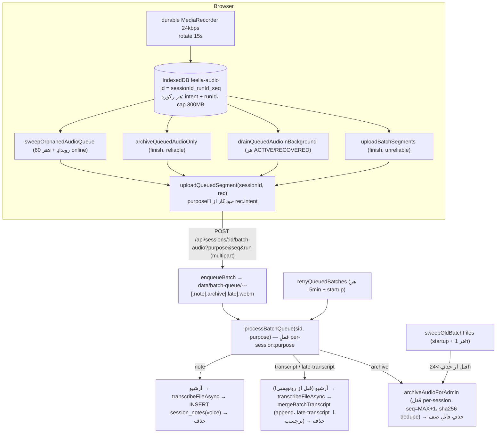

# Subsystem 02 — Audio Durability & Batch Fallback

> **وضعیت:** ACTIVE-CANONICAL · کد: `public/feelia-rt.js` (`AudioQueueDB`، `uploadQueuedSegment`،
> `startDurable`، `stopDurableSegment`، `watchTrackEnded`/`handleMicLost`، `flushAllDurable`،
> `uploadBatchSegments`، `drainQueuedAudioInBackground`، `archiveQueuedAudioOnly`،
> `awaitBatchDrain`، `readNewVoiceNote`)، `public/index.html` (`sweepOrphanedAudioQueue`،
> `beforeunload`، `openAdminClientSessions`)، `server/src/stt/batchqueue.ts`،
> `server/src/stt/sessionAudioArchive.ts` (`getFullSessionAudio`)، `server/src/stt/asyncTranscribe.ts`،
> روت‌های `batch-*` در `server/src/http/sessions.ts`، روت‌هایِ `audio*` در `server/src/http/admin.ts`،
> migration `017_session_audio_run_kind_sha.sql`.
> ⚠️ متنِ رضایتِ UI با این subsystem تعارض دارد (LAW-009، C1) — هنوز حل‌نشده.
> ❗ **این سند رویِ working-treeِ commitنشده‌ی audit صدا/۲۰۲۶-۰۹-۱۶ (بخش‌هایِ A تا F، هر شش
> بخشِ پلن) نوشته شده — همه رویِ MySQLِ لوکالِ واقعی + Soniوxِ واقعی + ffmpegِ واقعی +
> مرورگرِ واقعی تست شده‌اند (جزئیات: [stage1](../../verification/2026-09-16-audio-durability-stage1.md)،
> [stage2-partD](../../verification/2026-09-16-audio-durability-stage2-partD.md)،
> [stage3-partC](../../verification/2026-09-16-audio-durability-stage3-partC.md)،
> [stage4-partsEF](../../verification/2026-09-16-audio-durability-stage4-partsEF.md))، ولی هنوز
> commit/deploy نشده.**

## ۱. لایه‌ها

## ۲. شناسه‌ی run و seqِ سرورساخته (رفعِ باگِ بحرانی)

**باگِ قبلی:** seqِ آرشیو از کلاینت می‌آمد و `archiveAudioForAdmin` با
`ON DUPLICATE KEY UPDATE` رویِ `(session_id, seq)` کار می‌کرد. هر `RTSession` تازه (یادداشتِ
صوتی، یا ادامه‌ی جلسه بعدِ رفرش) `durableSeq` را از ۰ شروع می‌کرد → دو run مختلف با seq=۰ صدایِ
هم را بی‌صدا بازنویسی می‌کردند.

**فیکس (migration 017):**
- هر `RTSession` یک `runId` تصادفی می‌گیرد (`Date.now().toString(36)+random`)؛ کلیدِ IndexedDB
  `sessionId_runId_seq` است (نه `sessionId_seq`).
- `POST /batch-audio` پارامترِ `run` می‌گیرد (نبودش = `'legacy'`).
- `session_audio` ستون‌هایِ جدید: `run_id VARCHAR(64)`، `kind VARCHAR(8)` (`'session'|'note'`)،
  `sha256 CHAR(64) NULL`. یونیکِ قدیمیِ `(session_id, seq)` حذف و با
  `(session_id, run_id, seq)` + `(session_id, sha256)` جایگزین شد.
- `archiveAudioForAdmin` دیگر seqِ کلاینت را نمی‌پذیرد — زیرِ یک **قفلِ in-memory per-session**
  (`sessionLocks` در `sessionAudioArchive.ts`؛ LAW-013 اجازه می‌دهد چون runtime تک‌پروسه‌ایه):
  اول sha256 چک می‌شود (اگر تکراریه → no-op، idempotent برایِ retry)، وگرنه
  `seq = MAX(seq)+1` همان جلسه محاسبه و فایل با آن نوشته می‌شود. **هیچ archiveِ موفقی دیگر
  هرگز بازنویسی نمی‌شود.**
- `batchqueue.ts` هم همین قفل را برایِ خودِ `processBatchQueue` دارد (`queueLocks`، کلید
  `sessionId:purpose`) تا دو فراخوانیِ هم‌زمان (retryِ دستی وسطِ workerِ دوره‌ای) رویِ یک
  session/purpose race نکنند.

## ۳. intent (کلاینت) و purpose (سرور) — دیگر حدس زده نمی‌شود

هر رکوردِ IndexedDB یک فیلدِ `intent` دارد که **در لحظه‌ی بستنِ سگمنت** (نه بعداً در لحظه‌ی
آپلود) تعیین می‌شود:

| intent | چه وقت |
|---|---|
| `note` | `self.mode === 'note'` |
| `transcript` | `state ∈ {RECONNECTING, NETWORK_PAUSED, FAILED}` |
| `archive` | وگرنه (پیش‌فرض؛ رکوردهایِ قدیمی‌ترِ بدونِ این فیلد هم همین را می‌گیرند) |

**رفعِ باگِ 2026-09-22:** قبلاً شرط `self.unreliable ||` هم داشت. چون `unreliable` یک‌طرفه و
سراسری است (I4، subsystem 01)، این یعنی بعدِ **یک بار** قطعی/reconnectِ موفق، همه‌ی سگمنت‌هایِ
durableِ *بعدی* هم — حتی آن‌هایی که کاملاً در ACTIVEِ سالم ضبط شده بودند — `transcript` می‌گرفتند
و دوباره رونویسی+append می‌شدند (متنِ از قبل درستِ realtime برایِ باقیِ جلسه دوبار در پرونده
می‌آمد). الان فقط stateِ لحظه‌ی بستنِ همان سگمنت تعیین‌کننده است؛ برایِ اینکه یک سگمنتِ ۱۵ثانیه‌ای
هیچ‌وقت هم صدایِ سالم هم صدایِ بعدِ قطعی را با هم نداشته باشد، `scheduleReconnect`،
`offlineHandler` و مسیرِ موفقیتِ `connectWithFreshMint` حالا رویِ هر گذارِ ACTIVE↔قطعی مرزِ
سگمنت را صریح می‌بندند (`stopDurableSegment`+`startDurable`). تست: `T18` در
`scripts/rt-harness.cjs`.

**رفعِ race چرخش (2026-09-23، [verification](../../verification/2026-09-23-durable-rotation-race.md)):**
`MediaRecorder.stop()` ناهمگام است — آخرین `dataavailable` (دُمِ صدا) و `onstop` در یک taskِ بعدی
می‌رسند. همه‌ی مسیرهایِ «stop و بلافاصله start» (چرخشِ ۱۵ثانیه‌ای، سه مرزِ قطعیِ بالا) قبلاً خراب
بودند چون chunkها رویِ `self.durableChunks`ِ مشترک بود: `startDurable()` آرایه را عوض می‌کرد، دُمِ
recorderِ قبلی در آرایه‌ی تازه می‌افتاد، و `onstop`ِ قبلی **فقط همان دُمِ بی‌هدرِ EBML** را در
IndexedDB می‌نوشت؛ بدنه‌ی اصلی (هدر + ~۱۴ثانیه) در RAM گم می‌شد. هم‌زمان intent از `self.state`ِ
لحظه‌ی اجرایِ `onstop` خوانده می‌شد، پس در مرزِ ورود به قطعی سگمنتِ سالم `transcript` و در مرزِ
برگشت سگمنتِ خودِ قطعی `archive` می‌گرفت (برعکس). **الگویِ درست (الزامی):**
- chunkها محلیِ closureِ هر recorder در `startDurable` است (`var chunks = []`)؛ هیچ stateِ مشترکی رویِ `self` نیست.
- `stopDurableSegment` پیش از `rec.stop()` همگام `rec._seqAtStop` و `rec._stateAtStop` را ثبت می‌کند؛ `onstop` intent/seq را از همین‌ها می‌سازد (fallback به `self.*` فقط برایِ recorderی که خودش متوقف شده).
- جدولِ intentِ بالا یعنی «state در لحظه‌ی صدا زدنِ `stopDurableSegment`»، نه لحظه‌ی `onstop`.
- استثنا: `finish()` پیش از بستنِ آخرین سگمنت به `FINALIZING` می‌رود، پس stateِ لحظه‌ی پایان را صریح به‌عنوانِ override می‌دهد (`stopDurableSegment(stateAtFinish)`). پایان در FAILED/RECONNECTING/NETWORK_PAUSED → آخرین سگمنت `transcript`؛ پایان از ACTIVE → `archive`. قبلاً همیشه `archive` بود و صدایِ تا ۱۵ثانیه‌ی آخر (یا کلِ جلسه‌ی durable-onlyِ کوتاه) هرگز رونویسی نمی‌شد. تست: `T16x`/`T16y`/`T16z`؛ mockِ harness حالا `archive` را در صفِ رونویسی نمی‌گذارد.
- تست: `T20`/`T20a2` در harness با `FakeRecorder`ِ واقع‌گرا (هدرِ `HDR` در اولین chunk، دُمِ `TAIL` + `onstop` ناهمگام).

**خطایِ دائمی در صفِ سرور (2026-09-23):** `processBatchQueueInner` بعد از آرشیوِ ادمین و پیش از
Soniox، magic bytesِ container را چک می‌کند (`looksLikeValidContainer`: webm=`1A45DFA3`،
ogg=`OggS`، m4a=`ftyp` در بایتِ ۴). فایلِ نامعتبر، یا خطایِ Soniox با متنِ «Invalid audio file»
(`isPermanentTranscribeError`)، دیگر `kept queued` نمی‌ماند: فایل از صف حذف می‌شود (نسخه‌ی آرشیو
برایِ بررسی می‌ماند)، رویدادِ `batch.segment_unrecoverable` (`reason: bad-container |
soniox-invalid-audio`) ثبت می‌شود و `batch_status` طبقِ باقی‌مانده‌ی صف به `done` می‌رسد. مسیرِ
دریافت (`sessions.ts`) عمداً تغییری نکرد. `sweepOldBatchFiles` حالا علاوه بر startup هر ساعت
(`BATCH_SWEEP_INTERVAL_MS`) هم اجرا می‌شود.

تابعِ مشترکِ `uploadQueuedSegment(sessionId, rec)` (در `feelia-rt.js`، exposeشده رویِ
`window.FeeliaRT.uploadQueuedSegment`) purpose را از `rec.intent` می‌سازد و **هر چهار** تابعِ
آپلودکننده (`uploadBatchSegments`، `drainQueuedAudioInBackground`، `archiveQueuedAudioOnly`،
`sweepOrphanedAudioQueue`ِ `index.html`) از همین یک تابع استفاده می‌کنند — قبلاً هرکدام purpose
را جدا و از رویِ وضعیتِ *فعلیِ* `self.unreliable`/mode حدس می‌زدند، نه intentِ واقعیِ همان
رکورد؛ چون همه‌ی این توابع صفِ کلِ `sessionId` را می‌خوانند (نه فقط سگمنت‌هایِ خودشان)، این حدسِ
جمعی می‌توانست اشتباه باشد.

**fallbackِ خودکار (بخشِ C):** اگر `purpose=transcript` با ۴۰۰ رد شود (معمولاً چون جلسه در
همین حین completed شده)، `uploadQueuedSegment` **خودکار با `purpose=late-transcript` دوباره
می‌فرستد** — صدایِ آفلاینِ بعدِ پایانِ جلسه دیگر فقط بی‌صدا آرشیو نمی‌شود، رونویسی و با برچسبِ
`[بخشِ ضبط‌شده در زمانِ قطعیِ اینترنت — بعداً رونویسی شد]` به انتهایِ transcript اضافه می‌شود
(`mergeBatchTranscript(..., label)`؛ `late-transcript` رویِ جلسه‌ی `completed` مجاز است، رویِ
`canceled` مسدود). فقط ۴۰۰ِ واقعاً غیرقابلِ‌بازیابی («فایلِ خیلی کوتاه») یا ۴۰۴ (جلسه حذف‌شده)
باعثِ حذفِ بدونِ retry می‌شوند.

## ۴. قواعدِ سرور

- `batch-audio`: مالکیت؛ برای `transcript` جلسه نباید `completed|canceled` باشد (400)؛ برای
  `late-transcript` فقط `canceled` مسدود است؛ `archive`/`note` روی جلسه‌ی completed هم مجاز.
- `validateAudioBuffer`: 100 بایت ≤ حجم ≤ 50MB؛ سقفِ عملیِ multipart از ۱MiBِ پیش‌فرضِ Fastify
  به **۱۰MB صریح** رسید (`app.register(multipart, { limits: { fileSize: 10*1024*1024 } })`).
- `enqueueBatch`: نامِ فایل با `seq` شش‌رقمی + `runId` + timestamp + مارکرِ purpose
  (`.note.`/`.archive.`/`.late.`/بدونِ مارکر برایِ `transcript`)؛ برای `transcript`/`late-transcript`:
  `batch_status='queued'`، `stt_mode='batch'`.
- `processBatchQueue` (زیرِ قفلِ per-session:purpose):
  - **آرشیو قبل از رونویسی** (نه بعد): حتی اگه `transcribeFileAsync` شکست بخورد، صدا از قبل
    امن در `session_audio` است — فقط رونویسی عقب می‌افتد، فایل در صف می‌ماند.
  - متنِ خالی (سکوتِ واقعی) = **موفقیت**، نه شکست — آرشیو و از صف حذف می‌شود (قبلاً برایِ
    همیشه در صف می‌ماند و بعدِ ۲۴h بدونِ آرشیو پاک می‌شد).
  - بدونِ کلید → `batch_status='failed'` (فقط transcript/late-transcript).
  - پایان: `batch_status = queued` اگر فایلی مانده، وگرنه `done`.
- `mergeBatchTranscript(sessionId, baseVersion, text, label?)`: همیشه `current + "\n\n" +
  (label ? label+"\n"+text : text)`، `transcript_version+1`، `realtime_reliable=false`،
  `batch_status='done'` (بدونِ CAS — [subsystem 03](03-transcript-integrity.md)).
- `batch-retry`/`batch-status` از سه purpose پشتیبانی می‌کنند: `note`, `late-transcript`,
  (پیش‌فرض) `transcript`؛ `batch-status` فیلدِ `late_transcript_pending` هم برمی‌گرداند.
- **workerِ دوره‌ای `retryQueuedBatches`** (هر ۵ دقیقه + startup، `server/src/index.ts`): هر
  فایلِ باقی‌مانده در صف را (بر اساسِ مارکرِ نامِ فایل) دوباره پردازش می‌کند — قبلاً فقط با
  آپلودِ بعدیِ همان session/purpose یا `batch-retry`ِ دستی retry می‌شد.
- **`sweepOldBatchFiles`** (startup) قبل از حذفِ فایلِ >۲۴h، یک‌بار fail-open تلاش می‌کند
  آرشیوش کند — قبلاً مستقیم حذف می‌کرد، یعنی فایلی که هیچ‌وقت موفق به رونویسی نشده بود
  (کلیدِ نامعتبر، ری‌استارتِ مکرر) برایِ همیشه از بین می‌رفت.

## ۵. کلاینت: پذیرشِ پاسخ (`uploadQueuedSegment`، مشترک بینِ هر ۴ فراخواننده)

| نتیجه | رفتار |
|---|---|
| `res.ok` | حذف از IndexedDB |
| `404` | حذف (جلسه دیگر وجود ندارد) |
| `400` + پیامِ «کوتاه» | حذف (غیرقابلِ‌بازیابی) |
| `400` + `purpose=transcript` (سایرِ دلایل) | retryِ خودکار با `purpose=late-transcript`؛ موفق → حذف |
| `400` دیگر / شکستِ شبکه/۵xx | **در صف می‌ماند**، دفعه‌ی بعد دوباره امتحان می‌شود |

## ۶. مقاومتِ کلاینت در برابرِ از‌دست‌رفتنِ صدا

- **چرخشِ durable هر ۱۵ ثانیه** (قبلاً ۶۰s) — پنجره‌ی صدایِ فقط-در-RAM کاهش یافت.
- **`DURABLE_FLUSH_GUARD_MS = 10000`** (قبلاً ۱۵۰۰) در `stopDurableSegment` — نگهبانی که اگه
  `onstop` هیچ‌وقت fire نشه، `finish()`/`pause()` را برایِ همیشه قفل نکند؛ چون
  `AudioQueueDB.totalBytes()` با `getAll()` همه‌ی blobهایِ صف را می‌خواند (کند رویِ صفِ بزرگ).
- **`watchTrackEnded`/`handleMicLost`:** قطعِ فیزیکیِ میکروفون (هدست/OS/تماسِ تلفن) با
  `track.onended` تشخیص داده می‌شود (قبلاً کاملاً بی‌صدا بود — ضبط فقط متوقف می‌شد)؛ استریمِ
  تازه با backoff گرفته و durable/livePusher از سر گرفته می‌شود، بدونِ دست‌زدن به
  state machineِ WS/finalize.
- **`flushAllDurable` + `visibilitychange`(hidden)/`pagehide`:** سگمنتِ جاری بلافاصله flush
  می‌شود وقتِ پنهان‌شدن/بستنِ تب؛ اگر صفحه واقعاً بسته نشده، سگمنتِ تازه بلافاصله شروع می‌شود.
- **`window.FeeliaRT.hasActiveRecording()`:** برخلافِ `hasOpenConnection` (فقط WSِ باز)، حالتِ
  durable-only (بدونِ WS، ولی میکروفون هنوز ضبط می‌کند، مثلاً state=FAILED) را هم می‌بیند؛
  `beforeunload` در `index.html` از این استفاده می‌کند.
- **`sweepOrphanedAudioQueue`** هر ۶۰s + رویِ رویدادِ `online` (قبلاً فقط یک‌بار سرِ لودِ صفحه)؛
  سگمنت‌هایِ جلسه‌ای که در `localStorage.feelia_active_session` است را رد می‌کند (مالکش
  RTSessionِ resume‌شونده است — جلوگیری از راهِ برخوردِ sweep/RTSession رویِ یک sessionId).

## ۷. awaitBatchDrain
poll هر 5s از `batch-status` تا ۱۵ دقیقه؛ terminal: transcript → `!audio_pending &&
batch_status∈{done,failed}`؛ note → `!note_audio_pending`. سپس خواندنِ متن/آخرین یادداشتِ voice
پس از `startedAt`. (late-transcript معمولاً خارج از یک RTSessionِ فعال اتفاق می‌افتد — به
`awaitBatchDrain` سیم‌کشی نشده؛ `batch_status`/`late_transcript_pending` را می‌شود بعداً پرسید.)

## ۸. حریمِ خصوصی و نگهداری

| محل | چه زمانی پاک می‌شود |
|---|---|
| IndexedDB | آپلودِ پذیرفته‌شده (یا late-transcript fallback)، abort (`clearForSession`)، ۴۰۰ِ غیرقابلِ‌بازیابی/۴۰۴ |
| `data/batch-queue` | پس از پردازشِ موفق؛ یا >۲۴h در startup (بعدِ تلاشِ fail-open برایِ آرشیو) |
| Soniox | `finally` در `transcribeFileAsync` |
| `data/session-audio` | ۱۴ روز — [subsystem 05](05-session-audio-archive-speaker-resolve.md) |

**نتیجه‌ی واقعی:** صدای **هر** جلسه‌ی FeeliaRT (حتی کاملاً موفق) به سرور آپلود و ۱۴ روز آرشیو
می‌شود؛ صدایِ آفلاینِ بعدِ پایانِ جلسه هم دیگر گم نمی‌شود (late-transcript).

## ۹. تست
- harness (`pnpm test:rt`): T2 (batch)، T14، T15، T16 — در WT به‌خاطرِ نبودِ IndexedDB در Node
  شکست می‌خورند (بجز T14) — این ۶ شکست baselineِ ثابتِ قبل از audit صدا هستند، نه رگرسیون.
- **تستِ سرورِ real (audit صدا/۲۰۲۶-۰۹-۱۶):** migration 017 رویِ MySQLِ لوکالِ واقعی؛
  seq-collision بینِ دو run؛ idempotencyِ sha256؛ race زیرِ قفلِ per-session؛
  آرشیو-قبل-از-رونویسی با Soniوxِ واقعی؛ سکوت=موفقیت؛ late-transcript با متنِ واقعیِ
  رونویسی‌شده و برچسبِ درست؛ همه با curl/MySQLِ واقعی تأیید شدند.
- **تستِ مرورگرِ real:** چرخشِ ۱۵s، بازیابیِ خودکارِ میکروفونِ قطع‌شده، فلاشِ
  visibilitychange، fallbackِ خودکارِ `uploadQueuedSegment`، اسکیپِ `feelia_active_session` —
  همه با مرورگرِ واقعیِ Browser pane (میکروفونِ شبیه‌سازی‌شده با `AudioContext` اسیلاتور) +
  سرور/DB/Soniوxِ واقعی تأیید شدند. جزئیات در verificationهایِ بالایِ سند.
- هیچ تستِ خودکارِ سرور (unit/integration) برایِ `processBatchQueue`/merge وجود ندارد — همه‌ی
  تأییدهایِ بالا دستی/یک‌باره بودند، نه در CI.

## ۱۰. ریسک‌هایِ باقی‌مانده
1. تعارضِ رضایت (C1) — بحرانی، حل‌نشده.
2. ~~بخشِ E~~ **پیاده و تست شد (2026-09-16):** mimeِ واقعیِ کلاینت (از `file.mimetype`ِ
   fastify/multipart سمتِ سرور، و از `MediaRecorder.mimeType`ِ واقعی سمتِ کلاینت — نه فقط
   `pickMime()`ِ حدسی، برایِ پوششِ سافاری که هیچ‌کدام از `MIME_CANDIDATES` را پشتیبانی نمی‌کند)
   حالا تا انتها فوروارد می‌شود. چون فایلِ صفِ موقت فقط بایتِ خام است، mime با **پسوندِ خودِ
   فایل** (`webm`/`ogg`/`m4a`) بینِ enqueue و پردازشِ بعدی منتقل می‌شود
   (`extForMime`/`mimeForExt`/`mimeFromFilename` در `batchqueue.ts`). با فایلِ واقعیِ
   ogg (Vorbis) و m4a (AAC) رویِ MySQLِ واقعی تست شد — پسوند/`mime`/`duration_ms` هر سه درست
   ثبت شدند (جزئیاتِ کامل در verificationِ 2026-09-16).
3. ~~بخشِ F~~ **پیاده و تست شد (2026-09-16؛ چکِ کاملیت اضافه شد 2026-09-22):** `GET /api/admin/sessions/:id/audio/full[?download=1]`
   (`admin.ts` → `getFullSessionAudio` در `sessionAudioArchive.ts`) همه‌ی سگمنت‌هایِ `kind='session'`
   را با ffmpeg concat می‌کند و در `data/session-audio/<sid>/full.<ext>` کش می‌کند (invalidation
   با شمارشِ سگمنت‌ها، نه زمان). **از 2026-09-22:** قبل از concat (هم در مسیرِ کش‌شده، هم مسیرِ
   ساختِ تازه) `checkSeqContiguous` رویِ همین سگمنت‌ها اجرا می‌شود؛ نتیجه (`complete`/`missingSegments`)
   در پاسخِ تابع برمی‌گردد و `admin.ts` آن را رویِ هدرهایِ `X-Audio-Complete`/`X-Audio-Missing-Segments`
   ست می‌کند — فایل هنوز fail-open ساخته/سرو می‌شود (بلاک نمی‌شود)، فقط دیگر ادعایِ کاملیتش
   بدونِ سیگنالِ صریح نیست. تستِ واقعی (MySQLِ لوکال + ffmpegِ واقعی + فایل‌هایِ صوتیِ واقعی،
   دیتایِ canary پاک‌شده): یک gapِ عمدی در seq ساخته و `complete:false, missingSegments:[1]`
   تأیید شد؛ بعدِ پرکردنِ gap، `complete:true` و فایلِ واقعاً دوباره‌ساخته‌شده تأیید شد. مسیرِ سریع (`-c copy`) وقتی همه‌ی سگمنت‌ها یک container/codec
   دارند؛ fallbackِ `-filter_complex concat` با ری‌اینکودِ opus وقتی مختلط‌اند (نادر، مثلاً
   تغییرِ مرورگر وسطِ جلسه — با یک سگمنتِ webm و یک m4aِ واقعی رویِ همون جلسه تست شد). بدونِ
   ffmpeg → `503` با پیامِ روشن؛ آرشیوِ خودِ سگمنت‌ها fail-open می‌ماند. `index.html`
   (`openAdminClientSessions`) لیستِ «سگمنت ۱، سگمنت ۲، …» را کاملاً حذف کرد؛ یک `<audio>` +
   دکمه‌ی دانلود رویِ فایلِ کامل + بنرِ «N فایل در صفِ سرور» (اگر `pending_count>0`). یادداشت‌هایِ
   صوتی (`kind='note'`) جدا و همچنان تک‌به‌تک (بدونِ نیاز به concat). تستِ زنده با ffmpegِ واقعی
   و پخشِ واقعی در DOMِ مرورگر تأیید شد — جزئیات در [verification](../../verification/2026-09-16-audio-durability-stage4-partsEF.md).
4. مارکرهایِ `<end>/<fin>` در async حذف نمی‌شوند (اثر UNVERIFIED — این بخش از قبل بود، این
   audit لمسش نکرد).
5. `AudioQueueDB.totalBytes()` هنوز با `getAll()` همه‌ی blobها را می‌خواند (کندیِ ریشه‌ای حل
   نشده — فقط نگهبانِ زمانی افزایش یافت که ریسکِ عملی را کم می‌کند).
6. ~~قفلِ cross-context~~ **پیاده و تست شد (2026-09-16):** `window.FeeliaRT.withAudioLock(sessionId, fn)`
   (تعریف‌شده کنارِ `uploadQueuedSegment` در `feelia-rt.js`) از `navigator.locks.request` استفاده
   می‌کند (واقعاً بینِ تب‌ها هم مشترک است؛ اگر مرورگر پشتیبانی نکند، fallback به یک promise-lockِ
   سطحِ ماژول). `uploadBatchSegments`/`drainQueuedAudioInBackground`/`archiveQueuedAudioOnly`/
   `abort`ِ RTSession و `sweepOrphanedAudioQueue`ِ `index.html` همه از همین یک قفل، کلیدشده با
   `sessionId`، استفاده می‌کنند — `self._queueLock`ِ قدیمیِ per-instance کاملاً حذف شد.
   تستِ زنده: دو `withAudioLock` هم‌زمان رویِ یک sessionId با تأخیرهایِ متفاوت → دومی دقیقاً
   بعدِ پایانِ اولی شروع شد (نه هم‌زمان)؛ سپس دقیقاً همان سناریویِ راهِ‌برخوردِ کشف‌شده (RTSession
   بدونِ ستِ `feelia_active_session`) با `sweepOrphanedAudioQueue()` و
   `drainQueuedAudioInBackground()`ِ خودِ RTSession عمداً هم‌زمان شلیک شدند — سرور دقیقاً همان
   تعداد سگمنت را با `seq` پیوسته و بدونِ تکرار آرشیو کرد. جزئیات:
   [verification](../../verification/2026-09-16-audio-durability-stage5-crosscontextlock.md).
7. migration 017 و کدِ این audit **هنوز commit نشده‌اند** — working tree.
8. ~~onlineHandler فقط NETWORK_PAUSED~~ **پیاده و تست شد (2026-09-16، یافته‌ی #۱۶ی پلنِ اصلی):**
   با تستِ زنده‌ی قطعیِ **کاملِ** شبکه (نه فقط میکروفون) پیدا شد که بعدِ اتمامِ
   `MAX_RECONNECT_ATTEMPTS` (`state=FAILED`)، رویدادِ `online` قبلاً هیچ کاری نمی‌کرد —
   رونویسیِ زنده هیچ‌وقت دوباره فعال نمی‌شد (فقط صدا حفظ می‌شد). `watchOnline`ِ `feelia-rt.js`
   حالا رویِ `state===FAILED` هم با `reconnectAttempts=0` یک دورِ کاملِ تازه‌ی
   `scheduleReconnect` می‌زند. با Soniوxِ واقعی تأیید شد: `FAILED → RECONNECTING → RECOVERED
   → ACTIVE`. جزئیات: [verification](../../verification/2026-09-16-audio-durability-stage6-offline-reconnect.md).
