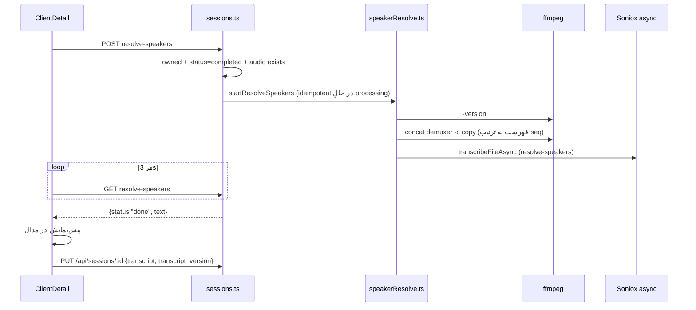

# Subsystem 05 — Session Audio Archive & Speaker Resolve

> **وضعیت:** ACTIVE-CANONICAL · کد: `server/src/stt/sessionAudioArchive.ts`، `server/src/stt/speakerResolve.ts`، `server/src/db/mysql/migrations/011_session_audio.sql`، `016_session_audio_duration.sql`، روت‌های `/api/admin/sessions/:id/audio`، `/api/admin/session-audio/:audioId/stream`، `/api/sessions/:id/resolve-speakers` · قوانین: LAW-005، LAW-009، LAW-010.

## ۱. هدف (از کامنتِ کد)
نگهداریِ عمدیِ صدای جلسات «فقط برای بازبینیِ ادمین (دیباگِ باگ‌ها)» با نگهداریِ محدود (۱۴ روز «طبقِ تصمیمِ تیم»)، و استفاده‌ی مجدد از همان صدا برای یکدست‌کردنِ شماره‌ی گوینده‌ها.

## ۲. آرشیو

| جنبه | رفتار |
|---|---|
| ورود | `archiveAudioForAdmin(sessionId, seq, buffer, mime, source)` از `processBatchQueue` (همه‌ی purposeها پس از موفقیت، و archive بدونِ رونویسی) |
| مسیر | `<cwd>/data/session-audio/<sessionId>/<seq6>.webm` (یا `.ogg` اگر mime شاملِ ogg) |
| ری‌ماکس + duration **(جدید، 2026-09-16)** | بعدِ نوشتنِ فایلِ خام، `ffmpeg -c copy` (بدونِ ری‌اینکود) روی همان فایل اجرا می‌شود و سپس مدت‌زمانِ فایلِ نهایی probe می‌شود → `duration_ms`. اگر ffmpeg نصب نباشد یا ری‌ماکس خطا بدهد، فایلِ خامِ اصلی دست‌نخورده می‌ماند و `duration_ms = NULL` (fail-open — آرشیو هرگز شکست نمی‌خورد) |
| DB | `INSERT … ON CONFLICT (session_id, seq) DO UPDATE` → **seqِ تکراری فایلِ قبلی را بازنویسی می‌کند** |
| دسترسی | فقط ادمین: فهرست (شاملِ `duration_ms`) + stream با Range و `?download=1` اختیاری (`Content-Disposition: attachment`)؛ از static سرو نمی‌شود |
| sweep | startup + هر ۲۴h: ردیف‌های `created_at < now-14d` → حذفِ فایل و ردیف؛ پوشه‌های خالی حذف |

### باگِ رفع‌شده — نمایشِ `0:00` در پخش‌کننده‌ی ادمین (2026-09-16)
**ریشه:** خروجیِ خامِ `MediaRecorder`ِ مرورگر (محدودیتِ شناخته‌شده‌ی Chromium) عنصرِ Duration را در هدرِ WebM نمی‌نویسد → `audio.duration` مرورگر `Infinity`/`NaN` می‌شود و `<audio controls>` آن را `0:00` نشان می‌دهد. **تأییدِ مستقیم در مرورگرِ واقعی:** فایلِ headerless بدونِ ری‌ماکس `duration=Infinity` خواند؛ همان فایل بعدِ ری‌ماکسِ `-c copy` را `duration=4.008` (برابرِ طولِ واقعیِ کلیپِ تست) خواند.
**رفع:** ری‌ماکسِ `ffmpeg -c copy` هنگامِ آرشیو (بالا) + نمایشِ `duration_ms` در UI (`public/index.html`، برچسبِ «سگمنت N (mm:ss)») + دکمه‌ی دانلود (`?download=1`).
**محدودیت:** فقط سگمنت‌هایِ **تازه‌آرشیوشده از این پس** را رفع می‌کند؛ سگمنت‌های قبلاً آرشیوشده بدونِ backfill دست‌نخورده می‌مانند (`duration_ms = NULL`، UI برچسبِ زمان را نشان نمی‌دهد نه `0:00` گمراه‌کننده) و همچنان ممکن است در پخش `0:00`/`Infinity` نشان دهند چون خودِ فایلِ رویِ دیسک هرگز ری‌ماکس نشده.

### مشکلاتِ شناخته‌شده (هنوز باز)
1. **تعارضِ رضایت (C1، بحرانی):** متنِ Setup: «صدا هیچ‌جا ذخیره نمی‌شود — فقط متنِ گفتگو در پرونده ثبت می‌گردد»؛ privacy note: «صدای خام هرگز ذخیره نمی‌شود». UI ادمین: «صدا فقط برایِ بازبینیِ فنی نگه داشته می‌شود — حداکثر ۱۴ روز».
2. **seq در هر نسلِ durable؟** `durableSeq` در طولِ عمرِ یک `RTSession` افزایشی است؛ ولی اگر جلسه پس از reload با `RTSession` جدید ادامه یابد، seq از ۰ شروع می‌شود → `ON CONFLICT` صدای بخش‌های قبلی را **بازنویسی** می‌کند و فایل‌های `data/batch-queue` هم با seq تکراری ولی timestamp متفاوت‌اند (INFERRED از کد؛ تست نشده).
3. **فایل‌های یتیم:** cascadeِ DB ردیف را حذف می‌کند؛ فایل می‌ماند و sweep آن را نمی‌بیند (R4، REQ-093).
4. **ترتیبِ UI:** «سگمنت N» = `seq+1`.
5. `Range` بدونِ اعتبارسنجیِ `end < size`.

## ۳. Speaker Resolve

- job map در حافظه (از دست رفتن با restart؛ >۲h حذف).
- concat بدونِ re-encode فرض می‌کند کدک/پارامترهای همه‌ی سگمنت‌ها یکسان است؛ سگمنت‌های `.ogg` کنارِ `.webm` احتمالاً شکست می‌خورند (INFERRED).
- متنِ حاصل مارکرِ ناپیوستگی ندارد و جایگزینِ کلِ متن می‌شود (با تأییدِ کاربر).
- هزینه: یک رونویسیِ async کامل در Soniox.

## ۴. تغییرِ امن
- هر تغییر در محل/مدت/دسترسیِ صدا → LAW-009 (متنِ رضایت) و LAW-010.
- endpointِ جدیدِ صدا فقط زیرِ `/api/admin/*`.
- قبل از حذفِ جلسه/مراجع در کدِ جدید، فایل‌ها را هم پاک کنید.
